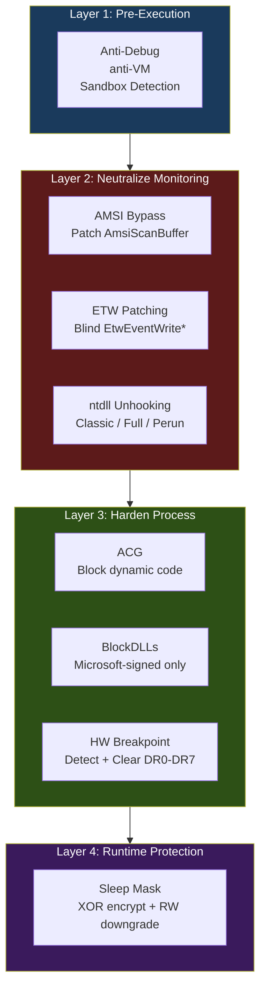

# Evasion Techniques Overview

> **MITRE ATT&CK:** T1562 -- Impair Defenses | **Detection:** Varies by technique

## What Is Evasion?

Evasion techniques neutralize or bypass security monitoring before performing offensive actions. On Windows, this means disabling scanners (AMSI), blinding telemetry (ETW), removing hooks placed by EDR products (unhooking), and protecting your implant from analysis (sleep encryption, anti-debug, anti-VM).

maldev provides a unified `evasion.Technique` interface with composable presets, all supporting optional `*wsyscall.Caller` routing for EDR bypass.

## Layered Defense Model



## Technique Comparison

| Technique | Package | MITRE | Detection | Reversible? | Caller-Routed? |
|-----------|---------|-------|-----------|-------------|----------------|
| [AMSI Bypass](amsi-bypass.md) | `evasion/amsi` | T1562.001 | Medium | No (permanent patch) | Yes |
| [ETW Patching](etw-patching.md) | `evasion/etw` | T1562.001 | Medium | No | Yes |
| [ntdll Unhooking](ntdll-unhooking.md) | `evasion/unhook` | T1562.001 | High | No | Yes |
| [Sleep Mask](sleep-mask.md) | `evasion/sleepmask` | T1027 | Low | Yes (auto-decrypt) | No |
| [HW Breakpoints](hw-breakpoints.md) | `evasion/hwbp` | T1622 | Low | Yes (clear) | No |
| [ACG + BlockDLLs](acg-blockdlls.md) | `evasion/acg`, `evasion/blockdlls` | T1562.001 | Low | No (irreversible) | Partial |
| [Anti-Analysis](anti-analysis.md) | `evasion/antidebug`, `evasion/antivm`, `evasion/sandbox` | T1497/T1622 | Low | N/A (detection only) | No |
| [PPID Spoofing](ppid-spoofing.md) | `c2/shell` | T1134.004 | Medium | N/A (child process) | No |
| [FakeCmdLine](fakecmd.md) | `evasion/fakecmd` | T1036.005 | Low | Yes (Restore) | Yes |
| [HideProcess](hideprocess.md) | `evasion/hideprocess` | T1564.001 | Medium | No (target patch) | Yes |
| [StealthOpen](stealthopen.md) | `evasion/stealthopen` | T1036 | Low | N/A (file access) | No |

## Presets

The `evasion/preset` package provides curated technique bundles:

```go
// Minimal: AMSI + ETW patches. Least detectable, most compatible.
techniques := preset.Minimal()

// Stealth: Minimal + selective ntdll unhook of commonly hooked functions.
techniques := preset.Stealth()

// Aggressive: Everything. Apply AFTER injection (ACG blocks RWX allocation).
techniques := preset.Aggressive()

// Apply with optional syscall caller.
errs := evasion.ApplyAll(techniques, caller)
```

## Architecture

All evasion techniques implement the `evasion.Technique` interface:

```go
type Technique interface {
    Name() string
    Apply(caller Caller) error
}
```

Apply them individually or in batches with `evasion.ApplyAll()`.
