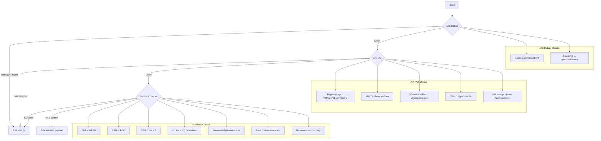

# Anti-Analysis (Anti-Debug + Anti-VM + Sandbox Detection)

> **MITRE ATT&CK:** T1497 (Sandbox Evasion) · T1622 (Debugger Evasion) | **D3FEND:** D3-DA (Dynamic Analysis) | **Detection:** Low

[← Back to Evasion Overview](README.md)

## For Beginners

Before doing anything sensitive, a smart implant checks if it's being watched. Think of it as a spy looking for two-way mirrors, hidden cameras, and fake environments before opening their briefcase.

Three categories of analysis detection:

- **Anti-Debug**: Is someone stepping through my code with a debugger?
- **Anti-VM**: Am I running inside a virtual machine (analyst's sandbox)?
- **Sandbox Detection**: Is the environment fake? (too little RAM, too few processes, no real user activity)

If any check fails, the implant exits silently — the analyst sees nothing.

## How It Works



## Usage

### Anti-Debug

```go
import "github.com/oioio-space/maldev/evasion/antidebug"

if antidebug.IsDebuggerPresent() {
    os.Exit(0)
}
```

### Anti-VM

```go
import "github.com/oioio-space/maldev/evasion/antivm"

name, err := antivm.Detect(antivm.DefaultConfig())
if name != "" {
    os.Exit(0) // running in VMware, VirtualBox, etc.
}
```

### Sandbox Detection

```go
import (
    "context"

    "github.com/oioio-space/maldev/evasion/sandbox"
)

checker := sandbox.New(sandbox.DefaultConfig())
if sandboxed, _, _ := checker.IsSandboxed(context.Background()); sandboxed {
    os.Exit(0)
}
```

### CPU-Burn Timing (defeats Sleep fast-forwarding)

```go
import "github.com/oioio-space/maldev/evasion/timing"

// Trig-based busy wait — impossible for sandboxes to accelerate
timing.BusyWaitTrig(200 * time.Millisecond)
```

## Combined Example

```go
import (
    "context"
    "os"
    "time"

    "github.com/oioio-space/maldev/evasion/antidebug"
    "github.com/oioio-space/maldev/evasion/antivm"
    "github.com/oioio-space/maldev/evasion/sandbox"
    "github.com/oioio-space/maldev/evasion/timing"
)

func checkEnvironment() bool {
    // 1. CPU burn — defeats Sleep hooks
    timing.BusyWaitTrig(200 * time.Millisecond)

    // 2. Debugger check
    if antidebug.IsDebuggerPresent() {
        return false
    }

    // 3. VM check
    if name, _ := antivm.Detect(antivm.DefaultConfig()); name != "" {
        return false
    }

    // 4. Sandbox check
    checker := sandbox.New(sandbox.DefaultConfig())
    if sandboxed, _, _ := checker.IsSandboxed(context.Background()); sandboxed {
        return false
    }

    return true // real system, no analysis detected
}

func main() {
    if !checkEnvironment() {
        os.Exit(0)
    }
    // proceed with payload...
}
```

## Advantages & Limitations

| Aspect | Detail |
|--------|--------|
| **Coverage** | 8 VM vendors (VMware, VirtualBox, Hyper-V, QEMU, Docker, WSL, Parallels, Xen) |
| **Cross-platform** | Anti-debug and sandbox work on Linux and Windows |
| **Configurable** | All thresholds customizable via `Config` struct |
| **Timing evasion** | 3 methods: BusyWait (loop), BusyWaitPrimality (math), BusyWaitTrig (trig) |
| **Limitation** | Advanced sandboxes patch these checks (high RAM, many processes) |
| **Limitation** | CPUID-based VM detection can be disabled by hypervisor |
| **Limitation** | Some analysts use bare-metal — no VM to detect |

## Compared to Other Implementations

| Feature | maldev | Sliver | CobaltStrike | D3Ext |
|---------|--------|--------|-------------|-------|
| Anti-debug | IsDebuggerPresent + TracerPid | Basic | Advanced (multiple checks) | IsDebuggerPresent |
| Anti-VM | 8 vendors, registry+files+NIC+CPUID+DMI | Basic VM check | Configurable | Registry + files |
| Sandbox | 7 environmental checks + timing | None | Sleep mask only | Basic |
| Configurable | Full Config struct | No | Profile-based | Partial |
| Cross-platform | Windows + Linux | Windows + Linux | Windows only | Windows only |
| Timing evasion | 3 CPU-burn methods | None | Sleep mask | None |

## API Reference

- [`evasion/antidebug`](../../evasion.md) — `IsDebuggerPresent() bool`
- [`evasion/antivm`](../../evasion.md) — `Detect(Config) (string, error)`, `DetectAll(Config) ([]string, error)`
- [`evasion/sandbox`](../../evasion.md) — `New(Config) *Checker`, `IsSandboxed(ctx) (bool, string, error)`, `CheckAll(ctx) []Result`
- [`evasion/timing`](../../evasion.md) — `BusyWait(d)`, `BusyWaitPrimality()`, `BusyWaitPrimalityN(n)`, `BusyWaitTrig(d)`
