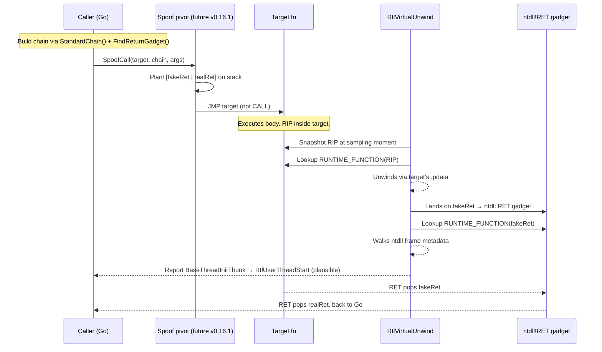

# Call-Stack Spoofing — Metadata Primitives

[<- Back to Evasion](README.md)

**MITRE ATT&CK:** [T1036 — Masquerading](https://attack.mitre.org/techniques/T1036/)
**Package:** `evasion/callstack`
**Platform:** Windows amd64
**Detection:** Medium

---

## Primer

Modern EDR and DFIR tooling routinely walks the stack of a suspicious
thread to see *who called that VirtualAllocEx / CreateRemoteThread /
NtUnmapViewOfSection*. The walker uses `RtlVirtualUnwind` (or its
kernel-mode sibling), which reads the PE `.pdata` table to locate the
`RUNTIME_FUNCTION` for the current `RIP`, then follows the stored
unwind info to climb up one frame at a time.

A **spoofed call stack** replaces the top frames of that walk with
addresses that look like a vanilla thread-init sequence
(`RtlUserThreadStart → BaseThreadInitThunk → ...`) — the walker cannot
distinguish the injected frames from a genuine execution path unless
it cross-validates `RIP` against ETW Threat-Intelligence or performs
its own control-flow reconstruction.

`evasion/callstack` ships the **metadata primitives** required to
build such a chain. The asm pivot that actually executes a call
through a synthesized chain is tracked as **v0.16.1** work — this
release provides the building blocks so higher-level packages
(`inject`, `evasion/unhook`, a future `sleepmask` L4 strategy) can
compose their own pivots without re-solving the `RUNTIME_FUNCTION`
plumbing.

---

## What ships in v0.16.0

```go
// LookupFunctionEntry wraps ntdll!RtlLookupFunctionEntry. Given any
// instruction address inside a loaded PE, returns a Frame populated
// with ReturnAddress + ImageBase + RUNTIME_FUNCTION (copied by value).
func LookupFunctionEntry(addr uintptr) (Frame, error)

// StandardChain returns a cached 2-frame return chain rooted at the
// Windows thread-init sequence:
//   [0] kernel32!BaseThreadInitThunk  (inner — direct caller of target)
//   [1] ntdll!RtlUserThreadStart      (outer — thread entry point)
// Both frames carry full RUNTIME_FUNCTION metadata so a stack walker
// following them finds unwind info at every step.
func StandardChain() ([]Frame, error)

// FindReturnGadget scans ntdll's .text for a lone RET (0xC3 followed by
// int3/nop padding) and returns its absolute address. Callers planting
// a fake return on the stack point there so the target's RET jumps
// into a well-known ntdll address — ntdll .pdata covers every .text
// byte, guaranteeing unwind metadata for the fake frame.
func FindReturnGadget() (uintptr, error)

// Validate checks a chain's structural consistency: non-zero
// ReturnAddress/ImageBase/UnwindInfoAddress, ControlPc bounded by
// RUNTIME_FUNCTION [Begin, End). Catches the most-likely spoof-
// construction mistakes (swapped RVA vs absolute, stale post-reload
// metadata) before they blow up at RtlVirtualUnwind time.
func Validate(chain []Frame) error

// Frame pairs a return address with its RUNTIME_FUNCTION row.
type Frame struct {
    ReturnAddress   uintptr
    ImageBase       uintptr
    RuntimeFunction RuntimeFunction
}

// RuntimeFunction mirrors the Windows amd64 RUNTIME_FUNCTION struct.
type RuntimeFunction struct {
    BeginAddress      uint32
    EndAddress        uint32
    UnwindInfoAddress uint32
}
```

---

## How Spoofing Works



The **v0.16.0 building blocks** cover the "lookup" arrows; the pivot
(push + JMP + real-RET recovery) is what `v0.16.1` will add in plan9
asm.

---

## Usage today

Consumers can already build a validated chain and hand it off to a
custom pivot (e.g., one implemented elsewhere in an operator's code
base):

```go
chain, err := callstack.StandardChain()
if err != nil { log.Fatal(err) }

ret, err := callstack.FindReturnGadget()
if err != nil { log.Fatal(err) }

if err := callstack.Validate(chain); err != nil {
    log.Fatalf("chain invalid: %v", err)
}

// Build stack layout: [fakeRet=ret, ...chain metadata for walker...]
// then call target through the operator's own asm pivot.
```

Once `v0.16.1` ships the in-package pivot, the composition surface
will be:

```go
// future-looking — NOT available in v0.16.0
callstack.SpoofCall(target, chain, arg1, arg2, arg3)
```

---

## Limitations

- **x64 only.** x86 uses frame-pointer walking rather than
  `.pdata`-based unwind, which requires a different spoof strategy.
- **Synthetic frames detected by ETW Threat-Intelligence.** Some EDRs
  (especially those consuming the TI provider) cross-check every
  stack frame RIP against the current call graph and can still flag
  a synthesized chain. `evasion/callstack` makes the chain
  *plausible*, not *indistinguishable*.
- **Module relocations.** `StandardChain` caches the frames after
  first call; if the target module unmaps + remaps at a new base
  (unusual but possible under ASLR-stressed environments), the
  cached frames become stale. Clear the cache by spawning a fresh
  process, or build a one-shot chain via `LookupFunctionEntry`.
- **No hardware-breakpoint variant yet.** The `fortra/hw-call-stack`
  technique (HWBP on RET gadget for stronger obfuscation) is
  separate future work, orthogonal to `v0.16.1`'s synthetic-frame
  pivot.

---

## API Reference

See [package doc](https://pkg.go.dev/github.com/oioio-space/maldev/evasion/callstack).

Every export is error-surfacing; `ErrUnsupportedPlatform`,
`ErrFunctionEntryNotFound`, and `ErrGadgetNotFound` exist for
`errors.Is` discrimination.
