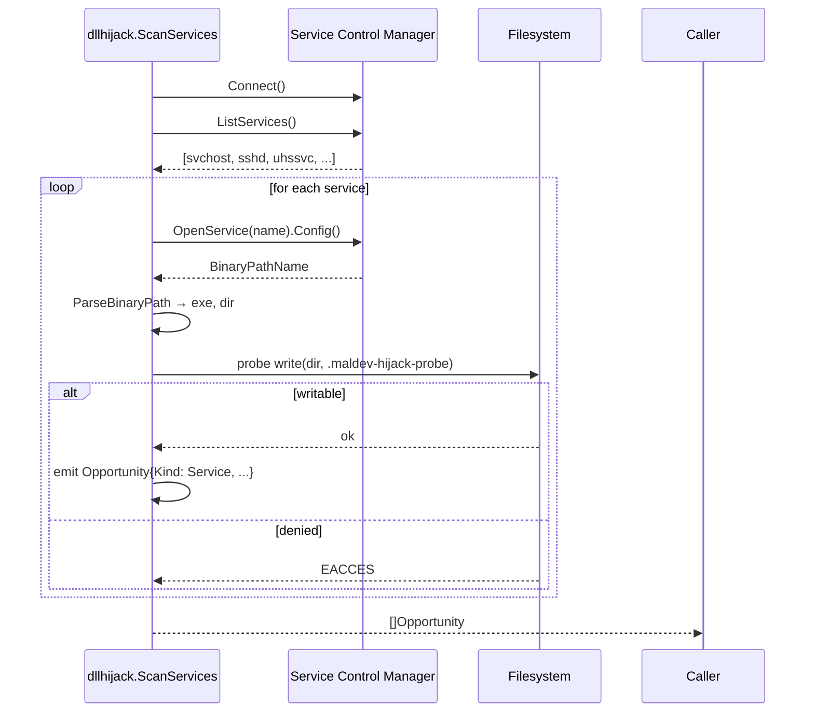

# DLL Search Order Hijacking — Discovery

[<- Back to Evasion](README.md)

**MITRE ATT&CK:** [T1574.001 — Hijack Execution Flow: DLL Search Order Hijacking](https://attack.mitre.org/techniques/T1574/001/)
**Package:** `evasion/dllhijack`
**Platform:** Windows
**Detection:** Medium

---

## Primer

Windows resolves DLL loads along a documented search order. If a process
starts from directory `D`, that directory is searched **before** System32
for most DLL imports. When `D` is writable by an attacker's token and the
process is about to load a DLL whose name collides with one we drop into
`D`, our DLL executes in the victim process's security context.

Discovery is a two-step problem:

1. **Who is the victim?** — a running process, a service, or a
   scheduled task. Each has a well-known "working directory" from which
   search resolution starts.
2. **Is there an exploitable path?** — a directory on the search path
   that the current user can write to before the target DLL is found
   elsewhere.

`evasion/dllhijack` ships step 1 for **services** today. The API is a
recon scanner; dropping a payload DLL and validating via a canary is
future work (tracked in the package doc).

---

## How It Works



**Step-by-step:**

1. **Connect** to the SCM via `golang.org/x/sys/windows/svc/mgr`.
2. **Enumerate** every installed service (`ListServices`).
3. **Fetch config** for each — we need `BinaryPathName`.
4. **Parse** the binary path: handle quoted paths (`"C:\Program Files\svc.exe" -arg`) and unquoted paths (`C:\Windows\System32\svc.exe -k ...`).
5. **Probe writability** of the binary's directory by attempting to create a temp file there (`O_CREATE|O_WRONLY|O_EXCL`, then `os.Remove`). The probe uses the current user's token — no elevation, no pretending.
6. **Emit** an `Opportunity` for each writable dir, including the service's ID, display name, and the reason we flagged it.

The writability probe's behaviour depends on the running token:

- **Non-admin**: most Windows services are in System32 / Program Files, both protected. The scanner typically returns 0–5 candidates — third-party services in user-writable locations.
- **Admin**: every dir on the system is writable, so the scanner returns the full service list. Useful for inventorying the attack surface, not for deciding what to exploit.

---

## Usage

```go
import (
    "fmt"
    "log"
    "github.com/oioio-space/maldev/evasion/dllhijack"
)

func main() {
    opps, err := dllhijack.ScanServices()
    if err != nil { log.Fatal(err) }

    for _, o := range opps {
        fmt.Printf("%s (%s)\n", o.ID, o.DisplayName)
        fmt.Printf("  binary       : %s\n", o.BinaryPath)
        fmt.Printf("  hijacked DLL : %s\n", o.HijackedDLL)
        fmt.Printf("  drop at      : %s\n", o.HijackedPath)
        fmt.Printf("  legit at     : %s\n\n", o.ResolvedDLL)
    }
}
```

Sample output on a Win10 host running as admin (`uhssvc` = Microsoft
Update Health Service, binary in `C:\Program Files\Microsoft Update
Health Tools\`):

```
uhssvc (Microsoft Update Health Service)
  binary       : C:\Program Files\Microsoft Update Health Tools\uhssvc.exe
  hijacked DLL : WINHTTP.dll
  drop at      : C:\Program Files\Microsoft Update Health Tools\WINHTTP.dll
  legit at     : C:\Windows\system32\WINHTTP.dll
```

### Low-level helpers

`SearchOrder(exeDir)` returns the ordered directory list Windows walks
for a DLL load (app dir → System32 → SysWOW64 → Windows).
`HijackPath(exeDir, dllName)` returns the first writable dir in that
order that doesn't already contain the DLL, or `""` if there's no
opportunity (including KnownDLL cases).

### Parsing `BinaryPathName` manually

`ParseBinaryPath` is exported for callers that read service config from
sources other than the SCM (registry dumps, event log exports):

```go
exe := dllhijack.ParseBinaryPath(`"C:\Program Files\Svc\svc.exe" --service`)
// exe == `C:\Program Files\Svc\svc.exe`
```

---

## Limitations

- **Services + scheduled tasks analyze STATIC imports** (PE import table).
  DLLs loaded at runtime via `LoadLibrary` / `GetModuleHandle` are invisible
  there. `ScanProcesses` covers the runtime-load blind spot by reading the
  live loaded-module list from every accessible process.
- **No canary** yet. Validation that a dropped DLL would actually be
  loaded requires the canary-DLL workflow — shipping in the next phase.

---

## Comparison

| Tool                  | Ships canary validation | Covers processes | Covers services | Covers tasks | Go-native |
|-----------------------|-------------------------|------------------|-----------------|--------------|-----------|
| `maldev/dllhijack`    | no (Phase C)            | **yes**          | **yes**         | **yes**      | yes       |
| DLLHijackHunter (.NET)| yes                     | yes              | yes             | yes          | no        |
| Siofra (Koret)        | no                      | yes              | no              | no           | no        |

---

## API Reference

```go
type Kind int
const (
    KindService Kind = iota + 1
    KindProcess
    KindScheduledTask
)
func (k Kind) String() string

type Opportunity struct {
    Kind         Kind
    ID           string // ServiceName / PID / TaskPath
    DisplayName  string
    BinaryPath   string // the exe that loads DLLs
    HijackedDLL  string // e.g. "version.dll" — the import that would be hijacked
    HijackedPath string // exact drop path for the payload
    ResolvedDLL  string // where the DLL currently resolves (usually System32)
    SearchDir    string // dirname(HijackedPath)
    Writable     bool
    Reason       string
}

// ScanServices enumerates services; per-import PE analysis.
func ScanServices() ([]Opportunity, error)

// ScanProcesses enumerates every accessible running process and reads
// its LIVE loaded-module list via Toolhelp32 — covers runtime LoadLibrary.
func ScanProcesses() ([]Opportunity, error)

// ScanScheduledTasks enumerates registered tasks via COM ITaskService,
// walks each task's exec actions, applies PE-imports filter per binary.
func ScanScheduledTasks() ([]Opportunity, error)

// ScanAll = Services ∪ Processes ∪ Tasks. Partial failures are surfaced
// as a wrapped error but do not abort the remaining scanners.
func ScanAll() ([]Opportunity, error)

// SearchOrder returns the DLL search order for a binary in exeDir:
// [exeDir, System32, SysWOW64, Windows]. SafeDllSearchMode is assumed
// on; CWD and %PATH% are deliberately skipped.
func SearchOrder(exeDir string) []string

// HijackPath reports the hijack candidate dir for one (exe, dll) pair:
// the first writable dir earlier in the search order than the DLL's
// real location, or "" if no opportunity. Correctly excludes KnownDLLs.
func HijackPath(exeDir, dllName string) (hijackDir, resolvedDir string)

// ScanServices enumerates Windows services with a writable binary dir.
// Windows only; cross-platform stub returns an error.
func ScanServices() ([]Opportunity, error)

// ParseBinaryPath extracts the exe from an SCM BinaryPathName. Pure
// string parsing, cross-platform.
func ParseBinaryPath(cmdline string) string
```
