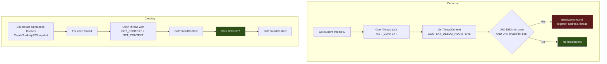

# Hardware Breakpoint Detection and Clearing

> **MITRE ATT&CK:** T1622 -- Debugger Evasion | **D3FEND:** D3-DICA -- Debug Instruction/Command Analysis | **Detection:** Low

## For Beginners

Some security tools use an invisible surveillance technique: hardware breakpoints. Instead of modifying your code (like software breakpoints or hooks), they program the CPU's debug registers (DR0 through DR3) to trigger an alert when specific memory addresses are read, written, or executed. This is invisible to normal code inspection -- there are no modified bytes, no detour jumps, nothing in memory that looks wrong.

Think of it like invisible laser tripwires in a museum. The regular security guards (EDR hooks) stand at the doors and you can see them. But invisible lasers crisscross the room, and if you step through one, a silent alarm goes off. Hardware breakpoint detection scans for these invisible tripwires by reading the CPU's debug registers. If any DR0-DR3 register contains a non-zero address with a corresponding enable bit in DR7, a breakpoint is active.

Clearing these breakpoints is like disabling the lasers. You zero out DR0-DR7 on every thread in the process, removing all hardware breakpoints set by any security tool or debugger.

## How It Works



**Detection logic:**

For each debug register DR0-DR3, check:
1. Is the address non-zero? (`DR[i] != 0`)
2. Is the corresponding local enable bit set in DR7? (`DR7 & (1 << (2*i)) != 0`)

If both conditions are true, there is an active hardware breakpoint at that address.

**Clearing logic:**

Zero all debug registers: DR0=0, DR1=0, DR2=0, DR3=0, DR6=0, DR7=0. This disables all breakpoints and clears all status flags.

## Usage

```go
package main

import (
    "fmt"
    "log"

    "github.com/oioio-space/maldev/evasion/hwbp"
)

func main() {
    // Detect hardware breakpoints on the current thread.
    bps, err := hwbp.Detect()
    if err != nil {
        log.Fatal(err)
    }
    for _, bp := range bps {
        fmt.Printf("DR%d = 0x%X on thread %d\n", bp.Register, bp.Address, bp.ThreadID)
    }

    // Detect on ALL threads in the process.
    allBPs, _ := hwbp.DetectAll()
    fmt.Printf("Found %d breakpoints across all threads\n", len(allBPs))

    // Clear all hardware breakpoints on all threads.
    cleared, _ := hwbp.ClearAll()
    fmt.Printf("Cleared breakpoints on %d threads\n", cleared)
}
```

## Combined Example

```go
package main

import (
    "context"
    "log"
    "os"

    "github.com/oioio-space/maldev/evasion/hwbp"
    "github.com/oioio-space/maldev/evasion/sandbox"
)

func main() {
    // 1. Check for hardware breakpoints (indicates debugging/analysis).
    bps, _ := hwbp.DetectAll()
    if len(bps) > 0 {
        log.Printf("WARNING: %d hardware breakpoints detected", len(bps))
        // Clear them to continue unmonitored.
        hwbp.ClearAll()
    }

    // 2. Run full sandbox detection.
    checker := sandbox.New(sandbox.DefaultConfig())
    sandboxed, reason, _ := checker.IsSandboxed(context.Background())
    if sandboxed {
        log.Printf("Sandbox detected: %s", reason)
        os.Exit(0) // bail out
    }

    // 3. Proceed with offensive operations...
}
```

## Advantages & Limitations

| Aspect | Detail |
|--------|--------|
| Stealth | High -- reading/clearing debug registers is a normal operation. No memory modification, no API hooking. |
| Coverage | Detects/clears all 4 hardware breakpoint registers across all threads. |
| Detection vectors | DR0-DR3 addresses and DR7 enable bits. Also reports the thread ID for each breakpoint. |
| Limitations | Only detects x86/x64 hardware breakpoints (DR0-DR3). Does not detect software breakpoints (INT3 patches) or EDR hooks. The `CreateToolhelp32Snapshot` call for thread enumeration may be logged. |
| Re-setting | A debugger can re-set breakpoints after clearing. This is a one-time sweep, not persistent protection. |
| Thread access | Requires `THREAD_GET_CONTEXT | THREAD_SET_CONTEXT` on each thread, which is available for threads in the same process. |

## Compared to Other Implementations

| Feature | maldev | Sliver | CobaltStrike | D3Ext/maldev |
|---------|--------|--------|--------------|--------------|
| Detect on current thread | `Detect()` | No | No | No |
| Detect on all threads | `DetectAll()` | No | No | No |
| Clear all threads | `ClearAll()` | No | No | No |
| Returns Breakpoint structs | Yes (register, addr, tid) | N/A | N/A | N/A |
| Thread enumeration | Toolhelp32 | N/A | N/A | N/A |
| DR7 enable bit validation | Yes | N/A | N/A | N/A |

## API Reference

```go
// Breakpoint describes a hardware breakpoint found in debug registers.
type Breakpoint struct {
    Register int     // DR index (0-3)
    Address  uintptr // Address being monitored
    ThreadID uint32  // Thread with the breakpoint
}

// Detect returns hardware breakpoints on the current thread.
func Detect() ([]Breakpoint, error)

// DetectAll returns hardware breakpoints on all threads in the process.
func DetectAll() ([]Breakpoint, error)

// ClearAll zeros DR0-DR7 on all threads. Returns count of threads modified.
func ClearAll() (int, error)
```
