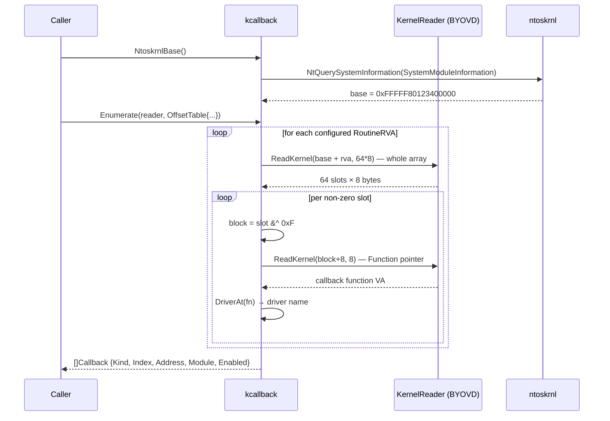

# Kernel Callback Enumeration (+ Experimental Removal)

[<- Back to Evasion](README.md)

**MITRE ATT&CK:** [T1562.001 — Impair Defenses: Disable or Modify Tools](https://attack.mitre.org/techniques/T1562/001/)
**Package:** `evasion/kcallback`
**Platform:** Windows amd64
**Detection:** Low (if removal succeeds cleanly) / High (during BYOVD driver load)

---

## Primer

Modern EDR/AV products hook into kernel event streams by registering
**kernel notification callbacks** via `PsSetCreateProcessNotifyRoutine`,
`PsSetCreateThreadNotifyRoutine`, and `PsSetLoadImageNotifyRoutine`.
Each API appends a callback slot to one of three in-kernel arrays:

| Array | Trigger | Used by |
|---|---|---|
| `PspCreateProcessNotifyRoutine` | `NtCreateUserProcess` | EDR process-start telemetry |
| `PspCreateThreadNotifyRoutine` | `PspInsertThread` | EDR thread-start telemetry |
| `PspLoadImageNotifyRoutine` | `MiMapViewOfImageSection` | EDR image-load scanning |

Each slot is a `PEX_CALLBACK` — a 64-bit value where the upper 60 bits
are a pointer to a `ROUTINE_BLOCK` and the lower 4 bits are flags
(enabled, reference count, ...). The real callback function lives at
offset 8 inside the `ROUTINE_BLOCK`.

**Enumerating** those arrays tells you which driver registered which
callback — often directly revealing the EDR's kernel driver + the
function address it hooks into. This is classic recon for understanding
an environment's defensive posture before deciding whether to proceed.

**Removing** a slot is the more aggressive play — the EDR stops seeing
the relevant kernel events. But writing to `PspCreateProcessNotifyRoutine`
requires arbitrary-kernel-memory-write capability, which user-mode
alone cannot reach. Every public removal technique (EDRSandBlast,
kdmapper + custom driver, RTCore64 exploit) relies on a signed-driver
primitive — **BYOVD**.

---

## v0.17.0 scope: enumeration primitives only

This release ships the **metadata + reader surface**:

```go
// Kernel symbol / driver resolution (user-mode, no driver needed)
func NtoskrnlBase() (uintptr, error)
func DriverAt(addr uintptr) (string, error)

// Enumeration (driver-backed KernelReader required)
func Enumerate(reader KernelReader, tab OffsetTable) ([]Callback, error)

// Plug-in point: any driver primitive that can serve ReadKernel satisfies
// this. Bring your own driver (RTCore64, GDRV, kdmapper-loaded custom).
type KernelReader interface {
    ReadKernel(addr uintptr, buf []byte) (int, error)
}
type KernelReadWriter interface {
    KernelReader
    WriteKernel(addr uintptr, data []byte) (int, error)
}
type NullKernelReader struct{} // default, always returns ErrNoKernelReader
```

**Removal** (`Remove(cb Callback, writer KernelReadWriter) (RemoveToken, error)`)
ships in **v0.17.1**. It reads the 8-byte slot at `cb.SlotAddr`,
captures the original tagged-pointer value into a `RemoveToken`, then
writes 8 zero bytes — the EDR's notify routine stops being called as
soon as the kernel sees the zero write. `Restore(tok, writer) error`
puts the original value back. The token is opaque except for `IsZero()`
which makes the deferred-cleanup idiom safe:

```go
tok, err := kcallback.Remove(cb, writer)
if err != nil { return err }
defer kcallback.Restore(tok, writer)
```

The API exposes a ~µs race window between read-original and
write-zero where a competing actor could observe a half-written slot,
but driver-backed primitives like RTCore64 issue both IOCTLs fast
enough that this is rarely observable in practice.

### No built-in offset database

`OffsetTable.CreateProcessRoutineRVA` / `CreateThreadRoutineRVA` /
`LoadImageRoutineRVA` are **caller-populated**. We do not ship a
built-in database because offsets shift with every cumulative
ntoskrnl update (`PspCreateProcessNotifyRoutine` moves even between
KB releases within the same build). Hardcoding a stale offset would
point callers at garbage and silently produce wrong results.

**Derivation workflow** (offline, one-time per build):

1. Grab the victim's `ntoskrnl.exe` (typically
   `C:\Windows\System32\ntoskrnl.exe`).
2. Fetch its PDB from Microsoft's symbol server:
   `symchk /if ntoskrnl.exe /s SRV*c:\symbols*https://msdl.microsoft.com/download/symbols`
3. Dump the symbol RVA:
   `llvm-pdbutil dump --globals ntoskrnl.pdb | grep PspCreateProcessNotifyRoutine`
4. Record the RVA in your `OffsetTable{Build: 19045, CreateProcessRoutineRVA: 0x...}`.
5. Build a map[uint32]OffsetTable keyed by build number and select at
   runtime via `win/version.Current().BuildNumber`.

EDRSandBlast ships a ready-made offset table updated regularly —
treat it as an upstream reference, not as committed library state.

---

## How enumeration works



---

## Usage

```go
import (
    "github.com/oioio-space/maldev/evasion/kcallback"
    "github.com/oioio-space/maldev/win/version"
)

// 1. Build your driver-backed KernelReader elsewhere (RTCore64,
//    GDRV, your own kdmapper-loaded driver).
reader := MyDriverReader{...}

// 2. Resolve ntoskrnl base and pick the OffsetTable for the
//    current build.
v := version.Current()
tab := offsetsByBuild[v.BuildNumber]
if tab.Build == 0 {
    log.Fatalf("no offsets for ntoskrnl build %d — dump the PDB", v.BuildNumber)
}

// 3. Enumerate.
cbs, err := kcallback.Enumerate(reader, tab)
if err != nil { log.Fatal(err) }

for _, cb := range cbs {
    fmt.Printf("%s[%d] -> 0x%X (%s) enabled=%v\n",
        cb.Kind, cb.Index, cb.Address, cb.Module, cb.Enabled)
}
```

Sample output (conceptual):

```
PspCreateProcessNotifyRoutine[0] -> 0xFFFFF80123456789 (ntoskrnl.exe) enabled=true
PspCreateProcessNotifyRoutine[1] -> 0xFFFFF88765432100 (cidevrt.sys) enabled=true
PspCreateProcessNotifyRoutine[2] -> 0xFFFFF89abcdef000 (WdFilter.sys) enabled=true
PspCreateThreadNotifyRoutine[0]  -> 0xFFFFF89abcdef800 (WdFilter.sys) enabled=true
PspLoadImageNotifyRoutine[0]     -> 0xFFFFF89abcdef100 (WdFilter.sys) enabled=true
```

---

## Future work

- Per-build offset cache baked into `win/version` so callers don't
  reimplement the map themselves.
- Per-Kind unhook helpers that wrap Remove for the most common slot
  patterns (e.g. `RemoveByModule("WdFilter.sys", writer)`).
- A real VM e2e against a driver-loaded RTCore64 (currently
  `kernel/driver/rtcore64` ships as scaffold; the binary embedding
  requires a separate build with `-tags=byovd_rtcore64`).

---

## Limitations

- **User-mode read is impossible.** `NullKernelReader` (the default
  injection target) always returns `ErrNoKernelReader`. A real
  enumeration needs a driver primitive.
- **Offsets shift frequently.** Pin your offset table to specific
  build numbers; always fall back to `ErrOffsetUnknown` when the
  current build isn't mapped.
- **The Enabled bit is approximate.** The low bit of a `PEX_CALLBACK`
  slot isn't universally "enabled" — in some Windows builds it's part
  of the reference count. Trust the Address field as the primary
  signal; treat Enabled as a hint.
