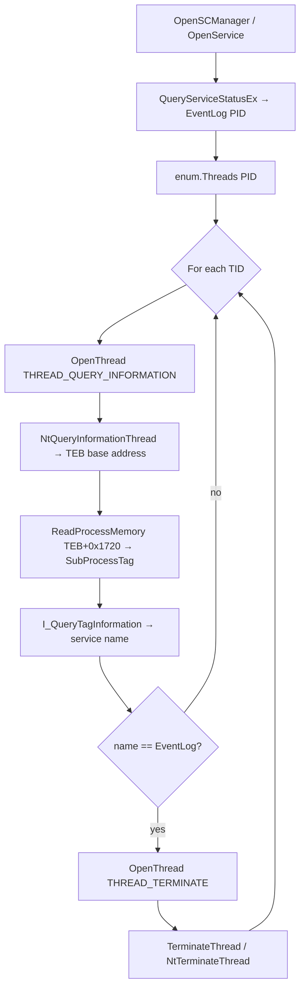

# Phant0m — Event Log Thread Termination

[<- Back to Evasion](README.md)

**MITRE ATT&CK:** [T1562.002](https://attack.mitre.org/techniques/T1562/002/) — Impair Defenses: Disable Windows Event Logging
**Package:** `evasion/phant0m`
**Platform:** Windows
**Detection:** High

---

## What It Does

Terminates the individual worker threads of the Windows Event Log service while
leaving the service itself registered as "Running" in the Service Control
Manager. With no threads alive, no new Windows Event Log entries can be written
— effectively silencing event logging without issuing a visible `sc stop
EventLog` command.

## How It Works

The Windows Event Log service runs as one or more threads inside a shared
`svchost.exe` process. Stopping the service outright is noisy (SCM logs an
event, Defender may alert). Phant0m takes a surgical approach: it finds the
exact `svchost.exe` that hosts `EventLog`, enumerates its threads, validates
each thread against the EventLog service tag, and terminates only the matching
ones.



**Service tag validation** uses `I_QueryTagInformation` (advapi32), an
undocumented-but-stable API used by Task Manager to show service names per
thread. The SubProcessTag is a 32-bit value stored at offset `0x1720` in the
x64 TEB. If `I_QueryTagInformation` is not available (very old systems), the
check falls back to terminating all threads in the EventLog PID.

The result: SCM still reports the service as `RUNNING`, its PID is still alive,
but every worker thread is dead and no log entries are recorded.

**Privilege requirement:** `SeDebugPrivilege` — available to SYSTEM or elevated
admin accounts.

## API

```go
// Kill terminates threads belonging to the Windows Event Log service.
// Validates threads via I_QueryTagInformation when available, so only
// EventLog worker threads are killed (other services in the same
// svchost.exe are not affected).
//
// Requires SeDebugPrivilege.
func Kill(caller *wsyscall.Caller) error

// ErrNoTargetThreads is returned when no EventLog worker threads could
// be identified or terminated.
var ErrNoTargetThreads = errors.New("no target threads found")
```

## Usage

### Basic — WinAPI (default)

```go
import "github.com/oioio-space/maldev/evasion/phant0m"

if err := phant0m.Kill(nil); err != nil {
    log.Printf("phant0m: %v", err)
}
```

### With syscall caller (indirect syscalls / syscall spoofing)

```go
import (
    "github.com/oioio-space/maldev/evasion/phant0m"
    wsyscall "github.com/oioio-space/maldev/win/syscall"
)

caller, _ := wsyscall.New(wsyscall.MethodIndirect)
if err := phant0m.Kill(caller); err != nil {
    log.Printf("phant0m: %v", err)
}
```

When a non-nil `*wsyscall.Caller` is provided, `NtTerminateThread` is invoked
through the caller (indirect/spoofed). When `nil`, `TerminateThread` is called
via the standard Win32 API.

## Advantages & Limitations

| Aspect | Notes |
|---|---|
| Stealth vs. `sc stop` | SCM still shows service as Running; no SCM-level event is emitted |
| Per-thread precision | Only EventLog threads are terminated; co-hosted services are unaffected |
| Persistence | Threads are gone until the service is restarted or the system reboots |
| Privilege | Requires `SeDebugPrivilege` (elevated / SYSTEM) |
| Detection | High — ETW providers, EDRs, and SIEM rules watch for TerminateThread on svchost |
| Architecture | x64 only (TEB offset `0x1720` is x64-specific) |
| Tag fallback | If `I_QueryTagInformation` is absent, all threads in the EventLog PID are killed |

## MITRE ATT&CK

| Technique | ID |
|---|---|
| Impair Defenses: Disable Windows Event Logging | [T1562.002](https://attack.mitre.org/techniques/T1562/002/) |

## Detection

**High** — Mature security environments detect this technique through several
channels:

- **Thread termination telemetry**: EDRs instrument `TerminateThread` /
  `NtTerminateThread` calls. Killing threads in `svchost.exe` (PID of a service
  host) from a different process is immediately suspicious.
- **Event log gaps**: A sudden absence of Windows Event Log entries is itself
  detectable by SIEM correlation rules watching for logging blackouts.
- **Service thread count**: Kernel-mode monitoring (e.g., Microsoft Sysmon
  Event ID 8 / thread creation) can detect that the EventLog service has zero
  live threads while its service status remains `RUNNING`.
- **SACL auditing**: Enabling process/thread access auditing on `svchost.exe`
  will log the `OpenThread(THREAD_TERMINATE)` calls.
