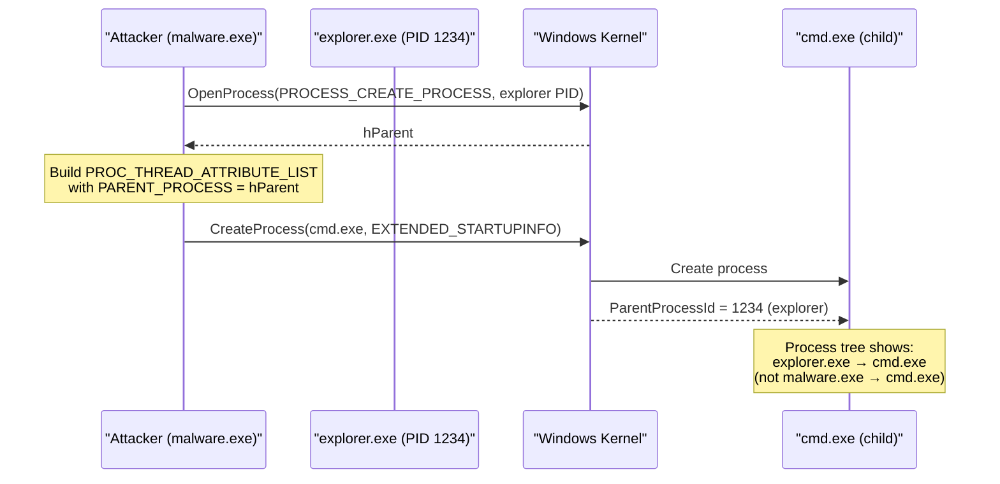

# PPID Spoofing

> **MITRE ATT&CK:** T1134.004 -- Access Token Manipulation: Parent PID Spoofing | **Detection:** Medium -- Process tree anomalies are detectable but require behavioral analysis

## Primer

When a process creates a child process on Windows, the child inherits its parent's identity in the process tree. Security tools use this parent-child relationship as a key detection signal. For example, if `cmd.exe` is spawned by `explorer.exe`, that looks normal -- the user opened a command prompt. But if `cmd.exe` is spawned by `excel.exe`, that is highly suspicious and likely indicates a macro-based attack.

PPID spoofing breaks this detection by lying about the parent. When creating a child process, we use the `PROC_THREAD_ATTRIBUTE_PARENT_PROCESS` attribute to specify a different parent process handle. The child process appears in the process tree as if it was spawned by the chosen parent (e.g., `explorer.exe` or `svchost.exe`), even though our process actually created it.

This is a legitimate Windows API feature -- Go 1.24+ even added native support via `syscall.SysProcAttr.ParentProcess`.

## How It Works



**Step-by-step:**

1. **Find target parent** -- Enumerate running processes to find a suitable legitimate parent (e.g., `explorer.exe`, `svchost.exe`).
2. **OpenProcess(PROCESS_CREATE_PROCESS)** -- Open the target with the minimum right needed for PPID spoofing.
3. **Build SysProcAttr** -- Set `ParentProcess` to the opened handle. Go 1.24+ handles the `PROC_THREAD_ATTRIBUTE_LIST` plumbing automatically.
4. **CreateProcess** -- Spawn the child process. Windows sets the child's `ParentProcessId` to the target, not the actual creator.

## Default Targets

maldev searches for these processes in order (first match wins):

| Process | Why |
|---------|-----|
| `explorer.exe` | Every interactive session has one. Most natural parent for user-facing apps. |
| `svchost.exe` | Dozens of instances. Services spawning children is normal. |
| `sihost.exe` | Shell Infrastructure Host. Present in every session. |
| `RuntimeBroker.exe` | UWP broker. Common, low-profile parent. |

## Usage

```go
package main

import (
    "fmt"
    "os/exec"

    "golang.org/x/sys/windows"

    "github.com/oioio-space/maldev/c2/shell"
)

func main() {
    spoofer := shell.NewPPIDSpoofer()

    if err := spoofer.FindTargetProcess(); err != nil {
        panic(err)
    }
    fmt.Printf("Spoofing parent to PID %d\n", spoofer.TargetPID())

    attr, parentHandle, err := spoofer.SysProcAttr()
    if err != nil {
        panic(err)
    }
    defer windows.CloseHandle(parentHandle)

    cmd := exec.Command("cmd.exe", "/c", "whoami")
    cmd.SysProcAttr = attr
    out, err := cmd.Output()
    if err != nil {
        panic(err)
    }
    fmt.Printf("Output: %s\n", out)
}
```

## Custom Targets

```go
// Target a specific process
spoofer := shell.NewPPIDSpooferWithTargets([]string{"winlogon.exe"})

if err := spoofer.FindTargetProcess(); err != nil {
    // winlogon.exe requires SeDebugPrivilege to open
    panic(err)
}
```

## Integration with Reverse Shell

The PPID spoofer integrates naturally with `c2/shell` for reverse shell scenarios:

```go
// The reverse shell can spawn under a spoofed parent,
// making the shell process appear as a child of explorer.exe
// in EDR process trees.
spoofer := shell.NewPPIDSpoofer()
spoofer.FindTargetProcess()
attr, handle, _ := spoofer.SysProcAttr()
defer windows.CloseHandle(handle)

cmd := exec.Command("cmd.exe")
cmd.SysProcAttr = attr
// ... bind to transport
```

## Advantages & Limitations

| Aspect | Detail |
|--------|--------|
| Stealth | Medium -- fools basic process tree analysis, but advanced EDR can correlate the real creator via ETW `ProcessStart` events or kernel callbacks. |
| Compatibility | Windows Vista+ (PROC_THREAD_ATTRIBUTE_PARENT_PROCESS). Go 1.24+ for native `SysProcAttr.ParentProcess`. |
| Privileges | `PROCESS_CREATE_PROCESS` on the target parent. For system processes (`winlogon.exe`, `lsass.exe`), `SeDebugPrivilege` is required. |
| Exploit Guard | Windows Exploit Guard / ASR rules can block PPID spoofing on hardened systems (Windows 10 22H2+). The test SKIPs in this case. |
| Scope | Only affects the parent PID in the process tree. The child still inherits the *creator's* token unless explicit token manipulation is also performed. |
| Go 1.24+ | Uses native `syscall.SysProcAttr.ParentProcess` -- no CGO, no manual attribute list management. |

## Detection

Defenders can detect PPID spoofing via:

1. **ETW ProcessStart events** -- The `CreatingProcessId` field in the kernel event shows the real creator, not the spoofed parent.
2. **Handle table analysis** -- The creator must have an open handle to the target parent with `PROCESS_CREATE_PROCESS`.
3. **Behavioral anomalies** -- A child process's token/session doesn't match the supposed parent's session.
4. **Sysmon Event ID 1** -- `ParentProcessId` vs `ParentProcessGuid` can reveal mismatches.

## API Reference

Package: `github.com/oioio-space/maldev/c2/shell`. PPID spoofing
lives under `c2/shell` because the operational use case is "spawn
the C2 reverse-shell binary under a benign parent". The page is
classified under evasion since the technique is a process-tree
evasion primitive rather than a c2-protocol concern.

### `shell.NewPPIDSpoofer() *PPIDSpoofer`

[godoc](https://pkg.go.dev/github.com/oioio-space/maldev/c2/shell#NewPPIDSpoofer)

Construct a spoofer with the default target list:
`["explorer.exe", "svchost.exe", "sihost.exe", "RuntimeBroker.exe"]`
— processes that are always running on a desktop Windows box and
routinely spawn short-lived children, so the process-tree-blending
factor is high.

**Returns:** `*PPIDSpoofer` (never nil).

**Side effects:** none — target enumeration is deferred until
`FindTargetProcess`.

**OPSEC:** as the constructor — silent. Detection focuses on the
spawned child, not the spoofer itself.

**Required privileges:** none for construction.

**Platform:** Windows.

### `shell.NewPPIDSpooferWithTargets(targets []string) *PPIDSpoofer`

[godoc](https://pkg.go.dev/github.com/oioio-space/maldev/c2/shell#NewPPIDSpooferWithTargets)

Same as `NewPPIDSpoofer` but with a caller-supplied target list.

**Parameters:** `targets` slice of image-name strings (case-insensitive
match). Order is preference order — first match wins inside
`FindTargetProcess`.

**Returns / Side effects / OPSEC / Required privileges / Platform:**
as `NewPPIDSpoofer`. Custom target lists are stealthier than the
default — the standard four are heavily flagged when used as PPID
hosts.

### `(*PPIDSpoofer).FindTargetProcess() error`

[godoc](https://pkg.go.dev/github.com/oioio-space/maldev/c2/shell#PPIDSpoofer.FindTargetProcess)

Enumerate processes via `CreateToolhelp32Snapshot`, pick the first
one whose image name matches any entry in the target list, and
record its PID internally for `SysProcAttr` to use.

**Returns:** `nil` on success; `"no target process found"` if no
match in the snapshot.

**Side effects:** one `CreateToolhelp32Snapshot` enumeration.

**OPSEC:** snapshot enumeration is benign on its own. The follow-on
`OpenProcess(PROCESS_CREATE_PROCESS)` against the matched parent is
where the high-fidelity Sysmon Event 10 fires.

**Required privileges:** unprivileged for the snapshot. The later
`OpenProcess` may require admin if the parent is elevated (e.g.,
spoofing a child of `services.exe`).

**Platform:** Windows.

### `(*PPIDSpoofer).TargetPID() uint32`

[godoc](https://pkg.go.dev/github.com/oioio-space/maldev/c2/shell#PPIDSpoofer.TargetPID)

Returns the PID selected by the most recent `FindTargetProcess`
call. Zero before any call succeeds.

**Returns:** `uint32` PID; zero if not yet selected.

**Side effects:** none.

**OPSEC:** silent.

**Required privileges:** none.

**Platform:** Windows.

### `(*PPIDSpoofer).SysProcAttr() (*syscall.SysProcAttr, windows.Handle, error)`

[godoc](https://pkg.go.dev/github.com/oioio-space/maldev/c2/shell#PPIDSpoofer.SysProcAttr)

Open the parent process with `PROCESS_CREATE_PROCESS` and build the
`syscall.SysProcAttr{ParentProcess: hParent}` for use with
`exec.Cmd`. **Caller must `CloseHandle(parentHandle)` after the
spawned child exits.**

**Returns:** populated `*syscall.SysProcAttr` ready to drop into an
`exec.Cmd`; the parent process handle (caller must close); error
from `OpenProcess` if the target is inaccessible (PPL, denied, etc.).

**Side effects:** opens a `PROCESS_CREATE_PROCESS` handle on the
spoofed parent — this handle remains open until the caller closes
it.

**OPSEC:** highest-fidelity Sysmon Event 10 trigger of any
PPID-spoofing primitive. EDRs alert specifically on
`PROCESS_CREATE_PROCESS` access against canonical parents
(explorer, svchost, etc.). Combine with custom target lists.

**Required privileges:** unprivileged for same-user parents; admin
+ `SeDebugPrivilege` for elevated / cross-session parents.

**Platform:** Windows.

### `shell.ParentPID(childPID uint32) (uint32, error)`

[godoc](https://pkg.go.dev/github.com/oioio-space/maldev/c2/shell#ParentPID)

Return the actual `ParentProcessID` field of `childPID`'s
`PROCESSENTRY32W`. Use post-spawn to verify the spoofed parent
attached correctly.

**Parameters:** `childPID` PID of the spawned child.

**Returns:** parent PID; error if `childPID` not found in the
process snapshot.

**Side effects:** one `CreateToolhelp32Snapshot` enumeration.

**OPSEC:** silent (read-only enumeration).

**Required privileges:** unprivileged.

**Platform:** Windows.

### `shell.IsAdmin() bool`

[godoc](https://pkg.go.dev/github.com/oioio-space/maldev/c2/shell#IsAdmin)

Convenience predicate: returns `true` if the current process token
is `IsElevated`. Use to gate PPID spoofing against elevated parents
that require `SeDebugPrivilege`.

**Returns:** `bool`.

**Side effects:** opens + reads the current process token.

**OPSEC:** silent (in-process token query).

**Required privileges:** none.

**Platform:** Windows.

## See also

- [Evasion area README](README.md)
- [`process` techniques (index)](../process/README.md) — sibling process-tampering primitives
- [`process/tamper/fakecmd`](../process/fakecmd.md) — companion lineage-spoof: pretty up the spawned child's CommandLine
