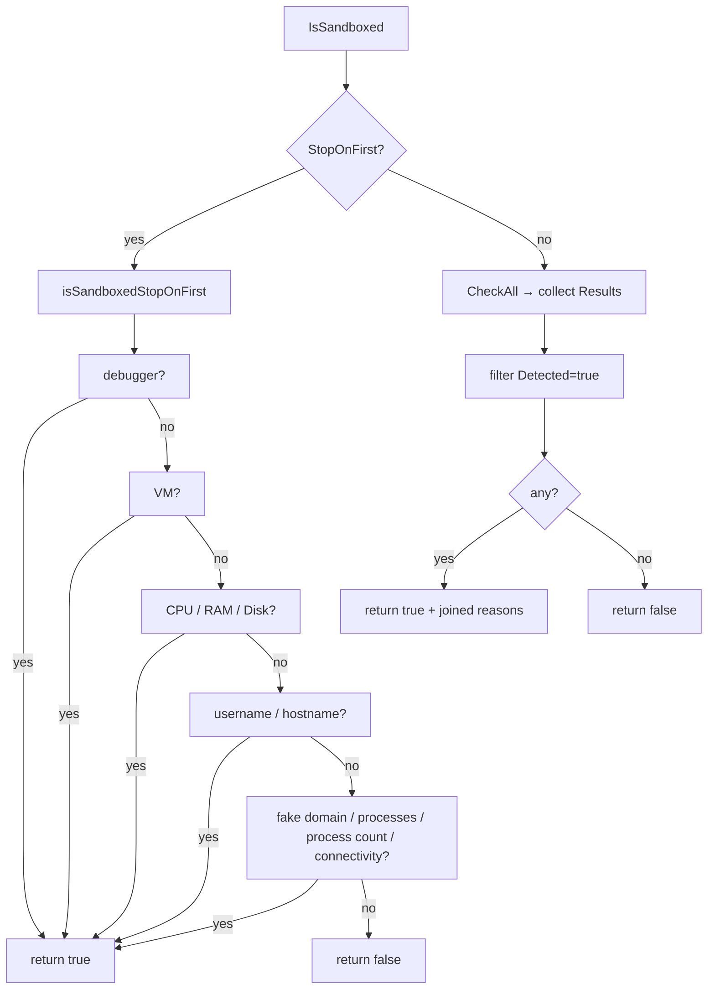

# Sandbox — Multi-Factor Environment Detection

[<- Back to Evasion](README.md)

**MITRE ATT&CK:** [T1497](https://attack.mitre.org/techniques/T1497/) — Virtualization/Sandbox Evasion
**Package:** `recon/sandbox`
**Platform:** Cross-platform (Windows and Linux)
**Detection:** Low

---

## Primer

Before AV vendors write a signature for your payload, they usually detonate it
in an automated **sandbox** — a throwaway VM that runs the sample, watches
what it does, and decides "malware" or "benign" within a few minutes. These
sandboxes leave fingerprints: small RAM, few CPU cores, artificial
usernames (`sandbox`, `malware`, `John Doe`), analysis tools running
(`procmon.exe`, `wireshark.exe`), fake DNS that answers every lookup with
`127.0.0.1`, and no real internet.

The `sandbox` package bundles a dozen of those indicators behind a single
`Checker.IsSandboxed(ctx)` call. You wire it into your implant's startup
path, and if enough indicators fire you exit cleanly (or sleep until the
analysis window closes). Analysts then see a sample that "does nothing",
the sandbox verdicts *benign*, and your real payload only runs on the
operator's actual target.

No single check is decisive — a developer laptop with 8 GB of RAM is not a
sandbox. The package reports **how many** indicators fired so you can tune
the threshold.

---

## What It Does

Aggregates multiple sandbox and analysis-environment indicators into a single
configurable `Checker`. Each check targets a different signal that sandboxes
and automated analysis platforms commonly exhibit: debugger presence, hypervisor
artifacts, low resource counts, analyst usernames, analysis-tool processes, fake
DNS interception, low process counts, and missing internet connectivity.

When one or more indicators fire, the caller knows it is likely running inside
an analysis environment and can take appropriate action (e.g., `os.Exit(0)`).

## How It Works

The package wraps four layers:

1. **Delegated checks** — `antidebug.IsDebuggerPresent()` and
   `antivm.IsRunningInVM()` are called directly; their logic lives in the
   respective packages.
2. **Resource checks** — CPU core count (`runtime.NumCPU`), total RAM
   (`GlobalMemoryStatusEx` on Windows, `/proc/meminfo` on Linux), and disk
   size (`GetDiskFreeSpaceExW` / `unix.Statfs`) are compared against
   configurable minimums.
3. **String checks** — the current username and hostname are compared
   case-insensitively against configurable blocklists.
4. **Network checks** — a "fake domain" HTTP GET detects sandbox DNS
   interception (sandboxes respond to any domain); a connectivity check
   to a real URL detects isolated/air-gapped environments.
5. **Process checks** — the running process list is scanned for known analysis
   tool names (Wireshark, x64dbg, IDA, etc.) and checked for a suspiciously low
   total count.

`IsSandboxed` has two modes:

- **StopOnFirst** (default): returns immediately on the first hit — fast and
  avoids leaving observable traces of scanning.
- **Full scan**: runs all checks and joins all detected reasons into one string.



## Configuration

```go
type Config struct {
    MinDiskGB       float64       // minimum disk size in GB (default: 64)
    MinRAMGB        float64       // minimum RAM in GB (default: 4)
    MinCPUCores     int           // minimum CPU cores (default: 2)
    BadUsernames    []string      // analyst usernames to detect
    BadHostnames    []string      // sandbox hostnames to detect
    BadProcesses    []string      // analysis tool process names
    FakeDomain      string        // domain that should NOT respond (sandbox DNS check)
    DiskPath        string        // volume to check (default: C:\ / /)
    MinProcesses    int           // minimum process count (default: 15)
    ConnectivityURL string        // real URL to probe (default: https://www.google.com)
    RequestTimeout  time.Duration // HTTP timeout (default: 5s)
    EvasionTimeout  time.Duration // duration for BusyWait
    StopOnFirst     bool          // stop at first detection (default: true)
}
```

`DefaultConfig()` ships with the following blocklists:

| List | Values |
|---|---|
| BadUsernames | sandbox, malware, virus, test, analysis, maltest, currentuser, user, analyst |
| BadHostnames | sandbox, malware, virus, cuckoo, anubis, joe, triage, any.run |
| BadProcesses | wireshark, procmon, procexp, x64dbg, x32dbg, ollydbg, ida, ida64, idaq, idaq64, fiddler, httpdebugger, burpsuite, processhacker, tcpview, autoruns, pestudio, dnspy, ghidra |

## Checks

| Check name | Method | What it detects |
|---|---|---|
| `debugger` | `IsDebuggerPresent()` | debugger attached (PEB flag + NtQueryInformationProcess) |
| `vm` | `IsRunningInVM()` | hypervisor CPUID, registry keys, device names |
| `cpu` | `HasEnoughCPU()` | fewer CPU cores than `MinCPUCores` |
| `ram` | `HasEnoughRAM()` | less RAM than `MinRAMGB` |
| `disk` | `HasEnoughDisk()` | disk smaller than `MinDiskGB` |
| `username` | `BadUsername()` | current username matches blocklist |
| `hostname` | `BadHostname()` | hostname matches blocklist |
| `domain` | `FakeDomainReachable()` | configured `FakeDomain` responds (sandbox DNS intercept) |
| `process` | `CheckProcesses()` | known analysis tool is running |
| `process_count` | `CheckProcessCount()` | fewer than `MinProcesses` processes (fresh VM) |
| `connectivity` | `CheckConnectivity()` | internet not reachable (isolated sandbox) |

## API

```go
// DefaultConfig returns sensible defaults for sandbox detection.
func DefaultConfig() Config

// New returns a Checker configured with cfg.
func New(cfg Config) *Checker

// IsSandboxed runs all configured checks. Returns (true, reason, nil) if any
// indicator fires. With StopOnFirst=true (default) it returns on the first hit.
func (c *Checker) IsSandboxed(ctx context.Context) (bool, string, error)

// CheckAll runs every detection check and returns one Result per check.
func (c *Checker) CheckAll(ctx context.Context) []Result

// BusyWait runs a CPU-burning wait for EvasionTimeout without calling Sleep.
func (c *Checker) BusyWait()

// Individual check methods (all exported):
func (c *Checker) IsDebuggerPresent() bool
func (c *Checker) IsRunningInVM() bool
func (c *Checker) HasEnoughCPU() bool
func (c *Checker) HasEnoughRAM() (bool, error)
func (c *Checker) HasEnoughDisk() (bool, error)
func (c *Checker) BadUsername() (bool, string, error)
func (c *Checker) BadHostname() (bool, string, error)
func (c *Checker) FakeDomainReachable(ctx context.Context) (bool, int, error)
func (c *Checker) CheckProcesses(ctx context.Context) (bool, string, error)
func (c *Checker) CheckProcessCount(ctx context.Context) (bool, string, error)
func (c *Checker) CheckConnectivity(ctx context.Context) (bool, string, error)
```

`Result` carries the outcome of a single check:

```go
type Result struct {
    Name     string // "debugger", "vm", "cpu", "ram", "disk", ...
    Detected bool
    Detail   string // human-readable description
    Err      error  // non-nil if the check itself failed
}
```

## Usage

### Quick check — bail on first indicator

```go
import (
    "context"
    "os"

    "github.com/oioio-space/maldev/recon/sandbox"
)

checker := sandbox.New(sandbox.DefaultConfig())
if sandboxed, reason, _ := checker.IsSandboxed(context.Background()); sandboxed {
    // silently exit — do not reveal the payload
    os.Exit(0)
}
```

### Custom config — tighter thresholds, add fake domain

```go
cfg := sandbox.DefaultConfig()
cfg.MinRAMGB    = 8
cfg.MinDiskGB   = 128
cfg.MinCPUCores = 4
cfg.FakeDomain  = "http://definitelynotarealdomainforsandboxcheck.xyz"
cfg.StopOnFirst = true

checker := sandbox.New(cfg)
if sandboxed, reason, _ := checker.IsSandboxed(context.Background()); sandboxed {
    os.Exit(0)
}
```

### Detailed results — log each check

```go
cfg := sandbox.DefaultConfig()
cfg.StopOnFirst = false

checker := sandbox.New(cfg)
results := checker.CheckAll(context.Background())
for _, r := range results {
    if r.Err != nil {
        log.Printf("[%s] check error: %v", r.Name, r.Err)
        continue
    }
    status := "clean"
    if r.Detected {
        status = "DETECTED"
    }
    log.Printf("[%s] %s — %s", r.Name, status, r.Detail)
}
```

### Combined with timing evasion

```go
cfg := sandbox.DefaultConfig()
cfg.EvasionTimeout = 10 * time.Second

checker := sandbox.New(cfg)
// Burn CPU for 10s first — defeats sandboxes that skip Sleep() calls
checker.BusyWait()
// Then check for remaining indicators
if sandboxed, _, _ := checker.IsSandboxed(context.Background()); sandboxed {
    os.Exit(0)
}
```

## Advantages & Limitations

| Aspect | Notes |
|---|---|
| Cross-platform | Works on Windows and Linux (per-OS implementations behind build tags) |
| Composable | Individual check methods can be used without the Checker |
| Low observable footprint | Checks are passive reads; no process injection or registry writes |
| Fake domain check | Requires caller to supply a domain name that should never resolve in prod |
| Username / hostname lists | Only catches known sandboxes; custom or one-off VMs evade string checks |
| No kernel checks | Does not inspect kernel objects; EDR agents in the kernel are not detectable |
| Connectivity check | May false-positive in legitimate air-gapped deployments |

## MITRE ATT&CK

| Technique | ID |
|---|---|
| Virtualization/Sandbox Evasion | [T1497](https://attack.mitre.org/techniques/T1497/) |
| Virtualization/Sandbox Evasion: System Checks | [T1497.001](https://attack.mitre.org/techniques/T1497/001/) |
| Virtualization/Sandbox Evasion: User Activity Based Checks | [T1497.002](https://attack.mitre.org/techniques/T1497/002/) |
| Virtualization/Sandbox Evasion: Time Based Evasion | [T1497.003](https://attack.mitre.org/techniques/T1497/003/) |

## Detection

**Low** — Individual checks are indistinguishable from normal application
behaviour (reading hostname, listing processes, making HTTP requests). Automated
analysis platforms typically look for known anti-analysis strings and API
sequences, not the combination of mundane syscalls that this package uses.

A sophisticated sandbox that populates realistic usernames, hostnames, process
lists, and resource counts will defeat the string/threshold checks. The
`antivm` and `antidebug` sub-checks have higher signal individually, but are
already accounted for in most sandbox profiles.
