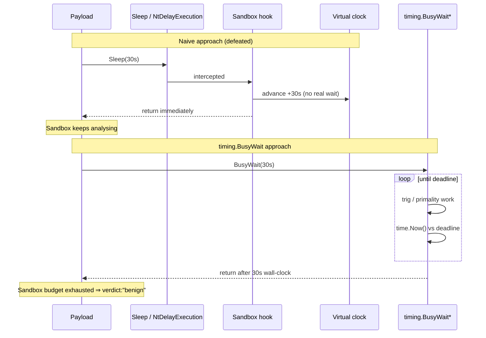

# Timing — CPU-Burning Sandbox Evasion

[<- Back to Evasion](README.md)

**MITRE ATT&CK:** [T1497.003](https://attack.mitre.org/techniques/T1497/003/) — Virtualization/Sandbox Evasion: Time Based Evasion
**Package:** `evasion/timing`
**Platform:** Cross-platform
**Detection:** Low

---

## Primer

Automated malware sandboxes have a budget: they can only run each sample for
a few minutes before moving on to the next one. Malware authors exploit
this by adding a long `Sleep(10 * time.Minute)` at startup — by the time
the sleep ends, the sandbox has already given up.

Sandbox engineers responded by **hooking `Sleep` / `NtDelayExecution`** so
that calls either return immediately or fast-forward an internal clock.
The sample thinks it slept 10 minutes; in reality the CPU only ran for a
few seconds.

The `evasion/timing` package defeats the fast-forward by **never calling
`Sleep` at all**. Instead it spins on real CPU work — an arithmetic or
primality loop — that still needs its full wall-clock duration to
complete, because a sandbox that fast-forwards the clock does not speed up
the CPU. The downside is obvious: a core pinned at 100%, visible in any
process monitor. That's the trade.

---

## What It Does

Provides CPU-burning delay functions that defeat sandbox analysis systems which
accelerate or outright skip `Sleep()` / `NtDelayExecution()` calls. Instead of
sleeping, the functions consume real wall-clock time by performing actual
computation — the sandbox cannot fast-forward the delay without also
fast-forwarding the CPU work.

## How It Works



Automated sandboxes hook `NtDelayExecution` (the kernel path for all
`Sleep`-family calls) and either return immediately or advance a virtual clock.
A payload that calls `Sleep(30s)` will appear to pause but the sandbox skips
ahead, running the rest of the code within seconds.

The solution is to never call `Sleep`. Instead, spin the CPU on work that
produces a result dependent on real elapsed time:

- **`BusyWait`** — tight loop comparing `time.Now()` against a deadline.
  Minimal CPU work, maximum timer fidelity.
- **`BusyWaitTrig`** — tight loop running `math.Sin`/`math.Cos` accumulations
  for the specified duration. The floating-point workload resembles legitimate
  scientific code; the result is written to a package-level `busySink` to
  prevent dead-code elimination.
- **`BusyWaitPrimality` / `BusyWaitPrimalityN`** — trial-division primality
  test over a configurable number of integers. Work-bound rather than
  time-bound, so the duration scales with hardware speed but the amount of
  computation is predictable.

None of these functions call any sleep-family API, so a hooked
`NtDelayExecution` has no effect on them.

## API

```go
// BusyWait burns CPU for the specified duration without calling Sleep.
// Defeats sandbox hooks on NtDelayExecution/Sleep that fast-forward time.
func BusyWait(d time.Duration)

// BusyWaitTrig burns CPU for the specified duration using trigonometric
// computations (sin/cos). Harder to fingerprint than a bare spin loop.
func BusyWaitTrig(d time.Duration)

// BusyWaitPrimality burns CPU using primality testing.
// Tests ~500,000 numbers — approximately 200ms on modern hardware.
func BusyWaitPrimality()

// BusyWaitPrimalityN is like BusyWaitPrimality but with a configurable
// iteration count. Higher values burn more CPU time.
func BusyWaitPrimalityN(iterations int)
```

## Method Comparison

| Method | Bound by | Workload | Duration predictability | Fingerprint risk |
|---|---|---|---|---|
| `BusyWait` | wall clock | empty loop | exact | medium (empty loop is recognisable) |
| `BusyWaitTrig` | wall clock | sin/cos FP math | exact | low (resembles scientific code) |
| `BusyWaitPrimality` | iterations | trial division | hardware-dependent | low (looks like crypto/math) |
| `BusyWaitPrimalityN` | iterations | trial division | hardware-dependent | low |

**When to choose which:**

- Use `BusyWait` when you need an exact delay and simplicity is acceptable.
- Use `BusyWaitTrig` when the workload should blend in with numeric computation
  and an exact duration is required.
- Use `BusyWaitPrimality` / `BusyWaitPrimalityN` when you want a fixed amount
  of computation rather than a fixed time, or when you want the delay to be
  less predictable across different hardware.

## Usage

### Simple delay (replace Sleep)

```go
import (
    "time"
    "github.com/oioio-space/maldev/evasion/timing"
)

// Wait 30 seconds without calling Sleep
timing.BusyWait(30 * time.Second)
```

### Trig-based delay (lower fingerprint)

```go
// Same duration, different workload pattern
timing.BusyWaitTrig(30 * time.Second)
```

### Work-based delay (fixed computation)

```go
// Default: test ~500,000 numbers for primality (~200ms on modern hardware)
timing.BusyWaitPrimality()

// Custom: more work = longer delay
timing.BusyWaitPrimalityN(5_000_000) // ~2s on modern hardware
```

### Combined with sandbox detection

The `evasion/sandbox` package exposes `BusyWait` through `Checker.BusyWait()`,
which uses `EvasionTimeout` from the config:

```go
import (
    "context"
    "os"
    "time"
    "github.com/oioio-space/maldev/evasion/sandbox"
)

cfg := sandbox.DefaultConfig()
cfg.EvasionTimeout = 30 * time.Second

checker := sandbox.New(cfg)
// Burn CPU first — sandbox cannot skip this
checker.BusyWait()
// Then run the full indicator check
if sandboxed, _, _ := checker.IsSandboxed(context.Background()); sandboxed {
    os.Exit(0)
}
```

Or call the timing package directly before any sensitive operation:

```go
import (
    "time"
    "github.com/oioio-space/maldev/evasion/timing"
)

// Stage 1: defeat time-skip sandbox analysis
timing.BusyWaitTrig(20 * time.Second)

// Stage 2: proceed with payload
runPayload()
```

## Advantages & Limitations

| Aspect | Notes |
|---|---|
| Defeats NtDelayExecution hooks | No Sleep call is made, so hook-based time acceleration has no effect |
| Cross-platform | Pure Go; no OS-specific APIs |
| Simple API | Four functions, no configuration struct |
| High CPU load | 100% core usage for the duration — visible in process monitors |
| Not a complete sandbox bypass | Sandboxes with hardware performance counters or cycle-count checks may still detect artificial burns |
| `BusyWait` empty loop | Compiler may optimise an empty loop; tested in Go where `time.Now()` prevents elimination |
| Primality duration varies | `BusyWaitPrimalityN` duration scales inversely with CPU speed — calibrate `iterations` for your target environment |

## MITRE ATT&CK

| Technique | ID |
|---|---|
| Virtualization/Sandbox Evasion: Time Based Evasion | [T1497.003](https://attack.mitre.org/techniques/T1497/003/) |

## Detection

**Low** — A CPU core pinned at 100% for tens of seconds before any
network/file activity is unusual for most benign applications but is not
actionable on its own. There is no hooking, injection, or privileged API call
involved. The `busySink` variable ensures the compiler does not eliminate the
`BusyWaitTrig` loop; however, static analysis of the binary would reveal the
pattern. Dynamic analysis sandboxes that measure instruction counts or cycle
budgets rather than wall time are not defeated by this technique.
