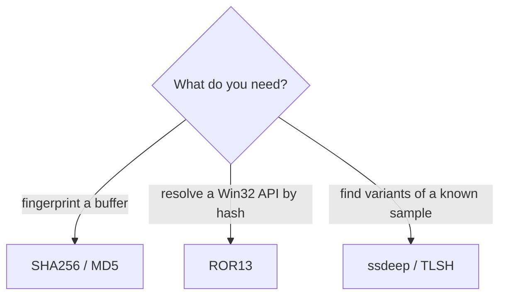

# Hash techniques

[← maldev README](../../../README.md) · [docs/index](../../index.md)

The `hash/` package supplies three families of hashing primitives:
**cryptographic** (MD5, SHA-1, SHA-256, SHA-512) for integrity and
identifiers, **API hashing** (ROR13 + ROR13Module) for shellcode-style
plaintext-free function resolution, and **fuzzy hashing** (ssdeep, TLSH)
for variant detection and similarity scoring.

## TL;DR

## Packages

| Package | Tech page | Detection | One-liner |
|---|---|---|---|
| [`hash`](../../../hash) | [cryptographic-hashes.md](cryptographic-hashes.md) · [fuzzy-hashing.md](fuzzy-hashing.md) | very-quiet | MD5/SHA-* (integrity), ROR13 (API hashing), ssdeep + TLSH (similarity) |

## Quick decision tree

| You want to… | Use |
|---|---|
| …identify a payload by content | [`hash.SHA256`](cryptographic-hashes.md#sha256data-byte-string) |
| …compute a Windows API name hash for a shellcode resolver | [`hash.ROR13`](cryptographic-hashes.md#ror13name-string-uint32) |
| …compute a module-name hash matching PEB-walk shellcode | [`hash.ROR13Module`](cryptographic-hashes.md#ror13modulename-string-uint32) |
| …score similarity between two samples (variant detection) | [`hash.SsdeepCompare`](fuzzy-hashing.md#ssdeepcomparehash1-hash2-string-int-error) or [`hash.TLSHCompare`](fuzzy-hashing.md#tlshcomparehash1-hash2-string-int-error) |
| …screen a directory of suspicious binaries against a known-bad seed | see [Advanced example](fuzzy-hashing.md#advanced-batch-similarity-scan) |

## MITRE ATT&CK

The hash package itself is utility. It is referenced from techniques
that consume it:

| Used by | Why |
|---|---|
| [`win/api.ResolveByHash`](../syscalls/api-hashing.md) | Plaintext-free Win32 API resolution (T1027.007) |
| Researcher / hunter workflows | Variant detection, signature defeat measurement |
| [`pe/morph`](../pe/morph.md) | Build-time fingerprint shifting; pair with fuzzy hashing to verify the morph kept the family intact |

## See also

- [API hashing](../syscalls/api-hashing.md) — dedicated tech page on the
  shellcode-style ROR13 use case.
- [`crypto`](../crypto/README.md) — confidentiality layer (`hash` is
  often used to derive integrity checks alongside).
- [Researcher path: fuzzy hashing for variant tracking](../../by-role/researcher.md)
