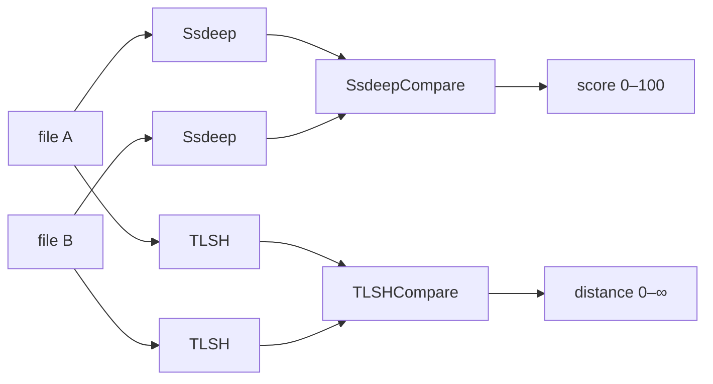

# Fuzzy hashing (ssdeep + TLSH)

[← hash index](README.md) · [docs/index](../../index.md)

## TL;DR

Two locality-sensitive hashes — ssdeep (context-triggered piecewise) and
TLSH (Trend Locality-Sensitive Hash) — that produce **similar outputs
for similar inputs**. Use to detect variants of a known sample after
small mutations (UPX section rename, packer entropy padding, single-byte
patches) that defeat traditional cryptographic hashes.

## Primer

A traditional hash like SHA-256 changes completely when a single byte
flips. That's by design: the slightest tamper must invalidate the
fingerprint. The downside is that any morph — even a cosmetic one —
makes a known-bad hash useless.

Fuzzy hashes give up exact-match in exchange for proximity. Two ssdeep
hashes can be compared to a similarity score in $[0, 100]$; two TLSH
hashes give a distance in $[0, \infty)$ where lower means more similar.
Defenders use them for variant tracking and clustering; offensive teams
use them to **measure** signature evasion (does my morph defeat fuzzy
hashing too, or only SHA-256?).

The package wraps the
[`glaslos/ssdeep`](https://github.com/glaslos/ssdeep) and
[`glaslos/tlsh`](https://github.com/glaslos/tlsh) pure-Go libraries
behind an idiomatic API.

## How it works



ssdeep slices the input on context-triggered boundaries (rolling hash
hits a threshold), then hashes each slice. Two files with identical
slice sequences score 100; files with only some slices in common score
proportionally.

TLSH builds a histogram of overlapping 5-byte windows, quantises it,
and emits a fixed 70-byte hex string. Distance is roughly Hamming over
the quantised histogram.

**Minimum input sizes:**

- ssdeep — works on any input, but very short inputs produce
  unreliable hashes.
- TLSH — 50 bytes minimum (library enforced); 256+ bytes recommended
  for stable distance.

## API Reference

### `Ssdeep(data []byte) (string, error)`

[godoc](https://pkg.go.dev/github.com/oioio-space/maldev/hash#Ssdeep)

Compute the ssdeep hash of a buffer. Returns a string of the form
`12:abcd...:efgh...` where the leading number is the block-size
magnitude.

### `SsdeepFile(path string) (string, error)`

[godoc](https://pkg.go.dev/github.com/oioio-space/maldev/hash#SsdeepFile)

Same as `Ssdeep` but reads from disk.

### `SsdeepCompare(hash1, hash2 string) (int, error)`

[godoc](https://pkg.go.dev/github.com/oioio-space/maldev/hash#SsdeepCompare)

Compare two ssdeep hashes. Returns a similarity score in $[0, 100]$
(higher = more similar) or `error` if the hashes have non-adjacent
block-size magnitudes (incomparable).

### `TLSH(data []byte) (string, error)`

[godoc](https://pkg.go.dev/github.com/oioio-space/maldev/hash#TLSH)

Compute the TLSH hash of a buffer. Returns a 70-character hex string.
Errors if `len(data) < 50`.

### `TLSHFile(path string) (string, error)`

[godoc](https://pkg.go.dev/github.com/oioio-space/maldev/hash#TLSHFile)

Same as `TLSH` but reads from disk.

### `TLSHCompare(hash1, hash2 string) (int, error)`

[godoc](https://pkg.go.dev/github.com/oioio-space/maldev/hash#TLSHCompare)

Compare two TLSH hashes. Returns a distance in $[0, \infty)$ — lower
means more similar.

Rough scale: $<30$ very close, $<70$ same family, $>200$ unrelated.

## Examples

### Simple

```go
s, _ := hash.Ssdeep(payload)
t, _ := hash.TLSH(payload)
fmt.Println(s, t)
```

### Composed (compare two payloads)

```go
s1, _ := hash.SsdeepFile("payload_v1.exe")
s2, _ := hash.SsdeepFile("payload_v2.exe")
score, _ := hash.SsdeepCompare(s1, s2)
fmt.Printf("ssdeep score: %d/100\n", score)

t1, _ := hash.TLSHFile("payload_v1.exe")
t2, _ := hash.TLSHFile("payload_v2.exe")
dist, _ := hash.TLSHCompare(t1, t2)
fmt.Printf("tlsh distance: %d\n", dist)
```

### Advanced (batch similarity scan)

Screen a directory of candidates against a known-malicious baseline.
Files that score $\ge 70$ on ssdeep or $\le 100$ on TLSH are likely
variants of the same family.

```go
import (
    "fmt"
    "io/fs"
    "path/filepath"

    "github.com/oioio-space/maldev/hash"
)

func scanVariants(baseline, dir string, ssdeepThreshold, tlshMax int) error {
    bSS, _ := hash.SsdeepFile(baseline)
    bTL, _ := hash.TLSHFile(baseline)

    return filepath.WalkDir(dir, func(path string, d fs.DirEntry, err error) error {
        if err != nil || d.IsDir() {
            return err
        }
        ss, _ := hash.SsdeepFile(path)
        tl, _ := hash.TLSHFile(path)
        score, _ := hash.SsdeepCompare(bSS, ss)
        dist, _  := hash.TLSHCompare(bTL, tl)

        if score >= ssdeepThreshold || (dist >= 0 && dist <= tlshMax) {
            fmt.Printf("variant ssdeep=%d tlsh=%d %s\n", score, dist, path)
        }
        return nil
    })
}
```

### Complex (UPXMorph vs SHA-256 vs fuzzy hashing)

The core demonstration of why fuzzy hashing exists. `pe/morph.UPXMorph`
replaces the eight-byte UPX section names (`UPX0`, `UPX1`, `UPX2`) with
random strings. That tiny change flips the SHA-256 — the blocklist
entry for the original hash is now useless. But 24 bytes out of
hundreds of kilobytes is nothing structurally: ssdeep and TLSH see
essentially the same binary and report high similarity.

```go
import (
    "fmt"
    "os"

    "github.com/oioio-space/maldev/hash"
    "github.com/oioio-space/maldev/pe/morph"
)

func main() {
    packed, err := os.ReadFile("implant-upx.exe")
    if err != nil { panic(err) }

    sha256Before := hash.SHA256(packed)
    ssBefore, _  := hash.Ssdeep(packed)
    tlBefore, _  := hash.TLSH(packed)

    morphed, err := morph.UPXMorph(packed)
    if err != nil { panic(err) }

    sha256After := hash.SHA256(morphed)
    ssAfter, _  := hash.Ssdeep(morphed)
    tlAfter, _  := hash.TLSH(morphed)

    ssScore, _ := hash.SsdeepCompare(ssBefore, ssAfter)
    tlDist, _  := hash.TLSHCompare(tlBefore, tlAfter)

    fmt.Println("SHA-256 same?:", sha256Before == sha256After)
    fmt.Printf("ssdeep score: %d / 100\n", ssScore)
    fmt.Printf("TLSH distance: %d\n", tlDist)
}
```

Typical output for a UPX-morphed binary:

```
SHA-256 same?:  false                        ← blocklist miss
ssdeep score:   97 / 100                     ← variant detected
TLSH distance:  12                           ← negligible neighbourhood change
```

A defender relying solely on SHA-256 is blind to the morphed copy. A
defender running ssdeep/TLSH catches it immediately.

## OPSEC & Detection

Fuzzy hashing is primarily a defender tool — the offensive use case is
**measuring** evasion, not performing it. Still:

| Artefact | Where defenders look |
|---|---|
| ssdeep score $\ge 70$ vs known-bad seed | VirusTotal "Similar Files" tab, Cuckoo signatures, MISP `ssdeep` events |
| TLSH distance $\le 100$ vs known-bad seed | Trend Micro telemetry, MITRE TLSH-based clustering |

**D3FEND counter:**
[D3-SEA — Static Executable Analysis](https://d3fend.mitre.org/technique/d3f:StaticExecutableAnalysis/)
covers fuzzy-hash-based clustering.

**Operator implication:** if your morph reduces the SHA-256 match but
leaves ssdeep/TLSH high, you've broken signature-based detection but
not similarity-based detection. Layer with structural mutation
(`pe/morph` + section rebuild + obfuscated control flow) until both
metrics fall.

## MITRE ATT&CK

| T-ID | Name | Sub-coverage | D3FEND counter |
|---|---|---|---|
| [T1027](https://attack.mitre.org/techniques/T1027/) | Obfuscated Files or Information | analysis tooling — measures, doesn't perform | D3-SEA |

(The hashes themselves don't perform a technique; they're used to
**evaluate** how thoroughly a morph or packer defeats clustering.)

## Limitations

- **ssdeep block-size mismatch.** Hashes with non-adjacent block-size
  magnitudes are incomparable — `SsdeepCompare` returns an error. This
  is a fundamental property of CTPH, not a bug.
- **TLSH minimum size.** 50 bytes is library-enforced. Shorter inputs
  return an error. 256+ bytes recommended for stable distance.
- **Pure-Go performance.** Both libraries are pure Go. Native
  ssdeep/TLSH C implementations are 3–5× faster on large datasets — if
  scanning thousands of files, batch them and parallelise via
  `errgroup`.
- **Defender bias.** These hashes were designed by defenders, for
  defenders. Their offensive value is purely diagnostic.

## See also

- [`cryptographic-hashes.md`](cryptographic-hashes.md) — the
  exact-match counterparts (MD5/SHA-*).
- [`pe/morph`](../pe/morph.md) — the canonical mutation tool whose
  effect is best measured against fuzzy hashes.
- [Roussev, *Data Fingerprinting with Similarity Digests*](https://www.sciencedirect.com/science/article/abs/pii/S1742287610000368)
  — academic primer on CTPH (the algorithm behind ssdeep).
- [Oliver, Cheng, Chen, *TLSH — A Locality Sensitive Hash*](https://github.com/trendmicro/tlsh/blob/master/TLSH_paper_4page.pdf)
  — TLSH algorithm paper.
