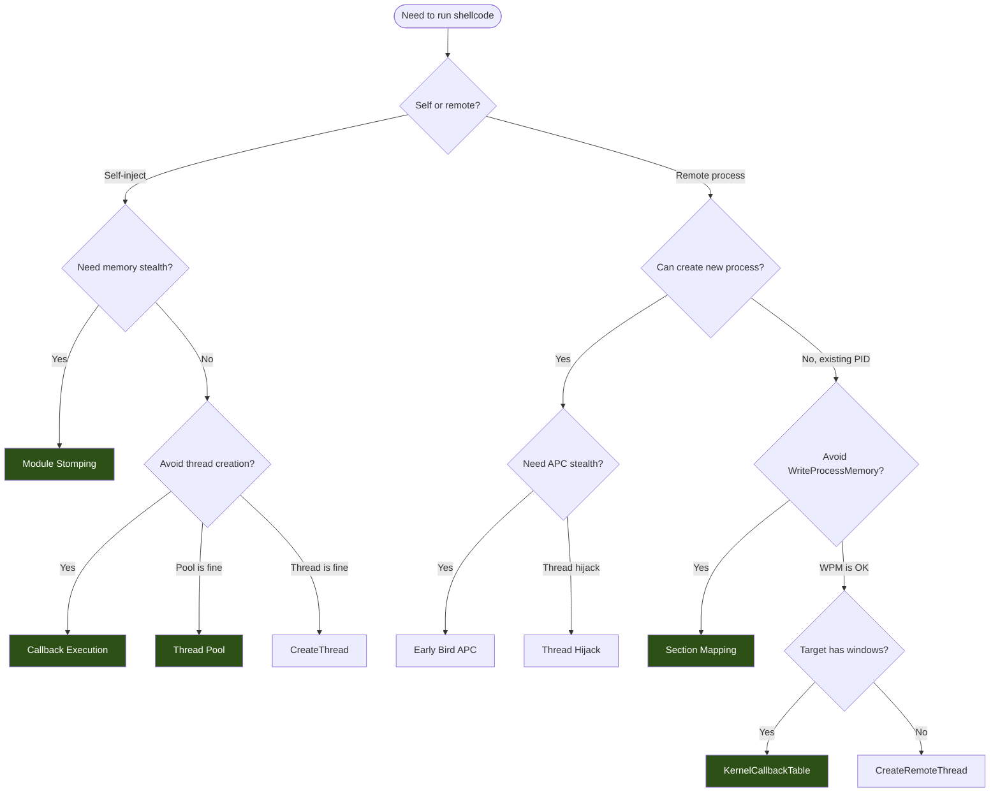

# Injection Techniques Overview

> **MITRE ATT&CK:** T1055 -- Process Injection | **Detection:** High -- all injection methods are monitored by EDR products

## What Is Process Injection?

Process injection is a family of techniques that place executable code (shellcode) into another process's memory and trigger its execution. This allows malware to run inside a trusted process, inheriting its identity, permissions, and trust level. Security tools watching for suspicious new processes see nothing unusual -- the code runs inside an already-running, legitimate application.

maldev provides a unified `inject` package with 15 injection methods across Windows and Linux, a fluent builder API, middleware decorators for evasion, and automatic fallback support.

## Technique Comparison

| Technique | Method Constant | Target | Creates Thread? | Uses WriteProcessMemory? | Stealth | Complexity |
|-----------|----------------|--------|-----------------|--------------------------|---------|------------|
| [CreateRemoteThread](create-remote-thread.md) | `MethodCreateRemoteThread` | Remote | Yes | Yes | Low | Low |
| [Early Bird APC](early-bird-apc.md) | `MethodEarlyBirdAPC` | Child (suspended) | No (APC) | Yes | Medium | Medium |
| [Module Stomping](module-stomping.md) | `ModuleStomp()` | Local | Caller decides | No | High | Medium |
| [Section Mapping](section-mapping.md) | `SectionMapInject()` | Remote | Yes | No | High | High |
| [Callback Execution](callback-execution.md) | `ExecuteCallback()` | Local | No | No | High | Low |
| [Thread Pool](thread-pool.md) | `ThreadPoolExec()` | Local | No (pool) | No | High | Medium |
| [KernelCallbackTable](kernel-callback-table.md) | `KernelCallbackExec()` | Remote | No | Yes | High | High |
| [Phantom DLL](phantom-dll.md) | `PhantomDLLInject()` | Remote | No (caller) | Yes | Very High | High |
| [Thread Hijack](thread-hijack.md) | `MethodThreadHijack` | Child (suspended) | No | Yes | Medium | Medium |
| [Argument Spoofing](process-arg-spoofing.md) | `SpawnWithSpoofedArgs()` | Child (suspended) | No | Yes | Medium | Medium |

## Decision Flow



## Architecture

All injection methods implement the `Injector` interface:

```go
type Injector interface {
    Inject(shellcode []byte) error
}
```

The builder API provides fluent construction with syscall method selection:

```go
injector, err := inject.Build().
    Method(inject.MethodEarlyBirdAPC).
    ProcessPath(`C:\Windows\System32\svchost.exe`).
    IndirectSyscalls().
    Use(inject.WithCPUDelayConfig(inject.CPUDelayConfig{MaxIterations: 10_000_000})).
    Create()
```

The Pipeline pattern separates memory setup from execution, allowing mix-and-match:

```go
p := inject.NewPipeline(
    inject.RemoteMemory(hProcess, caller),
    inject.CreateRemoteThreadExecutor(hProcess, caller),
)
err := p.Inject(shellcode)
```

## Syscall Methods

Every injection method supports four syscall routing modes via `WindowsConfig.SyscallMethod`:

| Mode | Constant | Hooks Bypassed | Use When |
|------|----------|---------------|----------|
| WinAPI | `wsyscall.MethodWinAPI` | None | Testing, no EDR |
| Native API | `wsyscall.MethodNativeAPI` | kernel32 | Light EDR |
| Direct Syscall | `wsyscall.MethodDirect` | All userland | Medium EDR |
| Indirect Syscall | `wsyscall.MethodIndirect` | All userland + CFG | Heavy EDR |
