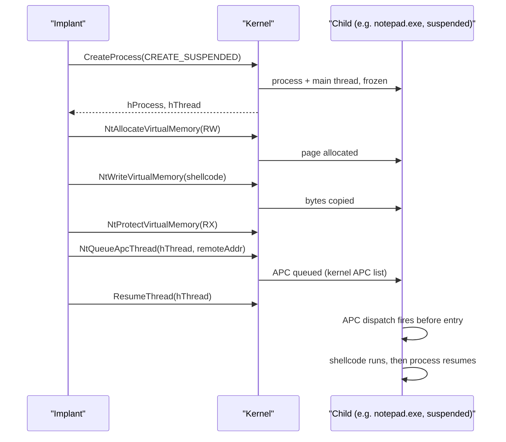

# Early Bird APC injection

[← injection index](README.md) · [docs/index](../../index.md)

> **New to maldev injection?** Read the [injection/README.md
> vocabulary callout](README.md#primer--vocabulary) first.

## TL;DR

Spawn a sacrificial child in `CREATE_SUSPENDED` state, allocate +
write + protect the shellcode in its address space, queue an APC on
its main thread, then `ResumeThread`. The APC fires before the
process entry point — no `CreateRemoteThread` event, no extra
thread, predictable timing. Stealth tier: medium.

| Trait | Value |
|---|---|
| **Target class** | Child (suspended) |
| **Creates a new thread?** | No — uses the suspended child's main thread + APC |
| **Uses `WriteProcessMemory`?** | Yes (`NtWriteVirtualMemory`) |
| **Stealth tier** | Medium — no `Create*Thread` event; `QueueUserAPC` itself is observable |
| **Bypasses CreateThread callbacks?** | Yes — `PsSetCreateThreadNotifyRoutine` doesn't fire (the thread already existed in suspended state) |

When to pick a different method:

- Want to redirect the suspended thread without APC? → [Thread Hijack](thread-hijack.md) — same setup, mutates `RIP` via `NtSetContextThread` instead.
- Need to inject into a process you can't spawn? → [CreateRemoteThread](create-remote-thread.md), [Section Mapping](section-mapping.md), [Kernel Callback Table](kernel-callback-table.md).
- Want the spawn itself to look like another process? → Pair with [Process Arg Spoofing](process-arg-spoofing.md) on the `CREATE_SUSPENDED` step.

## Primer

The classic CreateRemoteThread path is loud because the kernel emits a
thread-creation event the moment the new thread starts. Early Bird APC
sidesteps that by **reusing** the main thread of a freshly-spawned,
suspended child process. The thread already exists (the kernel created
it as part of `CreateProcess`); the implant queues an asynchronous
procedure call (APC) on it that points at the shellcode, then resumes
it. The kernel dispatches APCs as part of the thread's first
user-mode instructions, so the shellcode runs **before any of the
target process's own initialisation** — including CRT, before
`DllMain`, before `mainCRTStartup`.

The technique is a known pattern (FireEye, *FireEye Stories — Early Bird
Code Injection*, 2018). EDR products correlate `CREATE_SUSPENDED` ↔
`NtQueueApcThread` ↔ `ResumeThread` and flag the chain. It still
performs better than CRT against signature-based products and basic
ETW-Ti consumers because no `Create*Thread*` API is invoked at all.

## How it works



Steps:

1. **Spawn** the sacrificial child with `CREATE_SUSPENDED` (default
   `notepad.exe`; pass `ProcessPath` to override).
2. **Allocate / write / protect** in the child as for CRT.
3. **Queue APC** on the main thread via `NtQueueApcThread`. The kernel
   inserts the routine pointer into the thread's user-mode APC queue.
4. **Resume** the main thread. The kernel pops the APC before
   delivering control to the original entry point.

## API Reference

This injection mode plugs into the unified `inject.WindowsConfig` /
`inject.Builder` framework — the technique itself has no top-level
helper. Drive it via the standard `Injector` paths.

### `const inject.MethodEarlyBirdAPC Method = "earlybird"`

[godoc](https://pkg.go.dev/github.com/oioio-space/maldev/inject#MethodEarlyBirdAPC)

Selects the Early Bird APC technique. Pass to `Config.Method` or
`InjectorBuilder.Method`.

**Required `WindowsConfig` fields:** `ProcessPath` (sacrificial child;
default `C:\Windows\System32\notepad.exe`). `PID` is **not** used —
this is a child-process technique that spawns its own target
suspended.

**Pairs with:** `WithFallback()` chains to `MethodThreadHijack` on
failure (see `inject/fallback.go:24`).

**OPSEC:** spawning notepad.exe with no parent terminal is a
high-fidelity Sysmon Event 1 trigger. Choose a process-tree-blending
parent (`svchost.exe`, `RuntimeBroker.exe`, `WerFault.exe`) and pair
with PPID spoofing.

**Required privileges:** unprivileged for same-user spawn.

**Platform:** Windows. Stub returns "not implemented".

### `WindowsConfig.ProcessPath string`

[godoc](https://pkg.go.dev/github.com/oioio-space/maldev/inject#Config)

Absolute path to the sacrificial executable spawned suspended. Empty
defaults to `C:\Windows\System32\notepad.exe`. Choose a binary that
blends into the target's process tree.

**OPSEC:** the parent process and image-name pair are the most
visible signals — a lone notepad.exe child of a non-explorer parent
is anomalous. Pair this field with the `c2/shell` PPID-spoofing path
when stealth matters.

**Required privileges:** read on `ProcessPath`.

**Platform:** Windows.

### `inject.NewWindowsInjector(cfg *WindowsConfig) (Injector, error)`

[godoc](https://pkg.go.dev/github.com/oioio-space/maldev/inject#NewWindowsInjector)

Standard Injector constructor — same shape as every other Windows
method. Returns an `Injector` whose `.Inject(shellcode)` runs the
Early Bird APC chain (spawn suspended → allocate RW → write →
`NtQueueApcThread` → `NtAlertResumeThread`).

**Returns:** `Injector` interface; error from `cfg` validation.

**Side effects:** none until `.Inject` runs.

**OPSEC:** as the Method constant.

**Required privileges:** unprivileged.

**Platform:** Windows.

### `inject.Builder` pattern

```go
inj, err := inject.Build().
    Method(inject.MethodEarlyBirdAPC).
    ProcessPath(`C:\Windows\System32\svchost.exe`).
    IndirectSyscalls().
    Create()
```

`IndirectSyscalls()` configures the underlying `wsyscall.Caller` to
`MethodIndirect` so the `NtAllocate` / `NtWrite` / `NtQueueApcThread`
calls originate from inside ntdll's `.text` (defeats stack-walk
heuristics). See [`syscalls/direct-indirect.md`](../syscalls/direct-indirect.md)
for the full Caller surface.

## Examples

### Simple

```go
cfg := &inject.WindowsConfig{
    Config: inject.Config{
        Method:      inject.MethodEarlyBirdAPC,
        ProcessPath: `C:\Windows\System32\notepad.exe`,
    },
}
inj, err := inject.NewWindowsInjector(cfg)
if err != nil { return err }
return inj.Inject(shellcode)
```

### Composed (sacrificial parent + indirect syscalls)

```go
inj, err := inject.Build().
    Method(inject.MethodEarlyBirdAPC).
    ProcessPath(`C:\Windows\System32\svchost.exe`).
    IndirectSyscalls().
    Create()
if err != nil { return err }
return inj.Inject(shellcode)
```

### Advanced (chain with evasion + sleep mask)

```go
import (
    "github.com/oioio-space/maldev/evasion"
    "github.com/oioio-space/maldev/evasion/preset"
    "github.com/oioio-space/maldev/inject"
)

_ = evasion.ApplyAll(preset.Minimal(), nil)

inj, err := inject.Build().
    Method(inject.MethodEarlyBirdAPC).
    ProcessPath(`C:\Windows\System32\WerFault.exe`).
    IndirectSyscalls().
    Use(inject.WithCPUDelayConfig(inject.CPUDelayConfig{MaxIterations: 8_000_000})).
    WithFallback().
    Create()
if err != nil { return err }
return inj.Inject(shellcode)
```

### Complex (parent-process spoofing for the spawn)

The package does not change the parent of the spawned child by itself;
to set a non-`explorer.exe` parent (e.g. spawn under `services.exe`),
combine with [`process/spoofparent`](../evasion/ppid-spoofing.md):

```go
// Pseudo-code illustrating the chain — the actual API is in
// process/spoofparent.

import (
    "github.com/oioio-space/maldev/inject"
    "github.com/oioio-space/maldev/process/spoofparent"
)

token, _ := spoofparent.AcquireParentToken("services.exe")
defer token.Close()

inj, err := inject.Build().
    Method(inject.MethodEarlyBirdAPC).
    ProcessPath(`C:\Windows\System32\svchost.exe`).
    IndirectSyscalls().
    Create()
if err != nil { return err }
spoofparent.RunAs(token, func() error { return inj.Inject(shellcode) })
```

See the per-method tests in
[`inject/builder_test.go`](../../../inject/builder_test.go) for runnable
variations.

## OPSEC & Detection

| Artefact | Where defenders look |
|---|---|
| Process spawned with `CREATE_SUSPENDED` flag | Sysmon Event 1 — `CreationFlags` includes `0x4`. Defenders alert on `notepad.exe` / `svchost.exe` spawned suspended by an unusual parent |
| `NtQueueApcThread` to a thread of a freshly-spawned process | EDR userland hooks + ETW-Ti `ApcQueue` events |
| Memory page in child written from outside | Cross-process `NtWriteVirtualMemory` telemetry |
| Process tree mismatch | A `notepad.exe` child of a non-`explorer.exe` parent is a strong signal |

**D3FEND counters:**

- [D3-PSA](https://d3fend.mitre.org/technique/d3f:ProcessSpawnAnalysis/)
  — flags `CREATE_SUSPENDED` + queued APC sequences.
- [D3-PCSV](https://d3fend.mitre.org/technique/d3f:ProcessCodeSegmentVerification/)
  — verifies that thread start addresses match a known image.

**Hardening for the operator:** randomise the sacrificial executable
between runs; pair with PPID spoofing so the child looks like it
belongs to its target parent; route the four NT calls through indirect
syscalls so the userland-hook variant of the chain is invisible.

## MITRE ATT&CK

| T-ID | Name | Sub-coverage | D3FEND counter |
|---|---|---|---|
| [T1055.004](https://attack.mitre.org/techniques/T1055/004/) | Process Injection: Asynchronous Procedure Call | child-process variant queued before any user-mode code runs | D3-PSA |

## Limitations

- **Visible child process.** A foreign `notepad.exe` (or whatever
  `ProcessPath` points at) appears under the implant's parent. Choose
  something that blends in, or pair with PPID spoofing.
- **Position-independent shellcode required.** The APC fires before
  CRT initialisation; library functions and globals are not yet set
  up.
- **Child must stay alive.** The shellcode runs in the child's
  process; if the child exits, the implant dies with it. Long-running
  payloads should detach (spawn a thread inside the child or
  `LoadLibrary` a DLL).
- **CREATE_SUSPENDED is signal.** Even with PPID spoofing, the
  combination of suspended-spawn + early APC is a known FireEye-2018
  pattern.

## See also

- [CreateRemoteThread](create-remote-thread.md) — louder cousin; same
  primitives without the suspended-spawn dance.
- [NtQueueApcThreadEx](nt-queue-apc-thread-ex.md) — the same APC trick
  on existing PIDs (Win10 1903+).
- [Thread Hijack](thread-hijack.md) — alternative use of the suspended
  child: redirect the existing thread instead of queuing an APC.
- [`process/spoofparent`](../evasion/ppid-spoofing.md) — combine to
  set the parent of the sacrificial child.
- [FireEye, *Early Bird APC*, 2018](https://www.mandiant.com/resources/blog/early-bird-injection)
  — original public write-up.
