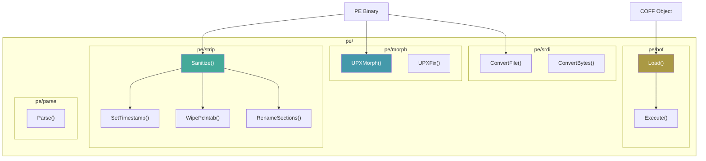

# PE Manipulation

[<- Back to README](../../../README.md)

The `pe/` package tree provides tools for manipulating Portable Executable files: stripping Go-specific metadata, loading COFF object files (BOFs), and morphing UPX-packed binaries to evade signature detection.

---

## Architecture Overview

## Documentation

| Document | Description |
|----------|-------------|
| [PE Sanitization](strip-sanitize.md) | Remove Go metadata: timestamps, pclntab, section names |
| [BOF Loader](bof-loader.md) | Load and execute Cobalt Strike BOFs (COFF objects) |
| [PE Morphing](morph.md) | Randomize UPX section names to evade signatures |
| [PE-to-Shellcode](pe-to-shellcode.md) | Convert EXE/DLL/.NET/scripts to injectable shellcode via Donut |

## MITRE ATT&CK

| Technique | ID | Description |
|-----------|-----|-------------|
| Obfuscated Files: Software Packing | [T1027.002](https://attack.mitre.org/techniques/T1027/002/) | PE strip + UPX morphing |
| Command and Scripting Interpreter | [T1059](https://attack.mitre.org/techniques/T1059/) | BOF execution |
| Process Injection: DLL Injection | [T1055.001](https://attack.mitre.org/techniques/T1055/001/) | PE-to-shellcode via Donut |

## D3FEND Countermeasures

| Countermeasure | ID | Description |
|----------------|-----|-------------|
| Static Executable Analysis | [D3-SEA](https://d3fend.mitre.org/technique/d3f:StaticExecutableAnalysis/) | Detect modified PE metadata |
| Executable File Analysis | [D3-EFA](https://d3fend.mitre.org/technique/d3f:ExecutableFileAnalysis/) | Detect COFF loading patterns |
| Process Spawn Analysis | [D3-PSA](https://d3fend.mitre.org/technique/d3f:ProcessSpawnAnalysis/) | Detect shellcode execution patterns (Donut stub) |
