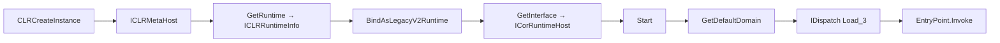

# CLR Hosting — In-Process .NET Assembly Execution

[<- Back to PE Operations](README.md)

## What It Does

Loads the .NET Common Language Runtime in the current process and executes
.NET EXE/DLL assemblies **from memory** — no disk writes, no child process.

## How It Works

`mscoree.dll!CLRCreateInstance` yields an `ICLRMetaHost`. We enumerate the
installed runtimes, pick the preferred one (v4 > fallback), obtain an
`ICLRRuntimeInfo`, bind legacy v2 activation policy, and request
`ICorRuntimeHost`. `Start()` initialises the runtime in-process. The default
`AppDomain` is queried for `IDispatch`, then `AppDomain.Load_3(SAFEARRAY[byte])`
loads the managed assembly and `MethodInfo.Invoke` calls its entry point
(EXE) or a resolved type method (DLL).



## API

```go
func Load(caller *wsyscall.Caller) (*Runtime, error)
func InstalledRuntimes() ([]string, error)
func (r *Runtime) ExecuteAssembly(assembly []byte, args []string) error
func (r *Runtime) ExecuteDLL(dll []byte, typeName, methodName, arg string) error
func (r *Runtime) Close()

// Returned when ICorRuntimeHost is not registered (e.g. no .NET 3.5).
var ErrLegacyRuntimeUnavailable error
```

## Compared to `pe/srdi`

|            | `pe/clr`                            | `pe/srdi`                  |
|------------|-------------------------------------|----------------------------|
| Target     | Current process                     | Any remote process         |
| .NET       | Native (IL execution)               | Donut-wrapped stub         |
| Disk I/O   | None                                | None                       |
| AMSI       | `AppDomain.Load_3` scanned          | Donut loader scanned       |

## Environmental Requirement

`ICorRuntimeHost` (CLR2 legacy COM hosting) is required for in-memory
`AppDomain.Load_3`. It needs **one** of:
- `.NET Framework 3.5` installed, **or**
- `useLegacyV2RuntimeActivationPolicy=true` in the host's app.config manifest.

If unavailable, `Load` returns `ErrLegacyRuntimeUnavailable`. On modern
CLR-only hosts you can still call `InstalledRuntimes()` to discover versions.

## MITRE ATT&CK

| Technique | ID |
|-----------|-----|
| Reflective Code Loading | [T1620](https://attack.mitre.org/techniques/T1620/) |

## Detection

**Medium** — `clr.dll` + `mscoreei.dll` loading inside a non-.NET host is a
Sysmon EID 7 / EDR heuristic. AMSI v2 scans every buffer passed to
`AppDomain.Load_3`. Call `evasion/amsi.PatchAll()` **before** `ExecuteAssembly`
for hostile payloads (Rubeus, Seatbelt, SharpHound).

## Credits

- [ropnop/go-clr](https://github.com/ropnop/go-clr) — vtable layouts and
  flow reference.
