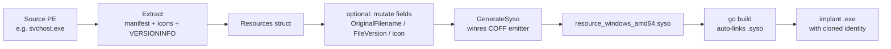

# PE Resource Masquerade

[← pe index](README.md) · [docs/index](../../index.md)

## TL;DR

Embed the manifest, icon set, and VERSIONINFO of a legitimate
Windows binary into a Go implant at compile time. Two modes:
**preset** (zero-effort blank-import) for the canonical svchost /
cmd / explorer / taskmgr / notepad identities, or **programmatic**
([Extract] / [Clone] / [Build] + `With*` options) to clone any
PE on demand. Process Explorer, Task Manager, and naive
allowlists render the implant as the cloned identity; signature
checks and behavioural EDRs see through it.

## Primer

Task Manager and Process Explorer trust the icon, company name,
and description embedded in a PE's resource section. Mature
allowlists key on `OriginalFilename` + `CompanyName`; AppLocker
publisher rules trust the embedded manifest. Masquerading those
fields with a known-Microsoft value clears casual triage and
opens up a host of "is this svchost?" trust assumptions.

The clone is shallow. `.rdata` strings (`runtime.`, `main.`),
imports (Go's ntdll-heavy IAT), and the Authenticode signature
state still betray the implant to anyone who looks past the icon.
Pair with [pe/strip](strip-sanitize.md) (Go-toolchain scrub),
[pe/cert](certificate-theft.md) (signature graft), and
[cleanup/timestomp](../cleanup/) (MFT alignment) for layered
cover.

## How It Works



At build time, `go build` finds every `*_windows_amd64.syso` in
an imported package directory and merges its COFF `.rsrc` section
into the final binary. No external tool is invoked during build.

## Available presets

5 identities × 2 UAC variants = 10 packages, each ~34 KB. Pick
one and blank-import:

| Identity | Source EXE | Base (asInvoker) | Admin (requireAdministrator) |
|---|---|---|---|
| cmd | `System32\cmd.exe` | `…/preset/cmd` | `…/preset/cmd/admin` |
| svchost | `System32\svchost.exe` | `…/preset/svchost` | `…/preset/svchost/admin` |
| taskmgr | `System32\taskmgr.exe` | `…/preset/taskmgr` | `…/preset/taskmgr/admin` |
| explorer | `Windows\explorer.exe` | `…/preset/explorer` | `…/preset/explorer/admin` |
| notepad | `System32\notepad.exe` | `…/preset/notepad` | `…/preset/notepad/admin` |

**Rules:**

1. **At most one** blank-import per final binary. Windows PEs
   carry exactly one `RT_MANIFEST` (ID = 1); two imports yield a
   duplicate-symbol linker error.
2. Pick the UAC variant that matches operational need:
   - **base** (`asInvoker`): no UAC prompt, runs with the
     invoking shell's token — most stealthy.
   - **admin** (`requireAdministrator`): forces the UAC consent
     UI. Only when the cloned identity naturally requires
     elevation (taskmgr, explorer/admin) — a cmd asking for
     admin is suspicious.

## API Reference

### Programmatic entry points

| Symbol | Description |
|---|---|
| [`Extract(pePath) (*Resources, error)`](https://pkg.go.dev/github.com/oioio-space/maldev/pe/masquerade#Extract) | Open a PE; extract manifest + icons + VERSIONINFO + optional Authenticode cert. |
| [`Clone(srcPE, outSyso, arch, level) error`](https://pkg.go.dev/github.com/oioio-space/maldev/pe/masquerade#Clone) | One-shot `Extract` + `GenerateSyso`. |
| [`Build(out, arch, opts ...Option) error`](https://pkg.go.dev/github.com/oioio-space/maldev/pe/masquerade#Build) | Option-chain entry point — start from a source PE, override fields, emit. |
| [`(*Resources).GenerateSyso(out, arch, level)`](https://pkg.go.dev/github.com/oioio-space/maldev/pe/masquerade#Resources.GenerateSyso) | Write `.syso` from the current `Resources` state. |
| [`(*Resources).IconCount() int`](https://pkg.go.dev/github.com/oioio-space/maldev/pe/masquerade#Resources.IconCount) | How many icon groups were extracted. |

### `Build` options

| Option | Effect |
|---|---|
| `WithSourcePE(path)` | Seed from existing PE (icons + manifest + VERSIONINFO). |
| `WithExecLevel(level)` | Override `requestedExecutionLevel`. |
| `WithManifest(xml)` | Replace entire manifest with raw XML. |
| `WithVersionInfo(vi)` | Override all version resource strings. |
| `WithIconFile(path)` | Load icon from PNG / ICO / BMP / JPEG. |
| `WithIconImage(img)` | Create icon from Go `image.Image`. |
| `WithIcons(icons)` | Advanced — pass `[]*winres.Icon` directly. |
| `WithCertificate(c)` | Store a `*cert.Certificate` for post-build application via `cert.Write`. |

### Constants

| Type | Values |
|---|---|
| `Arch` | `AMD64`, `I386` |
| `ExecLevel` | `AsInvoker`, `HighestAvailable`, `RequireAdministrator` |

### Sentinel errors

| Error | Trigger |
|---|---|
| `ErrEmptySourcePE` | `WithSourcePE("")` |

## Examples

### Simple — preset blank-import

```go
package main

import (
    _ "github.com/oioio-space/maldev/pe/masquerade/preset/svchost"
)

func main() {
    // Process Explorer renders this as svchost.exe
}
```

```text
PS> (Get-Item .\mybin.exe).VersionInfo | Format-List
CompanyName      : Microsoft Corporation
FileDescription  : Host Process for Windows Services
OriginalFilename : svchost.exe
ProductName      : Microsoft® Windows® Operating System
```

### Composed — Clone in a generate step

```go
//go:build ignore
// generator.go — invoked via `go generate`

package main

import "github.com/oioio-space/maldev/pe/masquerade"

func main() {
    _ = masquerade.Clone(
        `C:\Windows\System32\svchost.exe`,
        "resource_windows_amd64.syso",
        masquerade.AMD64,
        masquerade.AsInvoker,
    )
}
```

### Advanced — icon swap with custom VERSIONINFO

Use svchost icons but override every VERSIONINFO field — useful
when an AV cross-checks `OriginalFilename` against the on-disk
filename.

```go
masquerade.Build("resource_windows_amd64.syso", masquerade.AMD64,
    masquerade.WithSourcePE(`C:\Windows\System32\svchost.exe`),
    masquerade.WithExecLevel(masquerade.AsInvoker),
    masquerade.WithVersionInfo(&masquerade.VersionInfo{
        FileDescription:  "Host Process for Windows Services",
        CompanyName:      "Microsoft Corporation",
        ProductName:      "Microsoft® Windows® Operating System",
        OriginalFilename: "svchost.exe",
        FileVersion:      "10.0.22621.3007",
        ProductVersion:   "10.0.22621.3007",
    }),
)
```

### Pipeline — Clone + cert + strip + timestomp

End-to-end identity scrub: clone svchost identity, graft its
Authenticode cert, scrub Go markers, align MFT timestamps.

```go
//go:build ignore

package main

import (
    "log"
    "os"

    "github.com/oioio-space/maldev/cleanup/timestomp"
    "github.com/oioio-space/maldev/pe/cert"
    "github.com/oioio-space/maldev/pe/masquerade"
    "github.com/oioio-space/maldev/pe/strip"
)

func main() {
    const exe = `.\loader.exe`
    const ref = `C:\Windows\System32\svchost.exe`

    // 1. Generate the .syso (run before `go build`).
    if err := masquerade.Clone(ref,
        "resource_windows_amd64.syso",
        masquerade.AMD64,
        masquerade.AsInvoker,
    ); err != nil {
        log.Fatal(err)
    }

    // (assume `go build` produced `loader.exe` here)

    // 2. Strip Go markers.
    raw, _ := os.ReadFile(exe)
    raw = strip.Sanitize(raw)
    _ = os.WriteFile(exe, raw, 0o644)

    // 3. Graft the donor's Authenticode cert.
    _ = cert.Copy(ref, exe)

    // 4. Match MFT timestamps to the donor.
    _ = timestomp.CopyFromFull(ref, exe)
}
```

See [`ExampleClone`](../../../pe/masquerade/masquerade_example_test.go)
+ [`ExampleBuild`](../../../pe/masquerade/masquerade_example_test.go).

## Regenerating presets

```bash
# On a Windows host (read-only access to System32 is enough):
go run ./pe/masquerade/internal/gen
```

The generator is pure Go (uses `tc-hib/winres` as a library) and
does not modify the host filesystem outside this repository.

Regenerate when:

- A Windows update refreshes icons/metadata of a reference exe.
- Adding a new identity (extend the `identities` slice in
  `pe/masquerade/internal/gen/main.go`).
- Adding a new variant (e.g. `highestAvailable`).

## OPSEC & Detection

| Artefact | Where defenders look |
|---|---|
| `Verified: Unsigned` from `sigcheck /a` | Microsoft binaries are always signed; *unsigned* file claiming Microsoft origin is a high-fidelity signal — pair with `pe/cert` |
| Mismatched `OriginalFilename` vs on-disk filename | Mature AV (Defender, MDE) cross-checks; rename the on-disk file to match |
| Defender ML heuristics on Go-binary + Microsoft VERSIONINFO | Atypical combination flagged by some ML pipelines; pair with `pe/strip` |
| `.rdata` strings betraying Go origin (`runtime.`, `main.`, GOROOT paths) | YARA rules; partially mitigated by garble + `pe/strip` |
| Process Explorer's "Verified Signer" column | Shows `(Not verified)` when signature is missing |
| AppLocker / WDAC publisher rules | Strict enforcement validates the cert chain — masquerade alone cannot pass |

**D3FEND counters:**

- [D3-EAL](https://d3fend.mitre.org/technique/d3f:ExecutableAllowlisting/)
  — strict allowlisting cross-checks publisher.
- [D3-SEA](https://d3fend.mitre.org/technique/d3f:StaticExecutableAnalysis/)
  — VERSIONINFO + manifest inspection.
- [D3-PA](https://d3fend.mitre.org/technique/d3f:ProcessAnalysis/)
  — runtime behaviour rarely matches the cloned identity (svchost
  doesn't normally make outbound HTTPS to attacker C2).

**Hardening for the operator:**

- Pair with [`pe/cert`](certificate-theft.md) so signature checks
  no longer fail open.
- Pair with [`pe/strip`](strip-sanitize.md) so Go fingerprints
  don't betray the spoof.
- Match runtime behaviour to the cloned identity: a "svchost"
  beaconing every 60 s is more suspicious than a real svchost.
- Match the on-disk filename to `OriginalFilename` and place
  the binary in a path consistent with the cloned identity
  (`%SystemRoot%\System32\` for Microsoft binaries).

## MITRE ATT&CK

| T-ID | Name | Sub-coverage | D3FEND counter |
|---|---|---|---|
| [T1036.005](https://attack.mitre.org/techniques/T1036/005/) | Masquerading: Match Legitimate Name or Location | full — manifest + icon + VERSIONINFO clone | D3-EAL, D3-SEA, D3-PA |

## Limitations

- **Metadata only.** `.rdata` strings, imports, `.text` are not
  modified — this is shallow masquerading.
- **Signature absent by default.** Pair with `pe/cert` or any
  defender that checks Authenticode catches the spoof.
- **Static identity at build time.** Each binary carries one
  identity; runtime swaps would require image rewriting.
- **Defender ML edge cases.** Some EDRs flag the Go +
  Microsoft-VERSIONINFO combo as anomalous; test against the
  target stack.
- **Manifest restrictions.** Exactly one `RT_MANIFEST` per PE —
  cannot stack two preset imports.

## See also

- [Certificate theft](certificate-theft.md) — pair to defeat
  signature-presence checks.
- [PE strip / sanitize](strip-sanitize.md) — scrub Go markers
  post-link.
- [PE morph](morph.md) — mutate UPX section names if packed.
- [`cleanup/timestomp`](../cleanup/) — match MFT timestamps to
  the cloned identity.
- [`runtime/clr`](../runtime/) — CLR hosting blends naturally
  with `masquerade/svchost`.
- [Operator path](../../by-role/operator.md).
- [Detection eng path](../../by-role/detection-eng.md).

## Credits

- [tc-hib/winres](https://github.com/tc-hib/winres) — pure-Go
  COFF `.rsrc` emitter used by the generator.
