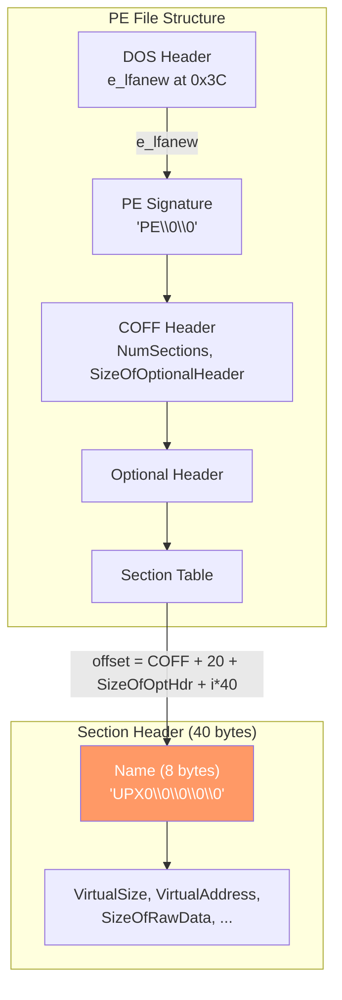

# PE Morphing (UPX Section Rename)

[<- Back to PE Overview](README.md)

**MITRE ATT&CK:** [T1027.002 - Obfuscated Files or Information: Software Packing](https://attack.mitre.org/techniques/T1027/002/)
**D3FEND:** [D3-SEA - Static Executable Analysis](https://d3fend.mitre.org/technique/d3f:StaticExecutableAnalysis/)

---

## Primer

UPX is the most popular executable packer -- it compresses binaries to reduce their size. The problem is that UPX-packed binaries have well-known section names (`UPX0`, `UPX1`, `UPX2`) that every antivirus and EDR recognizes instantly.

**Changing the chapter titles in a packed book so automated scanners cannot recognize it.** PE morphing replaces the `UPX` section names with random strings, breaking automatic UPX detection and unpacking tools while keeping the binary functional.

---

## How It Works

### Morphing Process


### Section Header Layout



### Before and After

```text
Before morphing:
  Section 0: UPX0     (virtual, decompression target)
  Section 1: UPX1     (compressed data)
  Section 2: UPX2     (UPX metadata)

After morphing:
  Section 0: xK9mP2aB (random)
  Section 1: 7nQ4rT8w (random)
  Section 2: mD5vL1cX (random)
```

---

## Usage

### Morph UPX Section Names

```go
import (
    "os"
    "github.com/oioio-space/maldev/pe/morph"
)

data, _ := os.ReadFile("implant-upx.exe")

// Replace UPX section names with random strings
morphed, err := morph.UPXMorph(data)
if err != nil {
    log.Fatal(err)
}

os.WriteFile("implant-morphed.exe", morphed, 0644)
```

### Restore UPX Names (for Debugging)

```go
// Restore original UPX0/UPX1/UPX2 names
restored, err := morph.UPXFix(morphed)
if err != nil {
    log.Fatal(err)
}

os.WriteFile("implant-restored.exe", restored, 0644)
// Can now be unpacked with: upx -d implant-restored.exe
```

---

## Combined Example — Morph + Fuzzy Hash Fingerprint

UPXMorph changes 24 bytes (three 8-byte section name fields). That is enough
to break SHA-256-based blocklists entirely. But defenders using ssdeep or
TLSH still detect the variant because 99.99 % of the binary is unchanged.
This example makes the contrast concrete:

```go
package main

import (
    "fmt"
    "os"

    "github.com/oioio-space/maldev/hash"
    "github.com/oioio-space/maldev/pe/morph"
)

func main() {
    packed, _ := os.ReadFile("implant-upx.exe")

    // Hash the original.
    sha256Before := hash.SHA256(packed)
    ssBefore, _  := hash.Ssdeep(packed)
    tlBefore, _  := hash.TLSH(packed)

    // Morph: only UPX section names change.
    morphed, err := morph.UPXMorph(packed)
    if err != nil {
        fmt.Fprintln(os.Stderr, err)
        os.Exit(1)
    }

    // Hash the morphed copy.
    sha256After := hash.SHA256(morphed)
    ssAfter, _  := hash.Ssdeep(morphed)
    tlAfter, _  := hash.TLSH(morphed)

    ssScore, _ := hash.SsdeepCompare(ssBefore, ssAfter)
    tlDist, _  := hash.TLSHCompare(tlBefore, tlAfter)

    fmt.Printf("SHA-256  before: %s\n", sha256Before)
    fmt.Printf("SHA-256  after:  %s\n", sha256After)
    fmt.Printf("same?    %v\n\n", sha256Before == sha256After) // false

    fmt.Printf("ssdeep score:    %d / 100\n", ssScore)   // ~97
    fmt.Printf("TLSH distance:   %d\n", tlDist)          // ~12

    // SHA-256 blocklist → miss.
    // ssdeep / TLSH similarity scan → hit (~97 score, ~12 distance).
    _ = os.WriteFile("implant-morphed.exe", morphed, 0o644)
}
```

**What this tells a defender:** a morphed UPX binary evades every hash-based
IOC but is trivially flagged by a similarity scan against the pre-morph
sample. Layering morph with `pe/strip` (section rename + pclntab wipe)
closes part of that gap, but TLSH distance only grows to ~30–50 —
still well within "same family" range for most tools.

---

## Combined Example: Build, Pack, Sanitize, Morph

```go
package main

import (
    "fmt"
    "os"
    "os/exec"

    "github.com/oioio-space/maldev/pe/morph"
    "github.com/oioio-space/maldev/pe/strip"
)

func main() {
    // Step 1: Build with garble
    exec.Command("garble", "-literals", "-tiny", "build",
        "-ldflags", "-s -w -H windowsgui",
        "-o", "step1-garbled.exe",
        "./cmd/implant",
    ).Run()

    // Step 2: Pack with UPX
    exec.Command("upx", "--best", "-o", "step2-packed.exe", "step1-garbled.exe").Run()

    // Step 3: Read packed binary
    data, _ := os.ReadFile("step2-packed.exe")

    // Step 4: Sanitize PE metadata
    data = strip.Sanitize(data)

    // Step 5: Morph UPX section names
    data, err := morph.UPXMorph(data)
    if err != nil {
        fmt.Println("morph failed:", err)
        return
    }

    // Step 6: Write final binary
    os.WriteFile("final-implant.exe", data, 0644)
    fmt.Println("Pipeline complete: final-implant.exe")
}
```

---

## Advantages & Limitations

### Advantages

- **Breaks UPX detection**: Antivirus YARA rules matching UPX section names no longer trigger
- **Breaks auto-unpacking**: Tools that detect and unpack UPX fail without the standard names
- **Changes file hash**: New random section names change the SHA256 of every morphed copy
- **Reversible**: `UPXFix()` restores original names for debugging/unpacking
- **Preserves functionality**: Only the 8-byte name fields change -- no code modification

### Limitations

- **UPX-specific**: Only targets UPX section names -- does not handle other packers
- **Superficial**: The UPX decompression stub is still present and recognizable by deep analysis
- **Entropy unchanged**: High-entropy sections (compressed data) are still detectable
- **Requires valid PE**: Uses the `saferwall/pe` parser -- malformed PEs may fail

---

## Compared to Other Implementations

| Feature | maldev (pe/morph) | UPX Scrambler | Manual hex edit | Amber |
|---------|-------------------|---------------|-----------------|-------|
| Language | Go | Python | N/A | Go |
| Section rename | Yes (random) | Yes (fixed) | Yes (manual) | No |
| Auto-detection | Yes (scans for UPX) | Yes | No | N/A |
| Reversible | Yes (UPXFix) | No | No | N/A |
| Hash change | Yes | Yes | Yes | Yes |
| Deep obfuscation | No | No | No | Yes (reflective) |

---

## API Reference

### Functions

```go
// UPXMorph replaces UPX section names with random bytes.
// Returns data unchanged if not UPX-packed.
func UPXMorph(peData []byte) ([]byte, error)

// UPXFix restores original UPX section names (UPX0, UPX1, UPX2).
func UPXFix(peData []byte) ([]byte, error)
```
