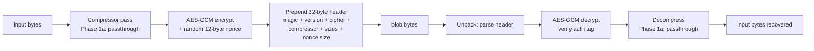

# PE Packer (Phase 1a–1e — encrypt/embed + reflective loader + UPX-style)

[← pe index](README.md) · [docs/index](../../index.md)

## TL;DR

Encrypt + embed any byte buffer (PE / shellcode / config) into a
self-describing maldev-format blob, then **reflectively load the
original PE into the current process's memory** at runtime. Two
sub-packages compose the full pipeline:

| You want to… | Use | Notes |
|---|---|---|
| Encrypt a payload + carry it as a blob (single AES-GCM) | [`packer.Pack`](https://pkg.go.dev/github.com/oioio-space/maldev/pe/packer#Pack) | Phase 1a; returns blob + AEAD key |
| Recover the original bytes from a blob | [`packer.Unpack`](https://pkg.go.dev/github.com/oioio-space/maldev/pe/packer#Unpack) | Phase 1a; needs the key Pack returned |
| **Stack multiple ciphers + permutations** (composability) | [`packer.PackPipeline`](https://pkg.go.dev/github.com/oioio-space/maldev/pe/packer#PackPipeline) | Phase 1c; returns blob + per-step keys |
| Reverse a pipeline-packed blob | [`packer.UnpackPipeline`](https://pkg.go.dev/github.com/oioio-space/maldev/pe/packer#UnpackPipeline) | Phase 1c; needs the per-step keys |
| Reflectively load a packed PE in-process (Windows x64) | [`runtime.LoadPE`](https://pkg.go.dev/github.com/oioio-space/maldev/pe/packer/runtime#LoadPE) | Phase 1b; Unpack + map + relocate + resolve imports + set protections |
| Inspect the loaded image without running it | [`runtime.Prepare`](https://pkg.go.dev/github.com/oioio-space/maldev/pe/packer/runtime#Prepare) | Tests + diagnostics |
| Pack/unpack from the shell | `cmd/packer pack` / `cmd/packer unpack` | Thin wrapper (single-AES-GCM only — pipeline CLI lands later) |

### Pipeline composability example (Phase 1c + 1c.5)

Stack compression + permutation + cipher — canonical
"compress-then-encrypt" order:

```go
import "github.com/oioio-space/maldev/pe/packer"

blob, keys, err := packer.PackPipeline(payload, []packer.PipelineStep{
    {Op: packer.OpCompress, Algo: uint8(packer.CompressorFlate)},
    {Op: packer.OpPermute,  Algo: uint8(packer.PermutationSBox)},
    {Op: packer.OpCipher,   Algo: uint8(packer.CipherAESGCM)},
})
// keys[0] is nil (compression has no secret); keys[1] / keys[2]
// are the per-step keys for the SBox + AES-GCM stages. Transport
// them to the implant.

// At unpack time:
recovered, err := packer.UnpackPipeline(blob, keys)
```

Pack runs the steps in order; Unpack reverses. The wire format
records each step's Op + Algo so the implant knows what to
reverse, but keys travel separately.

**Compression caveat**: always compress BEFORE encryption.
Encrypted bytes are near-uniform entropy and don't compress.
Phase 1c.5 ships `CompressorFlate` (raw DEFLATE — smallest
output overhead, ~98% reduction observed on highly-repetitive
input) and `CompressorGzip` (DEFLATE + framing). aPLib / LZMA
/ zstd / LZ4 are reserved constants and return
`ErrUnsupportedCompressor` until implemented.

⚠ **`runtime.PreparedImage.Run` is gated by `MALDEV_PACKER_RUN_E2E=1`**
so `go test` against unmodified binaries doesn't hand control
to arbitrary payloads.

⚠ **Known limitation (Phase 1b):** PEs depending on SxS-redirected
ordinal imports (e.g. `notepad.exe` imports COMCTL32 by ordinal,
which Windows redirects via activation context) fail at import
resolution. Activation-context support lands in Phase 1c.
Verified working on simpler EXEs (xcopy.exe, where.exe) which
use the modern api-ms-win-core-* import set.

What this DOES achieve (today, Phase 1a):

- Self-describing blob format with version field — future
  format bumps fail loudly via `ErrUnsupportedVersion`
  instead of misinterpreting bytes.
- AES-GCM AEAD — tampering / wrong-key both rejected by the
  auth tag.
- Polymorphic ciphertext per pack (random nonce) — same
  input → different output bytes every call.
- Round-trip-tested across input sizes (empty / 1 byte /
  page / multi-page).

What this does NOT achieve (today):

- **Doesn't compress.** `CompressorNone` is the only shipped
  option; aPLib / LZMA / zstd / LZ4 land in a follow-up.
- **Doesn't ship ChaCha20 / RC4** despite reserved constants.
  AES-GCM only.
- **Doesn't auto-build a host PE around the blob.** Operators
  manually wire the `runtime.LoadPE` call in their implant's
  Go program. Phase 1d's polymorphic stub generation will
  produce the host PE automatically.
- **DLLs not yet supported.** EXEs only — DLLs need DllMain
  calling + HINSTANCE. Loader returns `runtime.ErrNotEXE`.
- **TLS callbacks not yet supported.** Many production binaries
  use them; loader rejects with `runtime.ErrTLSCallbacks`.
- **x64 only.** x86 + ARM64 rejected with `runtime.ErrUnsupportedArch`.
- **Linux ELF not yet supported.** Phase 1c.
- **SxS-redirected ordinal imports fail.** notepad.exe (COMCTL32
  v6 via activation context) hits `GetProcAddressByOrdinal`
  failure. Verified working on simpler EXEs (xcopy, where, find)
  with the modern api-ms-win-core-* import set.

For the full design (3 phases, threat model, polymorphism via
compile-time templating, cross-platform Linux ELF, multi-target
bundle, anti-debug, AMSI silence, cert graft), see
[`docs/refactor-2026-doc/packer-design.md`](../../refactor-2026-doc/packer-design.md).

## Primer — vocabulary

Five terms recur on this page:

> **AEAD** (Authenticated Encryption with Associated Data) —
> cipher mode that produces both ciphertext AND an
> authentication tag. Decrypt with wrong key OR tampered
> ciphertext → tag mismatch → decrypt fails loudly. AES-GCM
> is the AEAD shipped here.
>
> **Nonce** — single-use random bytes mixed into the cipher
> so the same key + plaintext produces different ciphertext
> on every call. AES-GCM uses 12 bytes; never reuse a nonce
> with the same key (catastrophic break).
>
> **Magic** — fixed 4-byte prefix at the start of every
> packed blob (`MLDV`). Lets `Unpack` distinguish a maldev
> blob from random bytes / a different format. Trivially
> fingerprinted today; Phase 1b wraps the blob in a host PE
> so the magic is no longer at file offset 0.
>
> **FormatVersion** — uint16 in the header. Bumps on
> backwards-incompatible layout changes. Old `Unpack` reading
> a new blob fails with `ErrUnsupportedVersion`.
>
> **Reflective loader stub** — code that executes at the
> start of the packed binary, locates the encrypted payload,
> decrypts it, allocates RWX memory, applies relocations,
> resolves imports, and jumps to the original entry point —
> all from inside the running process. Phase 1b ships this.

## How It Works



## Examples

### Quick start — round-trip a payload

```go
package main

import (
    "fmt"
    "log"
    "os"

    "github.com/oioio-space/maldev/pe/packer"
)

func main() {
    payload, err := os.ReadFile("notepad.exe")
    if err != nil { log.Fatal(err) }

    // Step 1: pack. Default options = AES-GCM, no compression,
    //         freshly-generated 32-byte key.
    blob, key, err := packer.Pack(payload, packer.Options{})
    if err != nil { log.Fatal(err) }
    fmt.Printf("packed %d bytes → %d-byte blob\n", len(payload), len(blob))

    // Step 2: ship the blob + key separately. The blob alone is
    //         opaque AEAD ciphertext.
    _ = os.WriteFile("payload.bin", blob, 0o644)
    fmt.Printf("KEY (save it!): %x\n", key)

    // Step 3 (much later): unpack on the build host that has
    //         the key.
    recovered, err := packer.Unpack(blob, key)
    if err != nil { log.Fatal(err) }
    fmt.Printf("recovered %d bytes\n", len(recovered))
}
```

### CLI usage

```bash
# Pack: prints the AEAD key to stdout as 64-char hex.
$ go run ./cmd/packer pack -in payload.exe -out payload.bin
packed 184320 bytes → payload.bin (184380 bytes)
b3a2c1d4e5f6...      # save this, you need it for unpack

# Unpack: needs the key.
$ go run ./cmd/packer unpack -in payload.bin -out recovered.exe -key b3a2c1d4e5f6...
unpacked → recovered.exe (184320 bytes)

# Or write the key to a file (more script-friendly).
$ go run ./cmd/packer pack -in payload.exe -out payload.bin -keyout key.hex
$ go run ./cmd/packer unpack -in payload.bin -out recovered.exe -key "$(cat key.hex)"
```

### Custom key (key-derivation pipelines)

When the key comes from elsewhere — host fingerprint, KDF over a
shared secret, server-fetched after sandbox check — supply it
explicitly:

```go
import (
    "crypto/sha256"

    "github.com/oioio-space/maldev/pe/packer"
)

// Derive a 32-byte key from anything (here: hostname + magic word).
shared := sha256.Sum256([]byte("operator-codename:" + getHostname()))

blob, _, err := packer.Pack(payload, packer.Options{Key: shared[:]})
// Same key on the build host = round-trip works.
```

## API Reference

### `func Pack(data []byte, opts Options) (packed []byte, key []byte, err error)`

[godoc](https://pkg.go.dev/github.com/oioio-space/maldev/pe/packer#Pack)

Encrypt + embed `data` into a maldev-format blob.

**Parameters:**

- `data` — arbitrary bytes (PE / ELF / shellcode / anything).
- `opts.Cipher` — `CipherAESGCM` (default; only ship in Phase 1a).
- `opts.Compressor` — `CompressorNone` (default; only ship in Phase 1a).
- `opts.Key` — 16/24/32 bytes for AES-GCM; nil → fresh random 32 bytes.

**Returns:** `(blob, key, err)`. The key is the only material
needed to call `Unpack` later.

**OPSEC:** the blob carries the `MLDV` magic at offset 0. Phase
1a is intentionally fingerprintable — Phase 1b wraps it.

**Required privileges:** unprivileged.

**Platform:** cross-platform.

### `func Unpack(packed []byte, key []byte) ([]byte, error)`

[godoc](https://pkg.go.dev/github.com/oioio-space/maldev/pe/packer#Unpack)

Reverse `Pack`. Returns the original `data` bytes.

**Sentinels** (use `errors.Is`):

- `ErrShortBlob` — input shorter than 32-byte header.
- `ErrBadMagic` — input doesn't start with `MLDV`.
- `ErrUnsupportedVersion` — blob's version field unknown.
- `ErrUnsupportedCipher` — blob references a cipher this build
  doesn't implement.
- `ErrUnsupportedCompressor` — same for compressors.
- `ErrPayloadSizeMismatch` — header sizes inconsistent (truncated
  blob).

Wrong key OR tampered ciphertext both surface as the underlying
AEAD `cipher: message authentication failed` error (no maldev
sentinel — match on the unwrapped error if needed).

**Required privileges:** unprivileged.

**Platform:** cross-platform.

### `type Options struct`, `type Cipher`, `type Compressor`

See package godoc for full constant lists. Phase 1a only
implements `CipherAESGCM` + `CompressorNone`; other constants
are reserved for Phase 1b/1c.

### `func PackBinary(input []byte, opts PackBinaryOptions) (out []byte, key []byte, err error)`

[godoc](https://pkg.go.dev/github.com/oioio-space/maldev/pe/packer#PackBinary)

**v0.61.0 — Phase 1e UPX-style packer.** Modifies an input
PE32+ or ELF64 in place: encrypts the `.text` section with the
SGN polymorphic encoder, appends a small CALL+POP+ADD-prologue
decoder stub as a new section, rewrites the entry point. Output
is a single self-contained binary the kernel loads normally; no
secondary stage 2.

This replaces the broken `v0.59.0` / `v0.60.0` architecture
(host wrapper + stage 2 Go EXE) which produced byte-shape-correct
binaries that crashed at runtime. See
`docs/refactor-2026-doc/KNOWN-ISSUES-1e.md` for the post-mortem.

**Parameters:**

- `input` — full PE32+ or ELF64 binary bytes.
- `opts.Format` — `FormatWindowsExe` or `FormatLinuxELF`.
- `opts.Stage1Rounds` — number of SGN decoder rounds (3 is the
  ship-tested baseline; higher = larger stub + longer decrypt).
- `opts.Seed` — RNG seed for the polymorphic engine. Same seed
  + same input + same rounds = byte-identical output (useful
  for tests; vary per pack in production).
- `opts.CipherKey` — currently informational only (the SGN
  layer is the encryption); reserved for future Phase 1c+ AES
  wrapping.

**Returns:** `(packed, key, err)`. `packed` is a runnable
single-binary; `key` is the seed-derived key material.

**Sentinels** (use `errors.Is`):

- `transform.ErrUnsupportedInputFormat` — magic bytes don't
  match the requested `Format`.
- `transform.ErrNoTextSection` — input lacks an executable
  `.text` section.
- `transform.ErrOEPOutsideText` — original entry point falls
  outside the `.text` section.
- `transform.ErrTLSCallbacks` — input has TLS callbacks (would
  run before OEP and touch encrypted bytes).
- `transform.ErrStubTooLarge` — stub exceeded `StubMaxSize`.

**Side effects:** none — pure-Go byte manipulation.

**OPSEC:** the output PE/ELF carries an extra section (named
randomly per pack) and a slightly elevated entropy footprint.
Pair with [AddCoverPE]/[AddCoverELF] to inflate the static
surface and frustrate naive packer fingerprints.

**Required privileges:** unprivileged.

**Platform:** cross-platform — pack-time behaviour is identical
on linux/windows/darwin. Output runs on Windows (PE) or Linux
(ELF).

**E2E ship gate:** `TestPackBinary_LinuxELF_E2E` (gated behind
`-tags=maldev_packer_run_e2e`) packs the
`pe/packer/runtime/testdata/hello_static_pie` fixture and
asserts the subprocess runs to clean exit with the payload's
`"hello from packer"` output captured.

### `func AddCoverPE(input []byte, opts CoverOptions) ([]byte, error)`

[godoc](https://pkg.go.dev/github.com/oioio-space/maldev/pe/packer#AddCoverPE)

Anti-static-unpacker primitive (P3.1 Phase 3a). Appends junk
sections to a packed PE32+ produced by [PackBinary]. Each
section carries `MEM_READ` only (no W, no X) — the kernel maps
them but never executes; the runtime path is unchanged.

**Parameters:**

- `input` — packed PE32+ bytes.
- `opts.JunkSections` — ordered list of `JunkSection{Name, Size,
  Fill}`. `Name` is the 8-byte section name; common cover
  choices: `.rsrc`, `.rdata2`, `.pdata`, `.tls`. Empty defaults
  to `.rdata`.

**Fill strategies (`JunkFill`):**

| Constant | Body | Use |
|---|---|---|
| `JunkFillRandom` | `crypto/rand` bytes | ~8.0 bits/byte entropy — hide among legit `.rsrc` sections |
| `JunkFillZero` | zeros | flatten the entropy curve to evade percentage thresholds |
| `JunkFillPattern` | frequency-ordered byte alphabet (`0x00`, `0x48`, `0xC3`, `0xCC`, `0x90`, `0xFF`, `0xE8`, `0x55`) | mimics `.text` shape under casual entropy plots |

**Returns:** new buffer with cover sections appended;
`NumberOfSections` and `SizeOfImage` updated. Original `.text`
body bytes are byte-identical.

**Sentinels:**

- `ErrCoverInvalidOptions` — empty `JunkSections` or non-PE input.
- `ErrCoverSectionTableFull` — section header table cannot grow
  (no slack between table and first section's file offset).

**Required privileges:** unprivileged.

**Platform:** cross-platform pack-time; output runs on Windows.

### `func AddCoverELF(input []byte, opts CoverOptions) ([]byte, error)`

[godoc](https://pkg.go.dev/github.com/oioio-space/maldev/pe/packer#AddCoverELF)

ELF64 mirror of [AddCoverPE]. Each `JunkSection` becomes a new
`PT_LOAD` program-header entry with `PF_R` only.

**Go static-PIE support (v0.62.0):** Go static-PIE binaries place
the first PT_LOAD at file offset 0 (the PHT lives inside the
segment). When no in-place slack is available, `AddCoverELF` now
relocates the PHT to file-end inside a new R-only PT_LOAD whose
vaddr satisfies the kernel's `AT_PHDR = first_load_vaddr + e_phoff`
invariant. The four ELF spec invariants are preserved: AT_PHDR math,
PT_PHDR first in PHT, PT_LOAD ascending vaddr order, page-aligned
placement. `ErrCoverSectionTableFull` is no longer returned for
Go static-PIE inputs.

**Section header table (SHT):** cover layer adds entries to the
PHT only — the SHT is left untouched, so a stripped binary
stays stripped.

**Parameters / Returns / Sentinels:** same shape as `AddCoverPE`.

**Required privileges:** unprivileged.

**Platform:** cross-platform pack-time; output runs on Linux.

**E2E ship gate:** `TestPackBinary_LinuxELF_MultiSeed_WithCover`
(gated behind `-tags=maldev_packer_run_e2e`) packs
`hello_static_pie` with each of 8 seeds, chains
`ApplyDefaultCover`, and asserts each resulting binary runs to
clean exit with `"hello from packer"` output.

### `func DefaultCoverOptions(seed int64) CoverOptions`

[godoc](https://pkg.go.dev/github.com/oioio-space/maldev/pe/packer#DefaultCoverOptions)

Returns a 3-section `CoverOptions` tuned for general-purpose
cover. Names cycle through a pool of legitimate-looking
candidates (`.rsrc`, `.rdata2`, `.pdata`, `.tls`, `.reloc2`,
`.CRT`); sizes mix in the 0x1000–0x4000 range; fills span
`JunkFillRandom` (~8 KB random), `JunkFillPattern` (~4 KB
machine-code-shape histogram), `JunkFillZero` (~16 KB
flat-entropy padding).

**Parameters:** `seed` — controls the deterministic pick. Same
seed produces byte-identical output (reproducible builds);
varying per pack gives operational variance.

**Returns:** populated `CoverOptions` ready to feed
[AddCoverPE] / [AddCoverELF].

**Side effects:** none — pure-math helper.

**OPSEC:** see the underlying [AddCoverPE] / [AddCoverELF]
entries.

**Required privileges:** unprivileged.

**Platform:** cross-platform.

### `func ApplyDefaultCover(input []byte, seed int64) ([]byte, error)`

[godoc](https://pkg.go.dev/github.com/oioio-space/maldev/pe/packer#ApplyDefaultCover)

One-liner cover layer. Auto-detects PE32+ vs ELF64 via magic
bytes and dispatches to [AddCoverPE] / [AddCoverELF] with
[DefaultCoverOptions]`(seed)`.

**Parameters:**

- `input` — packed PE32+ or ELF64 bytes.
- `seed` — RNG seed for the option picker.

**Returns:** new buffer with the cover applied.

**Sentinels:**

- `ErrCoverInvalidOptions` — input is neither a PE nor an ELF.
- `ErrCoverSectionTableFull` — propagated unchanged from
  `AddCoverELF` for Go static-PIE inputs (PHT slack
  limitation; v2 will lift it via PHT relocation).

**OPSEC:** see [AddCoverPE] / [AddCoverELF].

**Required privileges:** unprivileged.

**Platform:** cross-platform pack-time.

### `type FakeImport struct`

[godoc](https://pkg.go.dev/github.com/oioio-space/maldev/pe/packer#FakeImport)

Describes one DLL and its function list for a fake import entry.

```go
type FakeImport struct {
    DLL       string   // e.g. "kernel32.dll"
    Functions []string // e.g. ["Sleep", "GetCurrentThreadId"]
}
```

Both `DLL` and every element of `Functions` must be a real export
on the target Windows version — the kernel rejects unresolvable
imports at load time.

### `var DefaultFakeImports []FakeImport`

[godoc](https://pkg.go.dev/github.com/oioio-space/maldev/pe/packer#DefaultFakeImports)

Ready-to-use list of real Windows 10 1809+ / Server 2019+ imports
(kernel32, user32, shell32, ole32 with stable function names
verified against Microsoft public symbol tables). Used automatically
by [DefaultCoverOptions] / [ApplyDefaultCover] for PE32+ inputs.

### `func AddFakeImportsPE(input []byte, fakes []FakeImport) ([]byte, error)`

[godoc](https://pkg.go.dev/github.com/oioio-space/maldev/pe/packer#AddFakeImportsPE)

Appends fake `IMAGE_IMPORT_DESCRIPTOR` entries (PE/COFF Spec Rev
12.0 § 6.4) to a packed PE32+. The merged Import Directory —
original entries followed by one entry per `FakeImport`, terminated
by a zero descriptor — is placed in a new R-only `.idata2` section.
`DataDirectory[1]` is patched to point at the new section.

**Self-containment:** `debug/pe.ImportedSymbols()` (and the Windows
loader) resolves ILT/name RVAs relative to the section containing
`DataDirectory[1]`. The new section is fully self-contained: existing
entries' ILTs and DLL name strings are copied in, and
`OriginalFirstThunk` is rewritten to point into the new section.
`FirstThunk` is preserved verbatim — the loader patches IAT via
`FirstThunk` at load time, and the binary's code references those
addresses.

**Parameters:**

- `input` — packed PE32+ bytes (output of [PackBinary] or
  [AddCoverPE]).
- `fakes` — list of DLL+function tuples to inject; must be
  non-empty. See [DefaultFakeImports] for a ready-made list.

**Returns:** new buffer with the fake import section appended;
`NumberOfSections`, `SizeOfImage`, and `DataDirectory[1]` updated.

**Sentinels:**

- `ErrCoverInvalidOptions` — `fakes` is empty or input is not PE32+.
- `ErrCoverSectionTableFull` — no section-header slot available.

**Required privileges:** unprivileged.

**Platform:** cross-platform pack-time; output runs on Windows.

**Example:**

```go
packed, _, _ := packer.PackBinary(input, packer.PackBinaryOptions{
    Format: packer.FormatWindowsExe, Stage1Rounds: 3, Seed: 1,
})
out, err := packer.AddFakeImportsPE(packed, packer.DefaultFakeImports)
// out now has kernel32/user32/shell32/ole32 entries in its import table
```

## OPSEC & Detection

| Artefact | Where defenders look |
|---|---|
| `MLDV` magic at file offset 0 | Static signature scanners — trivially flagged. **Phase 1b removes this surface** by wrapping the blob in a host PE (magic moves to a non-zero offset inside a custom section). |
| AES-GCM ciphertext entropy profile | High-entropy regions are common in legitimate signed binaries (compressed resources, embedded certs) — high entropy alone is weak signal. |
| Round number sizes (header is exactly 32 bytes) | Possible but weak; many file formats have round headers. |

**D3FEND counters:**

- [D3-FCA](https://d3fend.mitre.org/technique/d3f:FileContentAnalysis/)
  — magic-byte fingerprinting catches Phase 1a output.

**Hardening for the operator:**

- Don't ship the Phase 1a blob standalone — wait for Phase 1b
  to wrap it.
- Carry the AEAD key in a separate channel (config / second-stage
  fetch / host fingerprint derivation).
- Use [`crypto`](../crypto/payload-encryption.md) layered
  permutation (S-Box / XOR) BEFORE Pack to scramble the
  high-entropy ciphertext profile.

## MITRE ATT&CK

| T-ID | Name | Sub-coverage |
|---|---|---|
| [T1027.002](https://attack.mitre.org/techniques/T1027/002/) | Obfuscated Files or Information: Software Packing | partial — Phase 1a is the encrypt side; full coverage when Phase 1b ships |
| [T1620](https://attack.mitre.org/techniques/T1620/) | Reflective Code Loading | not yet — Phase 1b |

## Limitations

- **`PackBinary` (v0.61.0) requires `.text` to host OEP.** The
  original entry point must lie inside the `.text` section so
  the stub's final JMP lands on decrypted code. Binaries that
  start in another section (custom linkers, packed-twice
  inputs) return `ErrOEPOutsideText`.
- **`PackBinary` rejects TLS callbacks.** TLS callbacks run
  before OEP and would touch encrypted bytes. Inputs with a
  non-empty TLS Data Directory return `ErrTLSCallbacks`.
- **`AddCoverELF` PHT-slack constraint lifted (v0.62.0).** Go
  static-PIE binaries (first PT_LOAD at file offset 0) previously
  returned `ErrCoverSectionTableFull`. The cover layer now relocates
  the PHT to file-end and preserves all four ELF spec invariants;
  `ErrCoverSectionTableFull` is no longer returned for these inputs.
- **Fake imports shipped (v0.63.0).** `AddFakeImportsPE` /
  `DefaultFakeImports` add benign-DLL `IMAGE_IMPORT_DESCRIPTOR`
  entries (kernel32, user32, shell32, ole32) to the packed PE.
  `ApplyDefaultCover` chains the step automatically for PE32+
  inputs. The kernel resolves all entries at load time; the IAT
  slots are populated but the binary's code never references them.
- **`Pack` (Phase 1a) magic at offset 0.** Trivially
  fingerprinted; use `PackBinary` (Phase 1e) for binary output
  or `PackPipeline` (Phase 1c) for blob output where the magic
  travels inside a wrapper.
- **`Pack` compression not yet implemented.** `CompressorNone`
  only on the single-step Pack path; the pipeline path
  (`PackPipeline`) ships `CompressorFlate` + `CompressorGzip`.
- **`Pack` AES-GCM only.** ChaCha20 + RC4 constants are
  placeholders for future Cipher additions.
- **Key management is the operator's problem.** All packers
  return the key; how the operator transports it to Unpack at
  the target / build-host is not handled here.

## See also

- [Packer design doc](../../refactor-2026-doc/packer-design.md)
  — full 3-phase plan, capability matrix, threat model.
- [`pe/morph`](morph.md) — UPX section rename (adjacent
  technique; both ship, different problems).
- [`pe/srdi`](pe-to-shellcode.md) — Donut shellcode
  (alternative path; packer is "Donut for PEs on disk" — once
  Phase 1b lands).
- [`crypto`](../crypto/payload-encryption.md) — AEAD primitives
  also usable directly for the same encrypt-then-embed pattern.
